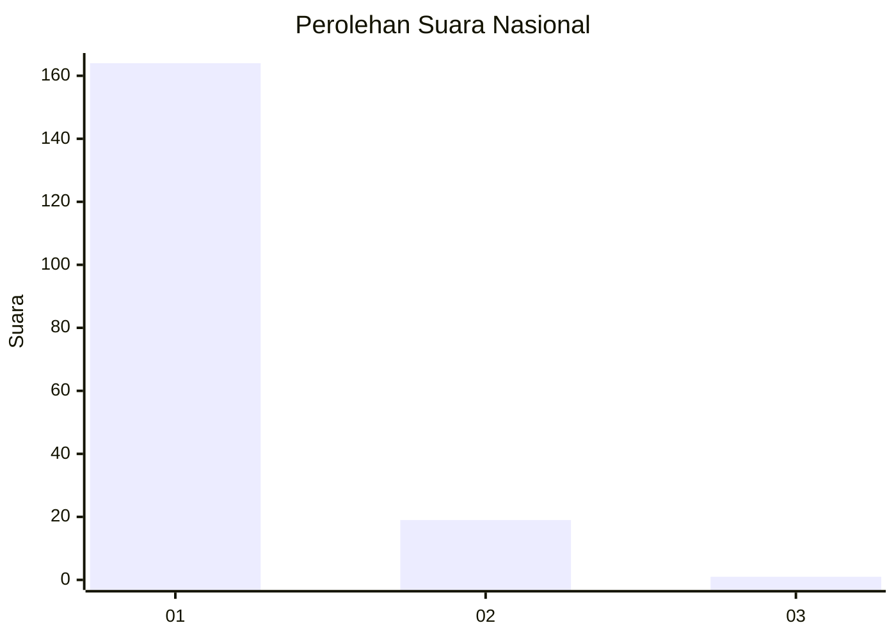
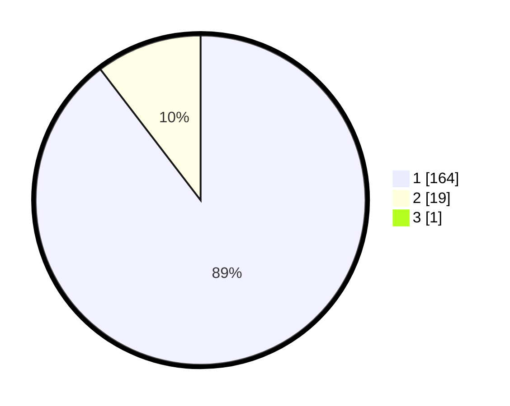

# Hasil

## Grafik

## Tabel

| No. | Nama Paslon    | Suara | Suara (raw) | Persentase |
|:--- |:-------------- | -----:| -----------:| ----------:|
| 1   | ANIES MUHAIMIN | 164   | [164][p-1]  | 89,13      |
| 2   | PRABOWO GIBRAN | 19    | [19][p-2]   | 10,33      |
| 3   | GANJAR MAHFUD  | 1     | [1][p-3]    | 0,54       |

[p-1]: https://github.com/gigit-pemilu/pemilu-2024/blob/main/pilpres/hitung-suara/sub/11-aceh/sub/03-aceh-timur/sub/07-peureulak/sub/2004-leuge/sub/005-tps/sub/paslon-1.txt
[p-2]: https://github.com/gigit-pemilu/pemilu-2024/blob/main/pilpres/hitung-suara/sub/11-aceh/sub/03-aceh-timur/sub/07-peureulak/sub/2004-leuge/sub/005-tps/sub/paslon-2.txt
[p-3]: https://github.com/gigit-pemilu/pemilu-2024/blob/main/pilpres/hitung-suara/sub/11-aceh/sub/03-aceh-timur/sub/07-peureulak/sub/2004-leuge/sub/005-tps/sub/paslon-3.txt

## Foto C Plano

https://sirekap-obj-formc.kpu.go.id/259d/pemilu/ppwp/11/03/07/20/04/1103072004005-20240215-001307--ac79c229-f77c-4d5f-ad05-6d1c30049779.jpg

https://sirekap-obj-formc.kpu.go.id/259d/pemilu/ppwp/11/03/07/20/04/1103072004005-20240215-001619--879608aa-f9f2-4711-8a83-fe0c0c259e04.jpg

## Metadata

| Key        | Value               |
| ---------- | ------------------- |
| Time Stamp | 2024-02-19 13:00:00 |

