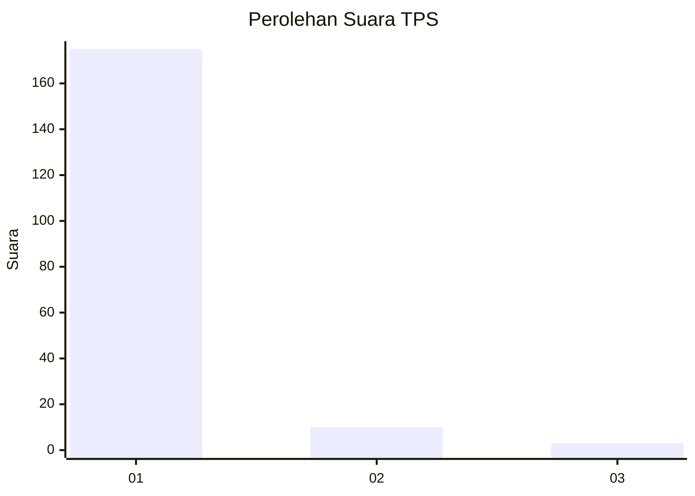
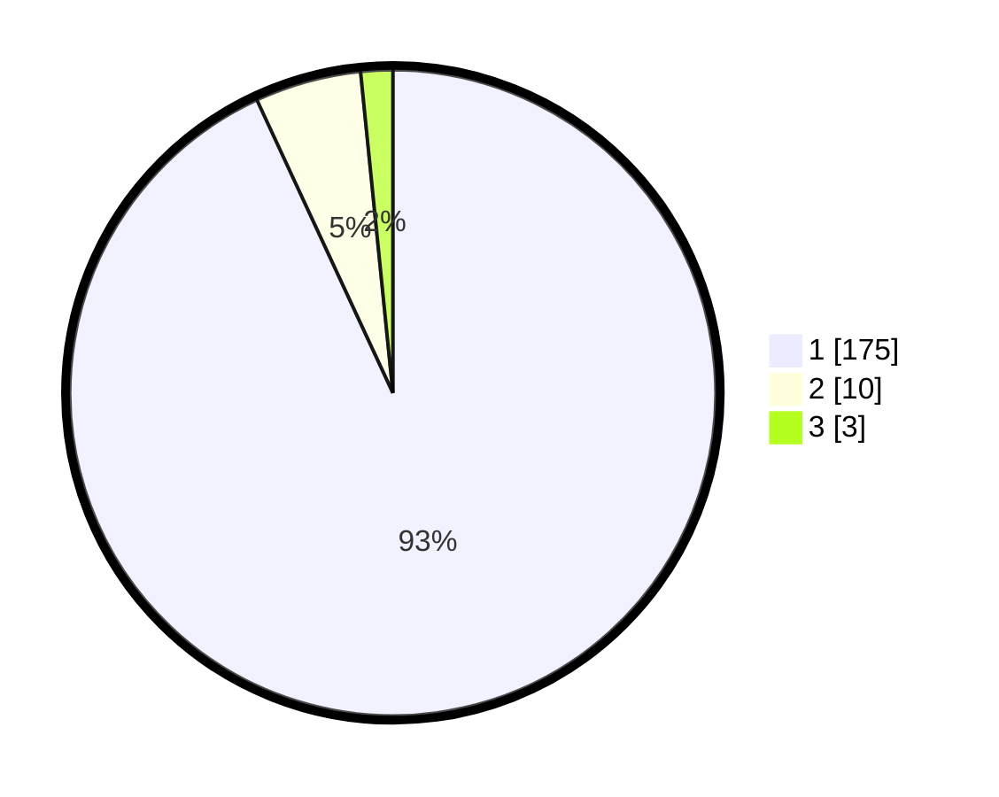

# Hasil

## Grafik

## Tabel

| No. | Nama Paslon    | Suara | Suara (raw) | Persentase |
|:--- |:-------------- | -----:| -----------:| ----------:|
| 1   | ANIES MUHAIMIN | 175   | [175][p-1]  | 93,09      |
| 2   | PRABOWO GIBRAN | 10    | [10][p-2]   | 5,32       |
| 3   | GANJAR MAHFUD  | 3     | [3][p-3]    | 1,60       |

[p-1]: https://github.com/gigit-pemilu/pemilu-2024-11-aceh/blob/main/pilpres/hitung-suara/sub/11-aceh/sub/03-aceh-timur/sub/07-peureulak/sub/2006-punti/sub/001-tps/sub/paslon-1.txt
[p-2]: https://github.com/gigit-pemilu/pemilu-2024-11-aceh/blob/main/pilpres/hitung-suara/sub/11-aceh/sub/03-aceh-timur/sub/07-peureulak/sub/2006-punti/sub/001-tps/sub/paslon-2.txt
[p-3]: https://github.com/gigit-pemilu/pemilu-2024-11-aceh/blob/main/pilpres/hitung-suara/sub/11-aceh/sub/03-aceh-timur/sub/07-peureulak/sub/2006-punti/sub/001-tps/sub/paslon-3.txt

## Foto C Plano

https://sirekap-obj-formc.kpu.go.id/6906/pemilu/ppwp/11/03/07/20/06/1103072006001-20240214-190815--80510d33-8259-4806-8a3b-f10c3fdb7006.jpg

https://sirekap-obj-formc.kpu.go.id/6906/pemilu/ppwp/11/03/07/20/06/1103072006001-20240215-035340--fb46e90e-4565-42e8-97a3-4cf4434e3d12.jpg

https://sirekap-obj-formc.kpu.go.id/6906/pemilu/ppwp/11/03/07/20/06/1103072006001-20240215-035514--45d0a71b-8e90-40d0-9db5-eea12477e5d9.jpg

## Metadata

| Key        | Value               |
| ---------- | ------------------- |
| Time Stamp | 2024-02-15 12:00:28 |

