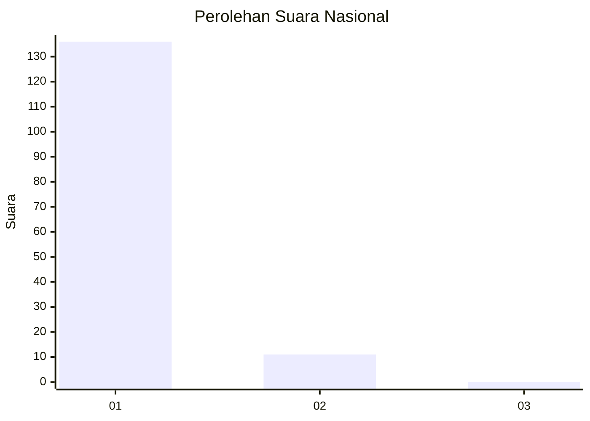
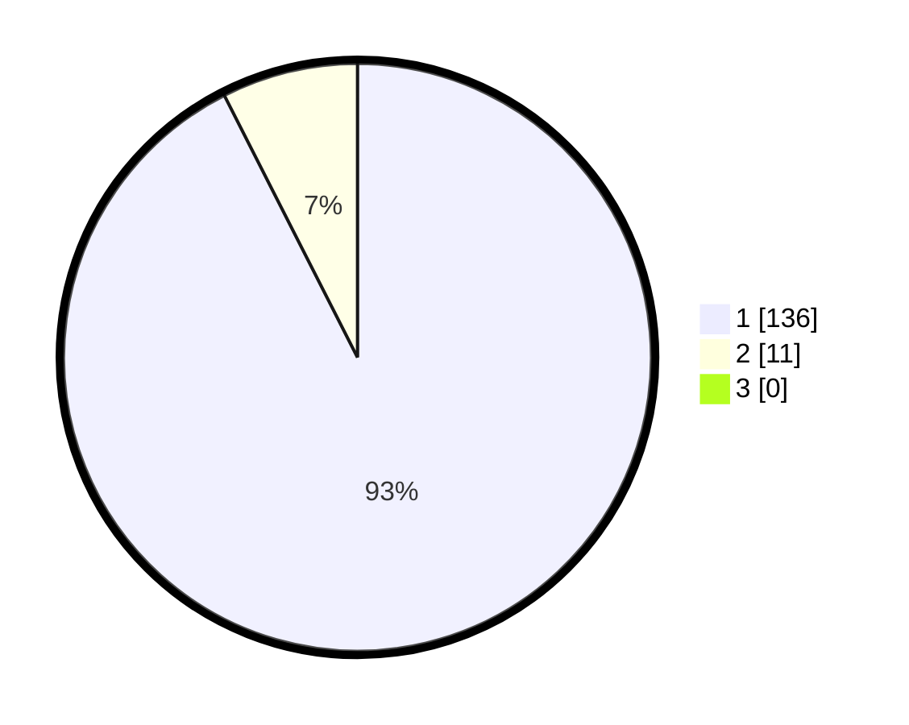

# Hasil

## Grafik

## Tabel

| No. | Nama Paslon    | Suara | Suara (raw) | Persentase |
|:--- |:-------------- | -----:| -----------:| ----------:|
| 1   | ANIES MUHAIMIN | 136   | [136][p-1]  | 92,52      |
| 2   | PRABOWO GIBRAN | 11    | [11][p-2]   | 7,48       |
| 3   | GANJAR MAHFUD  | 0     | [0][p-3]    | 0,00       |

[p-1]: https://github.com/gigit-pemilu/pemilu-2024/blob/main/pilpres/hitung-suara/sub/11-aceh/sub/03-aceh-timur/sub/07-peureulak/sub/2007-alue-dua-paya-gajah/sub/001-tps/sub/paslon-1.txt
[p-2]: https://github.com/gigit-pemilu/pemilu-2024/blob/main/pilpres/hitung-suara/sub/11-aceh/sub/03-aceh-timur/sub/07-peureulak/sub/2007-alue-dua-paya-gajah/sub/001-tps/sub/paslon-2.txt
[p-3]: https://github.com/gigit-pemilu/pemilu-2024/blob/main/pilpres/hitung-suara/sub/11-aceh/sub/03-aceh-timur/sub/07-peureulak/sub/2007-alue-dua-paya-gajah/sub/001-tps/sub/paslon-3.txt

## Foto C Plano

https://sirekap-obj-formc.kpu.go.id/bc8f/pemilu/ppwp/11/03/07/20/07/1103072007001-20240215-160016--7dc2d9c6-aac4-49e5-a3fe-b5e39e1821f3.jpg

https://sirekap-obj-formc.kpu.go.id/bc8f/pemilu/ppwp/11/03/07/20/07/1103072007001-20240215-153656--2bef36ba-f58f-43ef-8523-f4d5433d3d2d.jpg

## Metadata

| Key        | Value               |
| ---------- | ------------------- |
| Time Stamp | 2024-02-15 16:30:25 |

