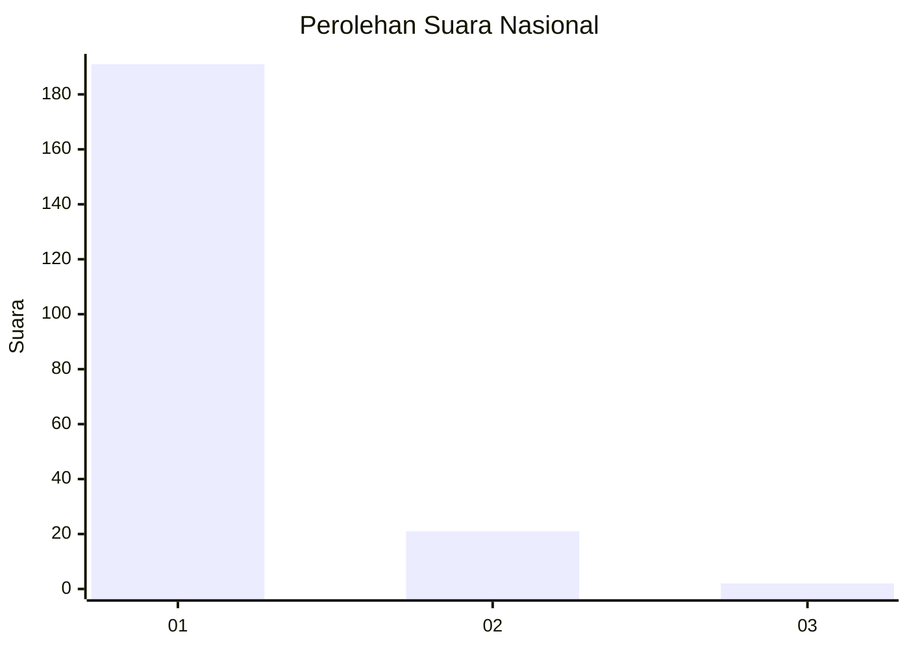
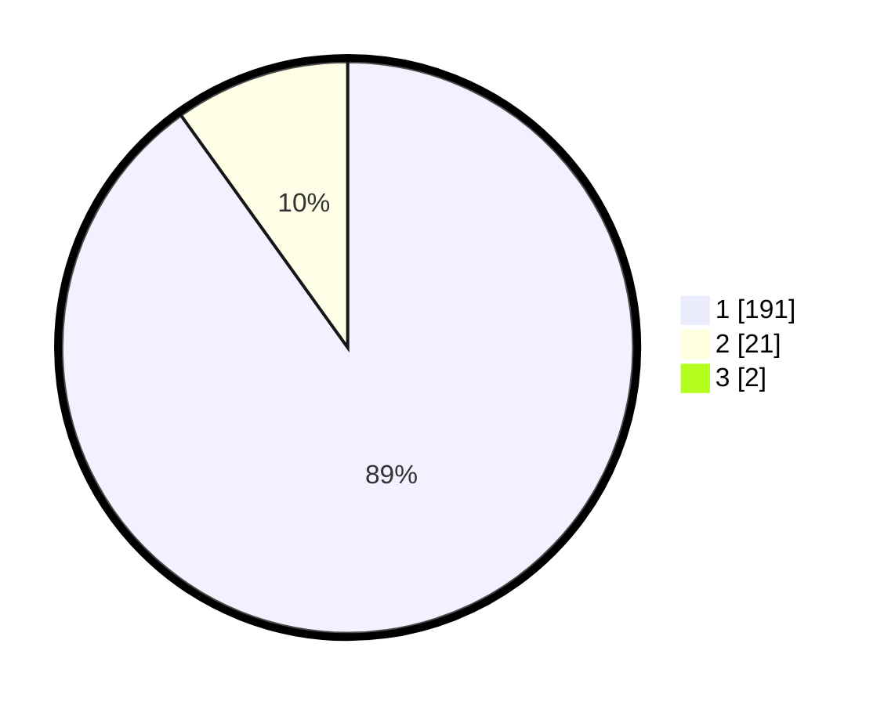

# Hasil

## Grafik

## Tabel

| No. | Nama Paslon    | Suara | Suara (raw) | Persentase |
|:--- |:-------------- | -----:| -----------:| ----------:|
| 1   | ANIES MUHAIMIN | 191   | [191][p-1]  | 89,25      |
| 2   | PRABOWO GIBRAN | 21    | [21][p-2]   | 9,81       |
| 3   | GANJAR MAHFUD  | 2     | [2][p-3]    | 0,93       |

[p-1]: https://github.com/gigit-pemilu/pemilu-2024/blob/main/pilpres/hitung-suara/sub/11-aceh/sub/03-aceh-timur/sub/07-peureulak/sub/2008-blang-bitra/sub/001-tps/sub/paslon-1.txt
[p-2]: https://github.com/gigit-pemilu/pemilu-2024/blob/main/pilpres/hitung-suara/sub/11-aceh/sub/03-aceh-timur/sub/07-peureulak/sub/2008-blang-bitra/sub/001-tps/sub/paslon-2.txt
[p-3]: https://github.com/gigit-pemilu/pemilu-2024/blob/main/pilpres/hitung-suara/sub/11-aceh/sub/03-aceh-timur/sub/07-peureulak/sub/2008-blang-bitra/sub/001-tps/sub/paslon-3.txt

## Foto C Plano

https://sirekap-obj-formc.kpu.go.id/92ef/pemilu/ppwp/11/03/07/20/08/1103072008001-20240215-114149--755c3239-fddf-4bf0-bc66-c477bb4d0877.jpg

https://sirekap-obj-formc.kpu.go.id/92ef/pemilu/ppwp/11/03/07/20/08/1103072008001-20240215-115357--18fc7db7-2f25-4cb9-8081-1281e75cdbb3.jpg

https://sirekap-obj-formc.kpu.go.id/92ef/pemilu/ppwp/11/03/07/20/08/1103072008001-20240215-022036--f9d543fc-1c94-4165-b05c-835dc9c014b8.jpg

## Metadata

| Key        | Value               |
| ---------- | ------------------- |
| Time Stamp | 2024-02-19 11:00:00 |

