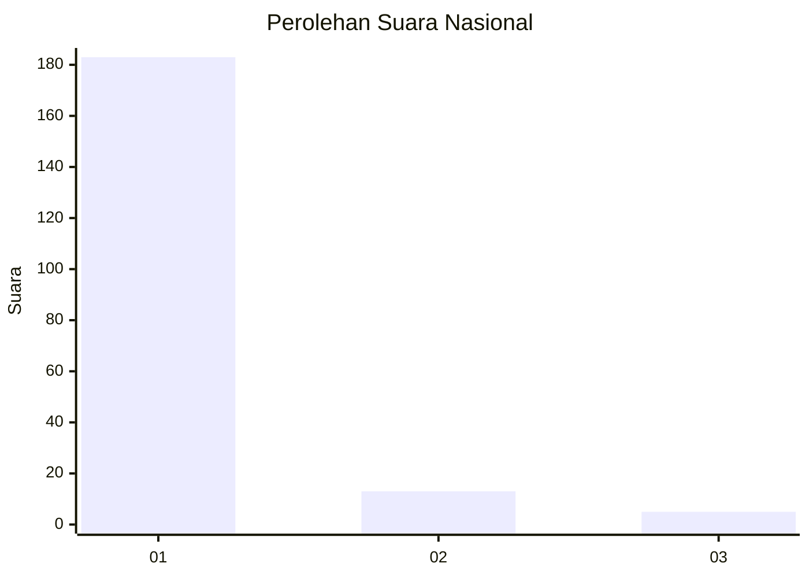
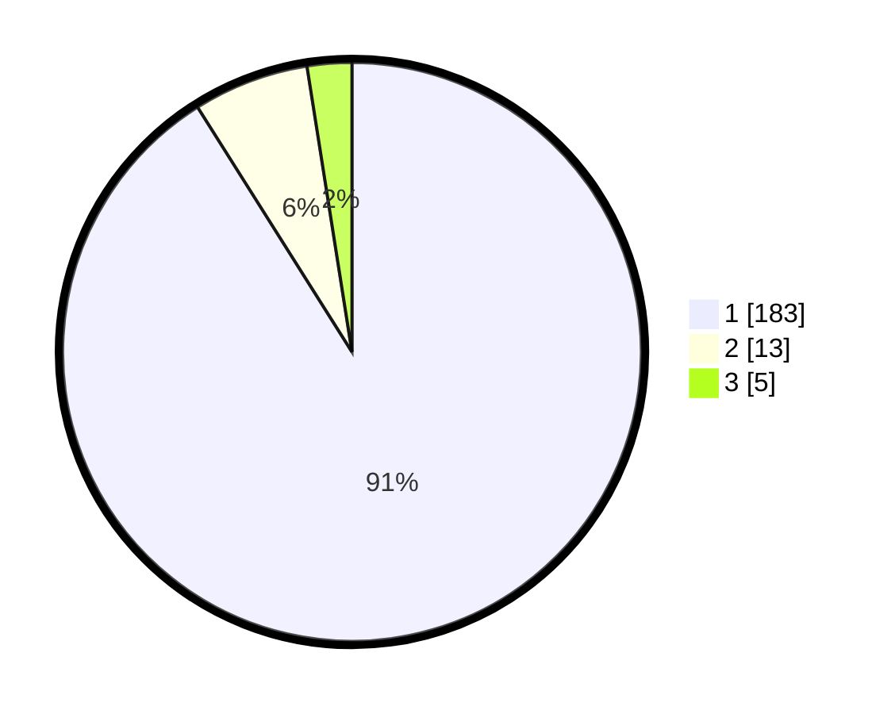

# Hasil

## Grafik

## Tabel

| No. | Nama Paslon    | Suara | Suara (raw) | Persentase |
|:--- |:-------------- | -----:| -----------:| ----------:|
| 1   | ANIES MUHAIMIN | 183   | [183][p-1]  | 91,04      |
| 2   | PRABOWO GIBRAN | 13    | [13][p-2]   | 6,47       |
| 3   | GANJAR MAHFUD  | 5     | [5][p-3]    | 2,49       |

[p-1]: https://github.com/gigit-pemilu/pemilu-2024/blob/main/pilpres/hitung-suara/sub/11-aceh/sub/03-aceh-timur/sub/07-peureulak/sub/2008-blang-bitra/sub/002-tps/sub/paslon-1.txt
[p-2]: https://github.com/gigit-pemilu/pemilu-2024/blob/main/pilpres/hitung-suara/sub/11-aceh/sub/03-aceh-timur/sub/07-peureulak/sub/2008-blang-bitra/sub/002-tps/sub/paslon-2.txt
[p-3]: https://github.com/gigit-pemilu/pemilu-2024/blob/main/pilpres/hitung-suara/sub/11-aceh/sub/03-aceh-timur/sub/07-peureulak/sub/2008-blang-bitra/sub/002-tps/sub/paslon-3.txt

## Foto C Plano

https://sirekap-obj-formc.kpu.go.id/7f74/pemilu/ppwp/11/03/07/20/08/1103072008002-20240214-205845--610a6089-6ce0-4ef4-a7b9-55f18654295d.jpg

https://sirekap-obj-formc.kpu.go.id/7f74/pemilu/ppwp/11/03/07/20/08/1103072008002-20240215-021521--c8fa89bd-b127-43de-8fc2-3eddfd62b3f6.jpg

https://sirekap-obj-formc.kpu.go.id/7f74/pemilu/ppwp/11/03/07/20/08/1103072008002-20240214-210152--8a8bbfc8-fb11-4562-a1ee-647a670f4973.jpg

## Metadata

| Key        | Value               |
| ---------- | ------------------- |
| Time Stamp | 2024-02-19 11:00:00 |

