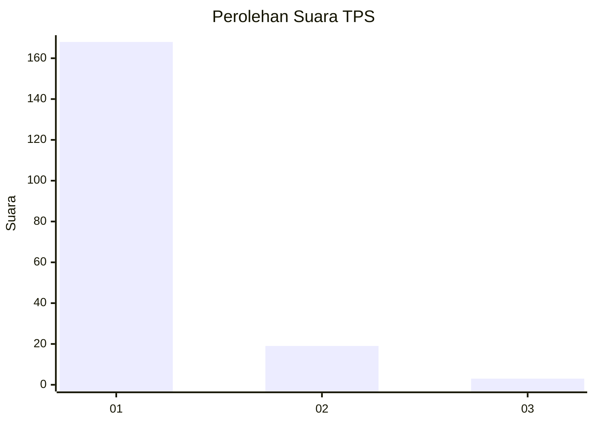
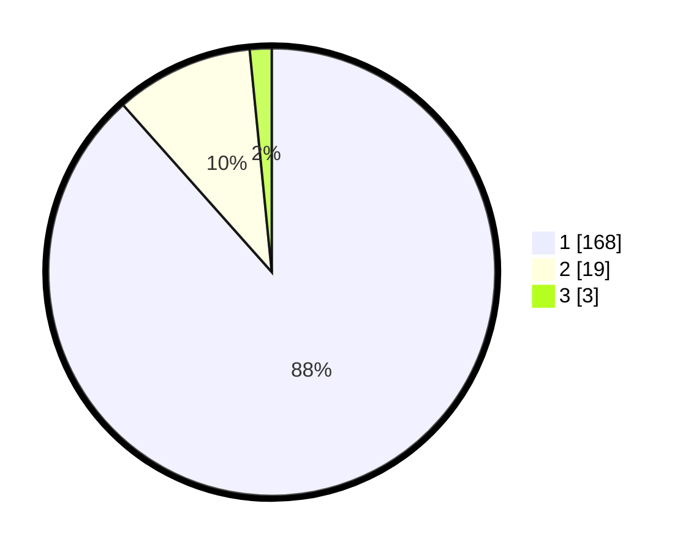

# Hasil

## Grafik

## Tabel

| No. | Nama Paslon    | Suara | Suara (raw) | Persentase |
|:--- |:-------------- | -----:| -----------:| ----------:|
| 1   | ANIES MUHAIMIN | 168   | [168][p-1]  | 88,42      |
| 2   | PRABOWO GIBRAN | 19    | [19][p-2]   | 10,00      |
| 3   | GANJAR MAHFUD  | 3     | [3][p-3]    | 1,58       |

[p-1]: https://github.com/gigit-pemilu/pemilu-2024-11-aceh/blob/main/pilpres/hitung-suara/sub/11-aceh/sub/03-aceh-timur/sub/07-peureulak/sub/2011-seumatang-muda-itam/sub/002-tps/sub/paslon-1.txt
[p-2]: https://github.com/gigit-pemilu/pemilu-2024-11-aceh/blob/main/pilpres/hitung-suara/sub/11-aceh/sub/03-aceh-timur/sub/07-peureulak/sub/2011-seumatang-muda-itam/sub/002-tps/sub/paslon-2.txt
[p-3]: https://github.com/gigit-pemilu/pemilu-2024-11-aceh/blob/main/pilpres/hitung-suara/sub/11-aceh/sub/03-aceh-timur/sub/07-peureulak/sub/2011-seumatang-muda-itam/sub/002-tps/sub/paslon-3.txt

## Foto C Plano

https://sirekap-obj-formc.kpu.go.id/f3f4/pemilu/ppwp/11/03/07/20/11/1103072011002-20240215-011609--25f6faae-4154-44ad-a184-6ec370e7ab5c.jpg

https://sirekap-obj-formc.kpu.go.id/f3f4/pemilu/ppwp/11/03/07/20/11/1103072011002-20240215-011704--f8bb99e6-00cd-4f30-8e19-7c3a2089de6d.jpg

https://sirekap-obj-formc.kpu.go.id/f3f4/pemilu/ppwp/11/03/07/20/11/1103072011002-20240215-011807--934dd117-7857-454d-ba8c-6283490c18e1.jpg

## Metadata

| Key        | Value               |
| ---------- | ------------------- |
| Time Stamp | 2024-02-19 14:00:00 |

