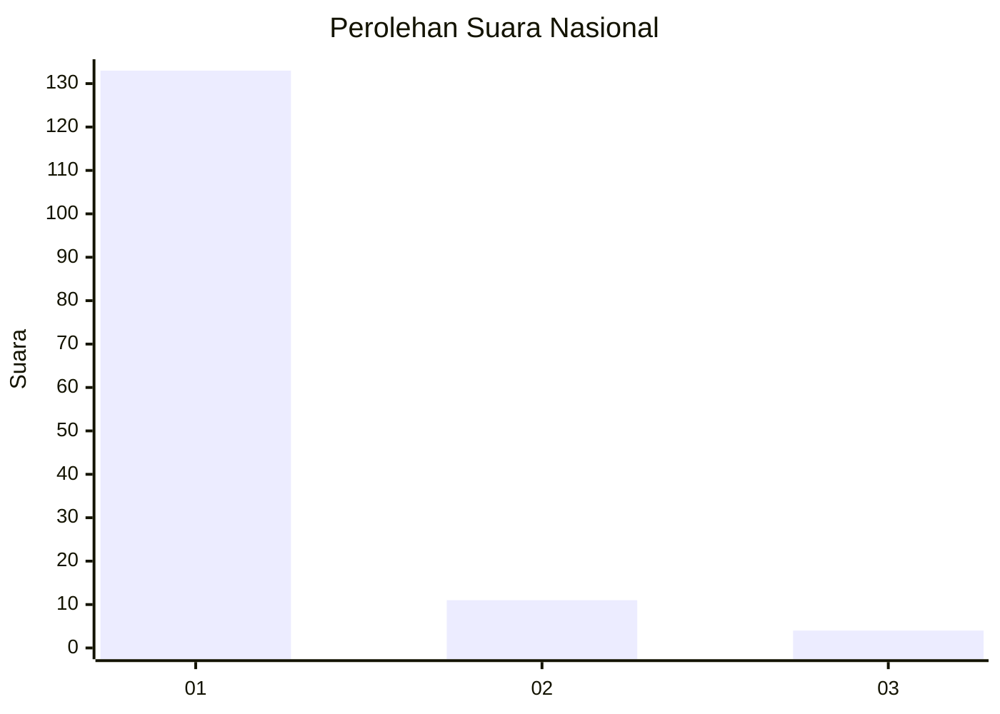
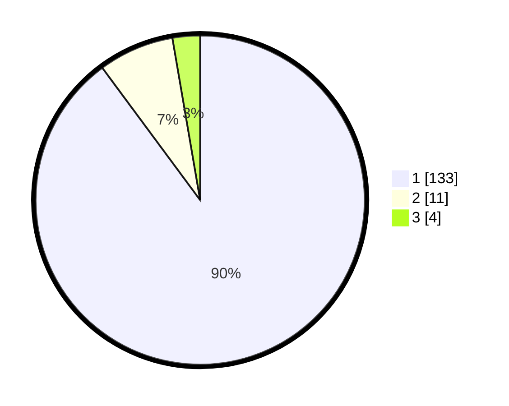

# Hasil

## Grafik

## Tabel

| No. | Nama Paslon    | Suara | Suara (raw) | Persentase |
|:--- |:-------------- | -----:| -----------:| ----------:|
| 1   | ANIES MUHAIMIN | 133   | [133][p-1]  | 89,86      |
| 2   | PRABOWO GIBRAN | 11    | [11][p-2]   | 7,43       |
| 3   | GANJAR MAHFUD  | 4     | [4][p-3]    | 2,70       |

[p-1]: https://github.com/gigit-pemilu/pemilu-2024/blob/main/pilpres/hitung-suara/sub/11-aceh/sub/03-aceh-timur/sub/07-peureulak/sub/2011-seumatang-muda-itam/sub/003-tps/sub/paslon-1.txt
[p-2]: https://github.com/gigit-pemilu/pemilu-2024/blob/main/pilpres/hitung-suara/sub/11-aceh/sub/03-aceh-timur/sub/07-peureulak/sub/2011-seumatang-muda-itam/sub/003-tps/sub/paslon-2.txt
[p-3]: https://github.com/gigit-pemilu/pemilu-2024/blob/main/pilpres/hitung-suara/sub/11-aceh/sub/03-aceh-timur/sub/07-peureulak/sub/2011-seumatang-muda-itam/sub/003-tps/sub/paslon-3.txt

## Foto C Plano

https://sirekap-obj-formc.kpu.go.id/f9ef/pemilu/ppwp/11/03/07/20/11/1103072011003-20240215-065838--7187897e-7f63-4ea4-a37c-45a49713e353.jpg

https://sirekap-obj-formc.kpu.go.id/f9ef/pemilu/ppwp/11/03/07/20/11/1103072011003-20240215-070142--1f70a534-fcfb-4f84-94d9-b1ca46733896.jpg

https://sirekap-obj-formc.kpu.go.id/f9ef/pemilu/ppwp/11/03/07/20/11/1103072011003-20240215-070308--d5c00b73-11c4-44dd-9b13-9085094b0385.jpg

## Metadata

| Key        | Value               |
| ---------- | ------------------- |
| Time Stamp | 2024-02-19 11:00:00 |

