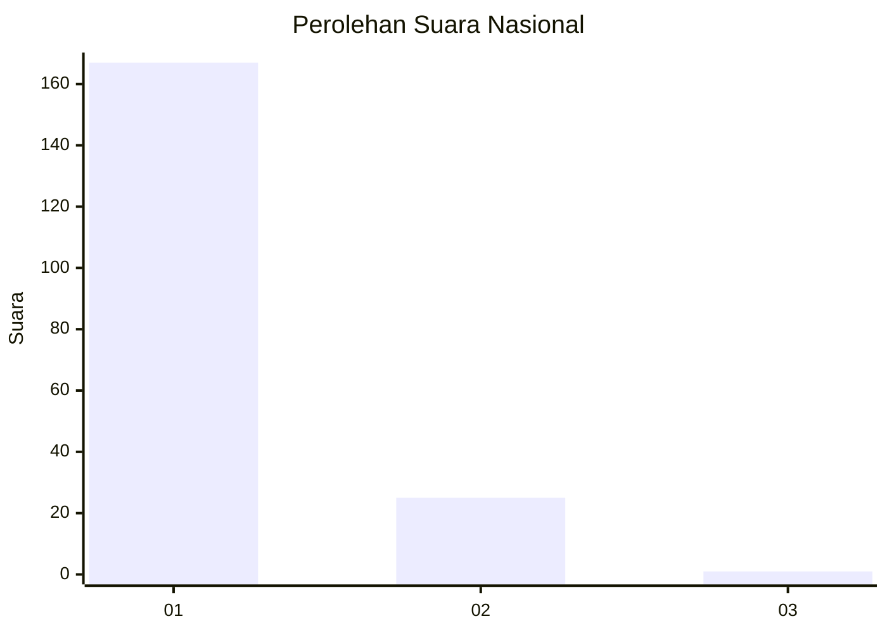
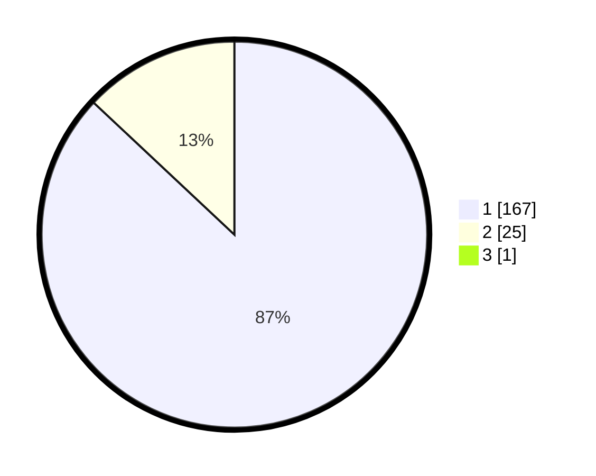

# Hasil

## Grafik

## Tabel

| No. | Nama Paslon    | Suara | Suara (raw) | Persentase |
|:--- |:-------------- | -----:| -----------:| ----------:|
| 1   | ANIES MUHAIMIN | 167   | [167][p-1]  | 86,53      |
| 2   | PRABOWO GIBRAN | 25    | [25][p-2]   | 12,95      |
| 3   | GANJAR MAHFUD  | 1     | [1][p-3]    | 0,52       |

[p-1]: https://github.com/gigit-pemilu/pemilu-2024/blob/main/pilpres/hitung-suara/sub/11-aceh/sub/03-aceh-timur/sub/07-peureulak/sub/2012-lhok-dalam/sub/002-tps/sub/paslon-1.txt
[p-2]: https://github.com/gigit-pemilu/pemilu-2024/blob/main/pilpres/hitung-suara/sub/11-aceh/sub/03-aceh-timur/sub/07-peureulak/sub/2012-lhok-dalam/sub/002-tps/sub/paslon-2.txt
[p-3]: https://github.com/gigit-pemilu/pemilu-2024/blob/main/pilpres/hitung-suara/sub/11-aceh/sub/03-aceh-timur/sub/07-peureulak/sub/2012-lhok-dalam/sub/002-tps/sub/paslon-3.txt

## Foto C Plano

https://sirekap-obj-formc.kpu.go.id/77a6/pemilu/ppwp/11/03/07/20/12/1103072012002-20240215-104120--9a12ddcf-59b3-4da3-9fab-3f7b752fa403.jpg

https://sirekap-obj-formc.kpu.go.id/77a6/pemilu/ppwp/11/03/07/20/12/1103072012002-20240215-000248--a49eabdc-d393-47bf-bf4b-e1ff99dc0d4c.jpg

https://sirekap-obj-formc.kpu.go.id/77a6/pemilu/ppwp/11/03/07/20/12/1103072012002-20240215-000417--ec5d315a-f61b-4eae-9a2f-0290a71edfdb.jpg

## Metadata

| Key        | Value               |
| ---------- | ------------------- |
| Time Stamp | 2024-02-19 14:00:00 |

