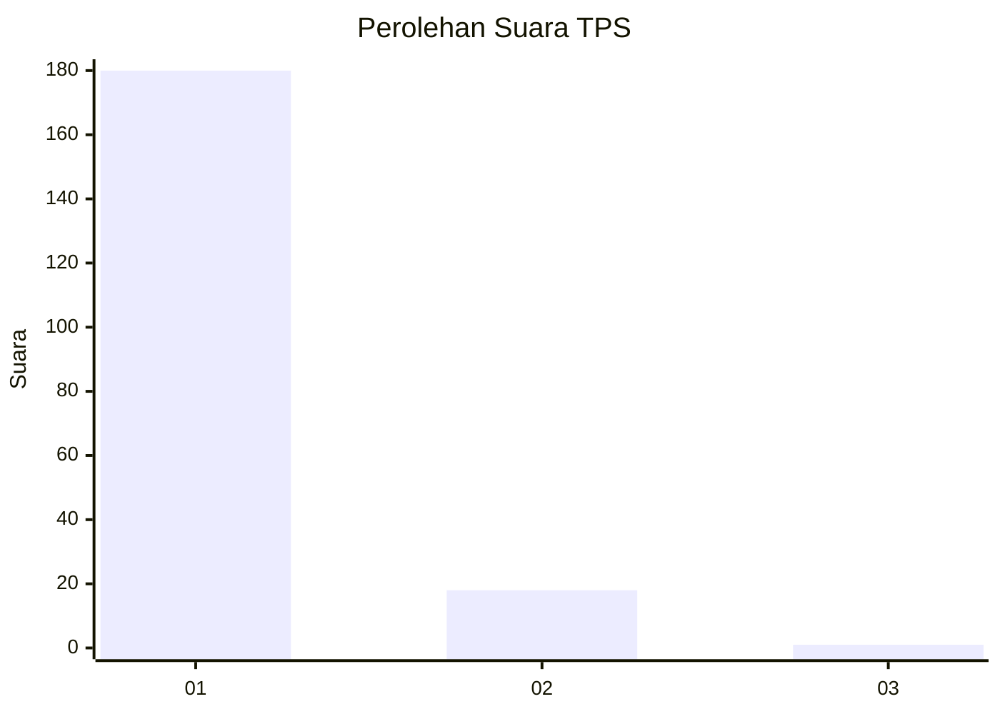
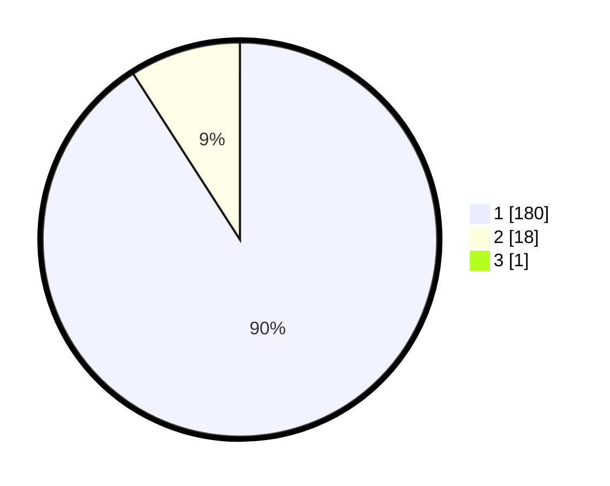

# Hasil

## Grafik

## Tabel

| No. | Nama Paslon    | Suara | Suara (raw) | Persentase |
|:--- |:-------------- | -----:| -----------:| ----------:|
| 1   | ANIES MUHAIMIN | 180   | [180][p-1]  | 90,45      |
| 2   | PRABOWO GIBRAN | 18    | [18][p-2]   | 9,05       |
| 3   | GANJAR MAHFUD  | 1     | [1][p-3]    | 0,50       |

[p-1]: https://github.com/gigit-pemilu/pemilu-2024-11-aceh/blob/main/pilpres/hitung-suara/sub/11-aceh/sub/03-aceh-timur/sub/07-peureulak/sub/2012-lhok-dalam/sub/003-tps/sub/paslon-1.txt
[p-2]: https://github.com/gigit-pemilu/pemilu-2024-11-aceh/blob/main/pilpres/hitung-suara/sub/11-aceh/sub/03-aceh-timur/sub/07-peureulak/sub/2012-lhok-dalam/sub/003-tps/sub/paslon-2.txt
[p-3]: https://github.com/gigit-pemilu/pemilu-2024-11-aceh/blob/main/pilpres/hitung-suara/sub/11-aceh/sub/03-aceh-timur/sub/07-peureulak/sub/2012-lhok-dalam/sub/003-tps/sub/paslon-3.txt

## Foto C Plano

https://sirekap-obj-formc.kpu.go.id/4f27/pemilu/ppwp/11/03/07/20/12/1103072012003-20240215-081101--6ac34105-5707-4e23-ad8c-ec53fc424dac.jpg

https://sirekap-obj-formc.kpu.go.id/4f27/pemilu/ppwp/11/03/07/20/12/1103072012003-20240215-081220--c36f6380-1e99-48d6-bc42-b84fdbde9cb8.jpg

https://sirekap-obj-formc.kpu.go.id/4f27/pemilu/ppwp/11/03/07/20/12/1103072012003-20240215-081343--e604c3a4-7d17-48b3-9fed-c388c35ceb4a.jpg

## Metadata

| Key        | Value               |
| ---------- | ------------------- |
| Time Stamp | 2024-02-19 14:00:00 |

