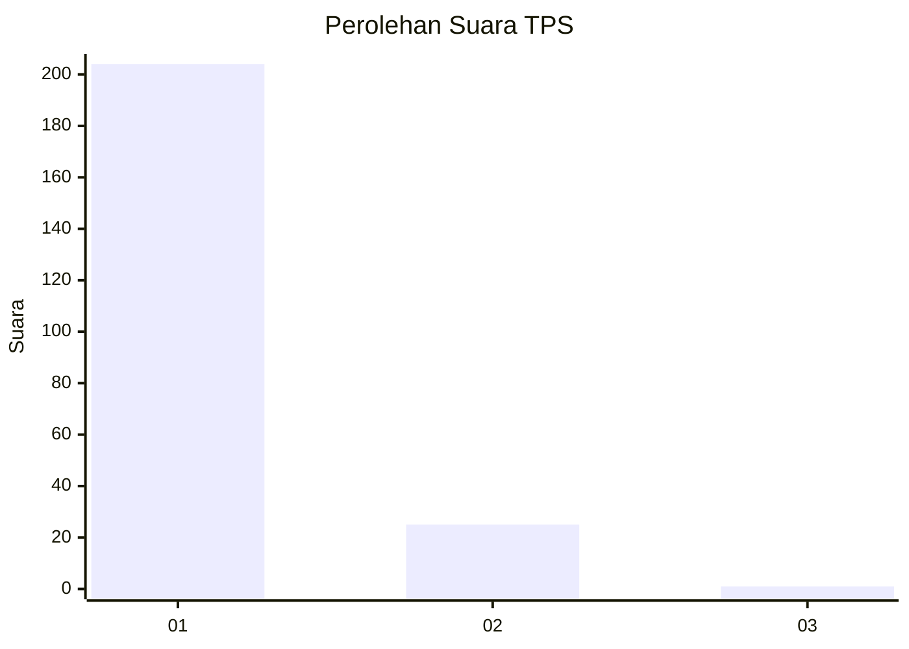
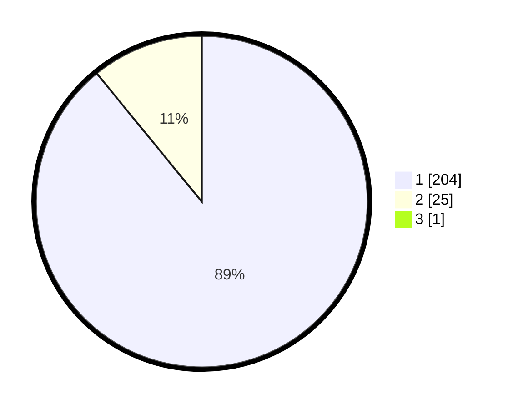

# Hasil

## Grafik

## Tabel

| No. | Nama Paslon    | Suara | Suara (raw) | Persentase |
|:--- |:-------------- | -----:| -----------:| ----------:|
| 1   | ANIES MUHAIMIN | 204   | [204][p-1]  | 88,70      |
| 2   | PRABOWO GIBRAN | 25    | [25][p-2]   | 10,87      |
| 3   | GANJAR MAHFUD  | 1     | [1][p-3]    | 0,43       |

[p-1]: https://github.com/gigit-pemilu/pemilu-2024-11-aceh/blob/main/pilpres/hitung-suara/sub/11-aceh/sub/03-aceh-timur/sub/07-peureulak/sub/2012-lhok-dalam/sub/004-tps/sub/paslon-1.txt
[p-2]: https://github.com/gigit-pemilu/pemilu-2024-11-aceh/blob/main/pilpres/hitung-suara/sub/11-aceh/sub/03-aceh-timur/sub/07-peureulak/sub/2012-lhok-dalam/sub/004-tps/sub/paslon-2.txt
[p-3]: https://github.com/gigit-pemilu/pemilu-2024-11-aceh/blob/main/pilpres/hitung-suara/sub/11-aceh/sub/03-aceh-timur/sub/07-peureulak/sub/2012-lhok-dalam/sub/004-tps/sub/paslon-3.txt

## Foto C Plano

https://sirekap-obj-formc.kpu.go.id/5d7f/pemilu/ppwp/11/03/07/20/12/1103072012004-20240215-053442--7ab46d3f-e56c-47cc-81df-eeb05693b509.jpg

https://sirekap-obj-formc.kpu.go.id/5d7f/pemilu/ppwp/11/03/07/20/12/1103072012004-20240215-053458--372a35b8-003c-4eb9-9de4-741f82d9c165.jpg

https://sirekap-obj-formc.kpu.go.id/5d7f/pemilu/ppwp/11/03/07/20/12/1103072012004-20240215-053519--05d7f6d5-0202-4923-b27b-106f36df60bf.jpg

## Metadata

| Key        | Value               |
| ---------- | ------------------- |
| Time Stamp | 2024-02-19 13:00:00 |

