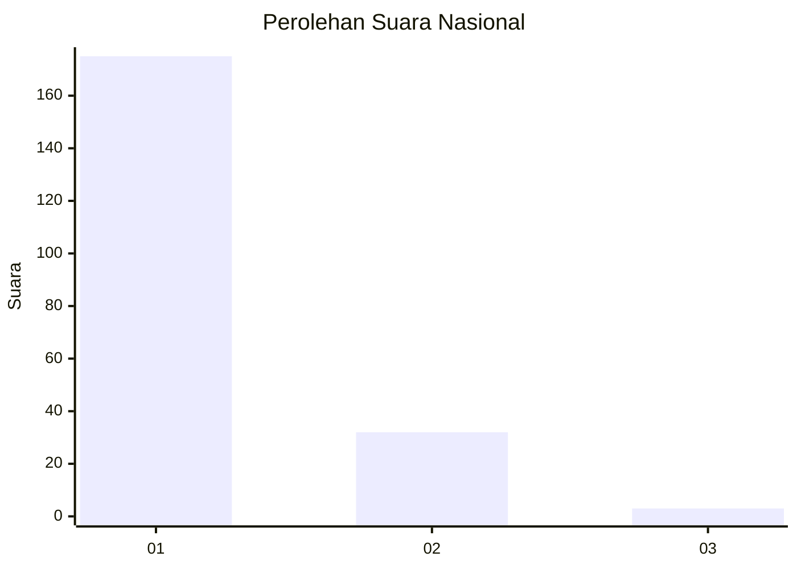
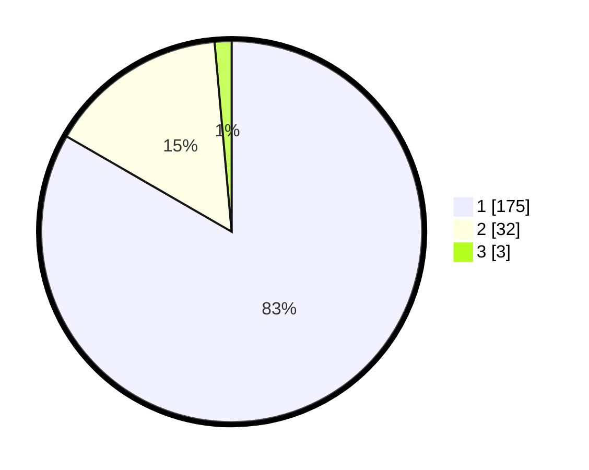

# Hasil

## Grafik

## Tabel

| No. | Nama Paslon    | Suara | Suara (raw) | Persentase |
|:--- |:-------------- | -----:| -----------:| ----------:|
| 1   | ANIES MUHAIMIN | 175   | [175][p-1]  | 83,33      |
| 2   | PRABOWO GIBRAN | 32    | [32][p-2]   | 15,24      |
| 3   | GANJAR MAHFUD  | 3     | [3][p-3]    | 1,43       |

[p-1]: https://github.com/gigit-pemilu/pemilu-2024/blob/main/pilpres/hitung-suara/sub/11-aceh/sub/03-aceh-timur/sub/07-peureulak/sub/2012-lhok-dalam/sub/005-tps/sub/paslon-1.txt
[p-2]: https://github.com/gigit-pemilu/pemilu-2024/blob/main/pilpres/hitung-suara/sub/11-aceh/sub/03-aceh-timur/sub/07-peureulak/sub/2012-lhok-dalam/sub/005-tps/sub/paslon-2.txt
[p-3]: https://github.com/gigit-pemilu/pemilu-2024/blob/main/pilpres/hitung-suara/sub/11-aceh/sub/03-aceh-timur/sub/07-peureulak/sub/2012-lhok-dalam/sub/005-tps/sub/paslon-3.txt

## Foto C Plano

https://sirekap-obj-formc.kpu.go.id/359f/pemilu/ppwp/11/03/07/20/12/1103072012005-20240215-093438--800f721e-5846-45a2-bcf7-aff966f97e4f.jpg

https://sirekap-obj-formc.kpu.go.id/359f/pemilu/ppwp/11/03/07/20/12/1103072012005-20240215-125154--39a4f581-9d7b-4df9-bcd9-027dc7b7af25.jpg

https://sirekap-obj-formc.kpu.go.id/359f/pemilu/ppwp/11/03/07/20/12/1103072012005-20240215-040011--33184443-37e9-4369-b249-f1a9a43fbec0.jpg

## Metadata

| Key        | Value               |
| ---------- | ------------------- |
| Time Stamp | 2024-02-19 13:00:00 |

