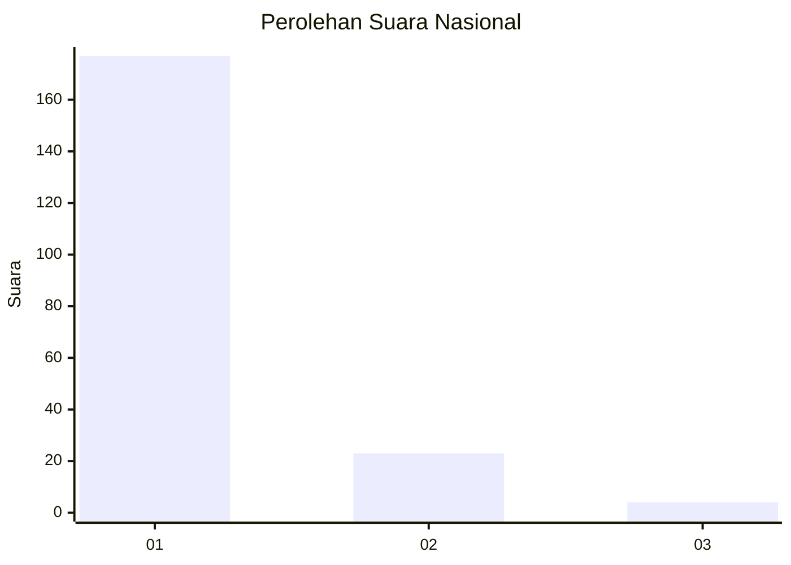
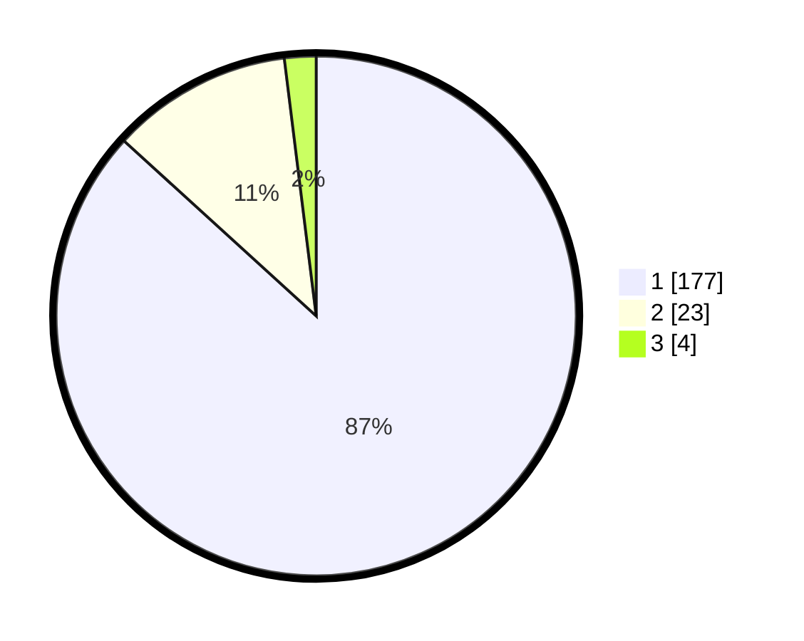

# Hasil

## Grafik

## Tabel

| No. | Nama Paslon    | Suara | Suara (raw) | Persentase |
|:--- |:-------------- | -----:| -----------:| ----------:|
| 1   | ANIES MUHAIMIN | 177   | [177][p-1]  | 86,76      |
| 2   | PRABOWO GIBRAN | 23    | [23][p-2]   | 11,27      |
| 3   | GANJAR MAHFUD  | 4     | [4][p-3]    | 1,96       |

[p-1]: https://github.com/gigit-pemilu/pemilu-2024/blob/main/pilpres/hitung-suara/sub/11-aceh/sub/03-aceh-timur/sub/07-peureulak/sub/2012-lhok-dalam/sub/006-tps/sub/paslon-1.txt
[p-2]: https://github.com/gigit-pemilu/pemilu-2024/blob/main/pilpres/hitung-suara/sub/11-aceh/sub/03-aceh-timur/sub/07-peureulak/sub/2012-lhok-dalam/sub/006-tps/sub/paslon-2.txt
[p-3]: https://github.com/gigit-pemilu/pemilu-2024/blob/main/pilpres/hitung-suara/sub/11-aceh/sub/03-aceh-timur/sub/07-peureulak/sub/2012-lhok-dalam/sub/006-tps/sub/paslon-3.txt

## Foto C Plano

https://sirekap-obj-formc.kpu.go.id/43e4/pemilu/ppwp/11/03/07/20/12/1103072012006-20240215-083732--93a6e10b-0084-4219-afc6-e76c5f9f4235.jpg

https://sirekap-obj-formc.kpu.go.id/43e4/pemilu/ppwp/11/03/07/20/12/1103072012006-20240215-083748--576d22f8-a9cf-4a8f-a5b5-2db80a131937.jpg

https://sirekap-obj-formc.kpu.go.id/43e4/pemilu/ppwp/11/03/07/20/12/1103072012006-20240215-083804--715107a7-d758-4533-bdd5-6af2d637fc67.jpg

## Metadata

| Key        | Value               |
| ---------- | ------------------- |
| Time Stamp | 2024-02-17 13:37:34 |

