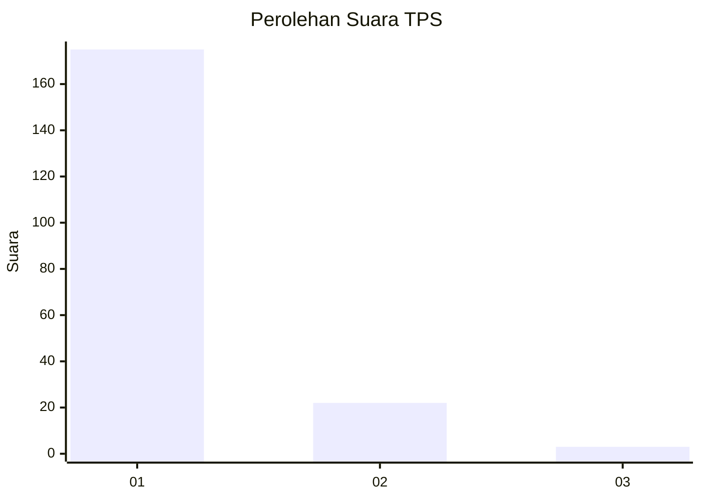
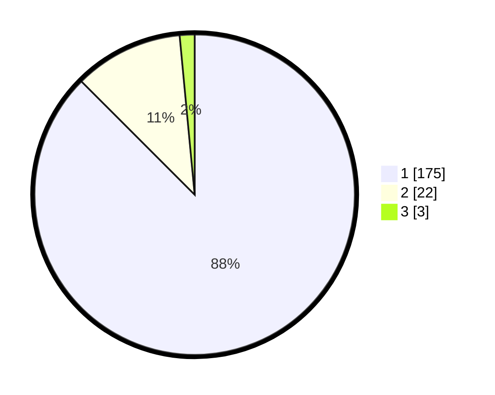

# Hasil

## Grafik

## Tabel

| No. | Nama Paslon    | Suara | Suara (raw) | Persentase |
|:--- |:-------------- | -----:| -----------:| ----------:|
| 1   | ANIES MUHAIMIN | 175   | [175][p-1]  | 87,50      |
| 2   | PRABOWO GIBRAN | 22    | [22][p-2]   | 11,00      |
| 3   | GANJAR MAHFUD  | 3     | [3][p-3]    | 1,50       |

[p-1]: https://github.com/gigit-pemilu/pemilu-2024-11-aceh/blob/main/pilpres/hitung-suara/sub/11-aceh/sub/03-aceh-timur/sub/07-peureulak/sub/2012-lhok-dalam/sub/007-tps/sub/paslon-1.txt
[p-2]: https://github.com/gigit-pemilu/pemilu-2024-11-aceh/blob/main/pilpres/hitung-suara/sub/11-aceh/sub/03-aceh-timur/sub/07-peureulak/sub/2012-lhok-dalam/sub/007-tps/sub/paslon-2.txt
[p-3]: https://github.com/gigit-pemilu/pemilu-2024-11-aceh/blob/main/pilpres/hitung-suara/sub/11-aceh/sub/03-aceh-timur/sub/07-peureulak/sub/2012-lhok-dalam/sub/007-tps/sub/paslon-3.txt

## Foto C Plano

https://sirekap-obj-formc.kpu.go.id/3625/pemilu/ppwp/11/03/07/20/12/1103072012007-20240214-190937--d49cfc04-295f-4970-8bd8-56efea198837.jpg

https://sirekap-obj-formc.kpu.go.id/3625/pemilu/ppwp/11/03/07/20/12/1103072012007-20240215-012655--882409ce-6809-4f2d-a073-895ea718221c.jpg

https://sirekap-obj-formc.kpu.go.id/3625/pemilu/ppwp/11/03/07/20/12/1103072012007-20240214-215147--102439b7-1d9a-449d-bb74-75d90e9d6711.jpg

## Metadata

| Key        | Value               |
| ---------- | ------------------- |
| Time Stamp | 2024-02-17 13:37:34 |

