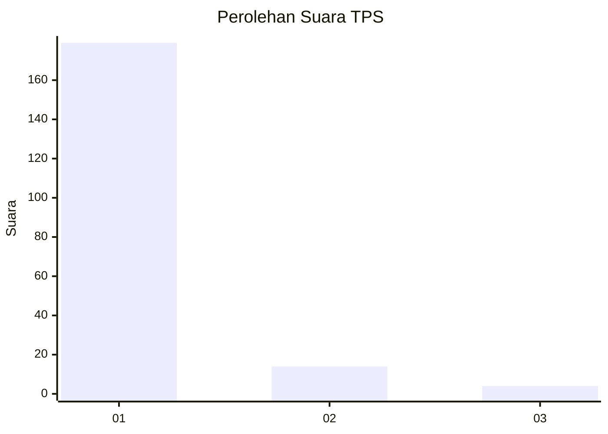
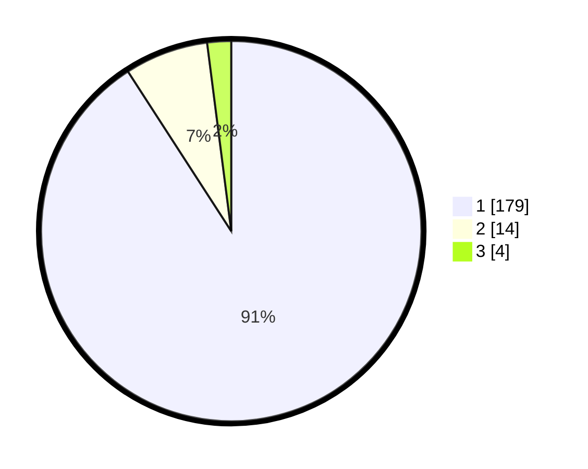

# Hasil

## Grafik

## Tabel

| No. | Nama Paslon    | Suara | Suara (raw) | Persentase |
|:--- |:-------------- | -----:| -----------:| ----------:|
| 1   | ANIES MUHAIMIN | 179   | [179][p-1]  | 90,86      |
| 2   | PRABOWO GIBRAN | 14    | [14][p-2]   | 7,11       |
| 3   | GANJAR MAHFUD  | 4     | [4][p-3]    | 2,03       |

[p-1]: https://github.com/gigit-pemilu/pemilu-2024-11-aceh/blob/main/pilpres/hitung-suara/sub/11-aceh/sub/03-aceh-timur/sub/07-peureulak/sub/2013-beusa-meuranoe/sub/001-tps/sub/paslon-1.txt
[p-2]: https://github.com/gigit-pemilu/pemilu-2024-11-aceh/blob/main/pilpres/hitung-suara/sub/11-aceh/sub/03-aceh-timur/sub/07-peureulak/sub/2013-beusa-meuranoe/sub/001-tps/sub/paslon-2.txt
[p-3]: https://github.com/gigit-pemilu/pemilu-2024-11-aceh/blob/main/pilpres/hitung-suara/sub/11-aceh/sub/03-aceh-timur/sub/07-peureulak/sub/2013-beusa-meuranoe/sub/001-tps/sub/paslon-3.txt

## Foto C Plano

https://sirekap-obj-formc.kpu.go.id/faca/pemilu/ppwp/11/03/07/20/13/1103072013001-20240214-190049--bca839bf-ac0a-4a4e-a00f-e6a7ab6a4ebb.jpg

https://sirekap-obj-formc.kpu.go.id/faca/pemilu/ppwp/11/03/07/20/13/1103072013001-20240215-055156--0f59a7ad-e2b5-4664-8867-f81655566f6a.jpg

https://sirekap-obj-formc.kpu.go.id/faca/pemilu/ppwp/11/03/07/20/13/1103072013001-20240214-202344--a0863c4e-c9f8-4fef-bff7-a43eed3c050b.jpg

## Metadata

| Key        | Value               |
| ---------- | ------------------- |
| Time Stamp | 2024-02-22 17:00:00 |

## DATA PEMILIH TETAP

Jumlah pemilih dalam DPT: **273**.
 * L: **136**.
 * P: **137**.

## DATA PENGGUNA HAK PILIH

Jumlah pengguna hak pilih dalam DPT: **195**.
 * L: **85**.
 * P: **110**.

Jumlah pengguna hak pilih dalam DPTb: **0**.
 * L: **0**.
 * P: **0**.

Jumlah pengguna hak pilih dalam DPK: **4**.
 * L: **2**.
 * P: **2**.

Jumlah pengguna hak pilih: **199**.
 * L: **87**.
 * P: **112**.

## JUMLAH SUARA SAH DAN TIDAK SAH

JUMLAH SELURUH SUARA SAH: **197**.

JUMLAH SUARA TIDAK SAH: **2**.

JUMLAH SELURUH SUARA SAH DAN SUARA TIDAK SAH: **199**.

