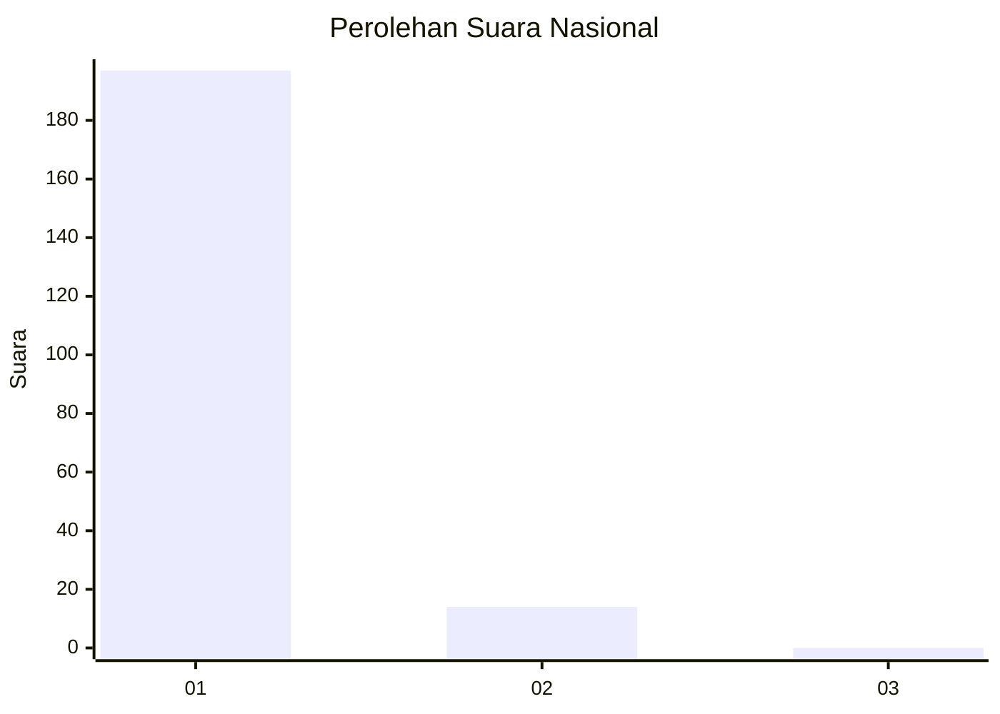
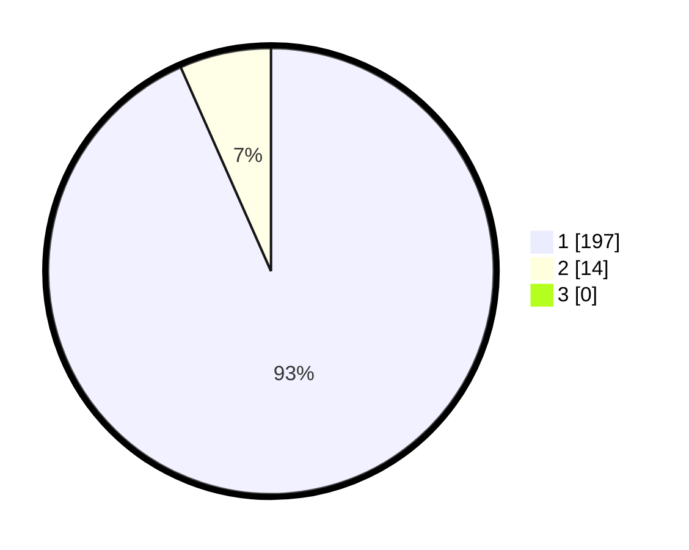

# Hasil

## Grafik

## Tabel

| No. | Nama Paslon    | Suara | Suara (raw) | Persentase |
|:--- |:-------------- | -----:| -----------:| ----------:|
| 1   | ANIES MUHAIMIN | 197   | [197][p-1]  | 93,36      |
| 2   | PRABOWO GIBRAN | 14    | [14][p-2]   | 6,64       |
| 3   | GANJAR MAHFUD  | 0     | [0][p-3]    | 0,00       |

[p-1]: https://github.com/gigit-pemilu/pemilu-2024/blob/main/pilpres/hitung-suara/sub/11-aceh/sub/03-aceh-timur/sub/07-peureulak/sub/2013-beusa-meuranoe/sub/002-tps/sub/paslon-1.txt
[p-2]: https://github.com/gigit-pemilu/pemilu-2024/blob/main/pilpres/hitung-suara/sub/11-aceh/sub/03-aceh-timur/sub/07-peureulak/sub/2013-beusa-meuranoe/sub/002-tps/sub/paslon-2.txt
[p-3]: https://github.com/gigit-pemilu/pemilu-2024/blob/main/pilpres/hitung-suara/sub/11-aceh/sub/03-aceh-timur/sub/07-peureulak/sub/2013-beusa-meuranoe/sub/002-tps/sub/paslon-3.txt

## Foto C Plano

https://sirekap-obj-formc.kpu.go.id/9998/pemilu/ppwp/11/03/07/20/13/1103072013002-20240215-035942--fa6b1ad9-36f2-4502-be20-3ab595b09de1.jpg

https://sirekap-obj-formc.kpu.go.id/9998/pemilu/ppwp/11/03/07/20/13/1103072013002-20240215-040158--f3cc714c-0b94-4077-9705-714fffda1930.jpg

https://sirekap-obj-formc.kpu.go.id/9998/pemilu/ppwp/11/03/07/20/13/1103072013002-20240215-040322--274602b3-70be-4f21-ae7f-af984a7ebb02.jpg

## Metadata

| Key        | Value               |
| ---------- | ------------------- |
| Time Stamp | 2024-02-19 13:00:00 |

