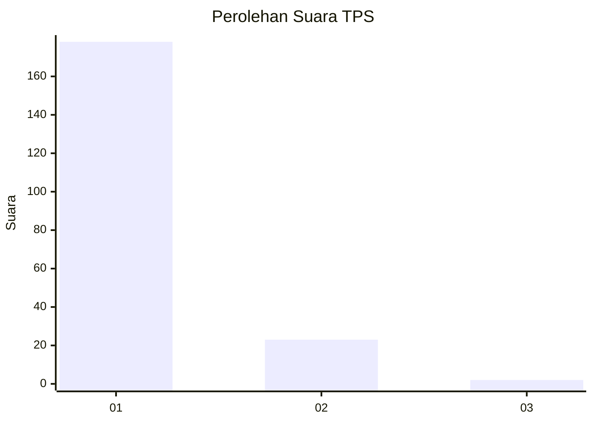
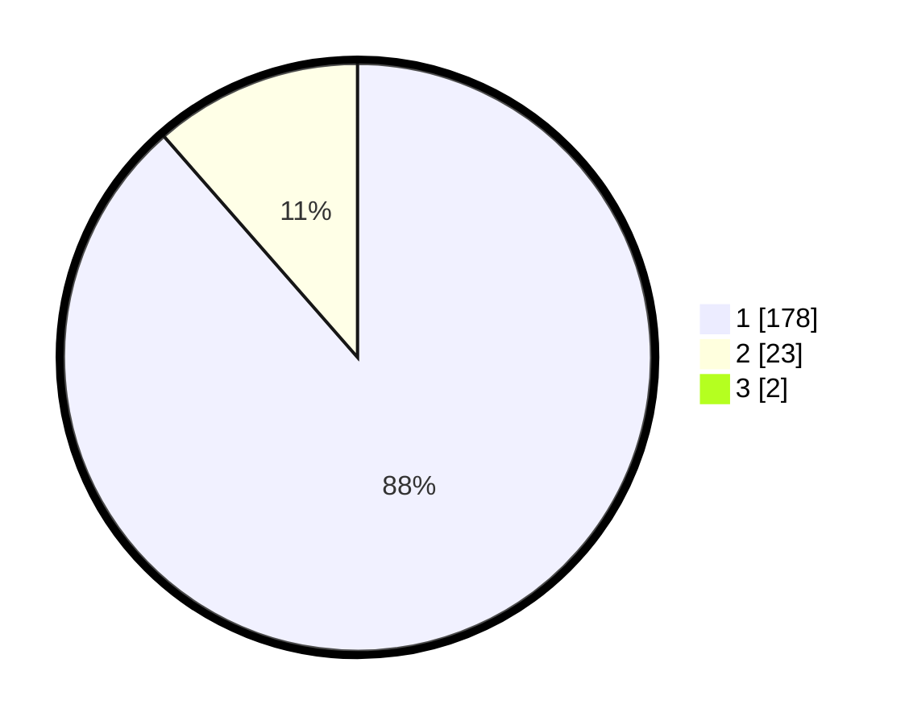

# Hasil

## Grafik

## Tabel

| No. | Nama Paslon    | Suara | Suara (raw) | Persentase |
|:--- |:-------------- | -----:| -----------:| ----------:|
| 1   | ANIES MUHAIMIN | 178   | [178][p-1]  | 87,68      |
| 2   | PRABOWO GIBRAN | 23    | [23][p-2]   | 11,33      |
| 3   | GANJAR MAHFUD  | 2     | [2][p-3]    | 0,99       |

[p-1]: https://github.com/gigit-pemilu/pemilu-2024-11-aceh/blob/main/pilpres/hitung-suara/sub/11-aceh/sub/03-aceh-timur/sub/07-peureulak/sub/2013-beusa-meuranoe/sub/003-tps/sub/paslon-1.txt
[p-2]: https://github.com/gigit-pemilu/pemilu-2024-11-aceh/blob/main/pilpres/hitung-suara/sub/11-aceh/sub/03-aceh-timur/sub/07-peureulak/sub/2013-beusa-meuranoe/sub/003-tps/sub/paslon-2.txt
[p-3]: https://github.com/gigit-pemilu/pemilu-2024-11-aceh/blob/main/pilpres/hitung-suara/sub/11-aceh/sub/03-aceh-timur/sub/07-peureulak/sub/2013-beusa-meuranoe/sub/003-tps/sub/paslon-3.txt

## Foto C Plano

https://sirekap-obj-formc.kpu.go.id/5544/pemilu/ppwp/11/03/07/20/13/1103072013003-20240215-075815--201fda0f-c172-41d8-879b-9f63b8b710f0.jpg

https://sirekap-obj-formc.kpu.go.id/5544/pemilu/ppwp/11/03/07/20/13/1103072013003-20240215-072810--1c03f24b-a097-45c9-a946-6ee6ad2a8294.jpg

https://sirekap-obj-formc.kpu.go.id/5544/pemilu/ppwp/11/03/07/20/13/1103072013003-20240215-073010--3c105b76-f895-46ac-894d-1478887dcef8.jpg

## Metadata

| Key        | Value               |
| ---------- | ------------------- |
| Time Stamp | 2024-02-19 13:00:00 |

