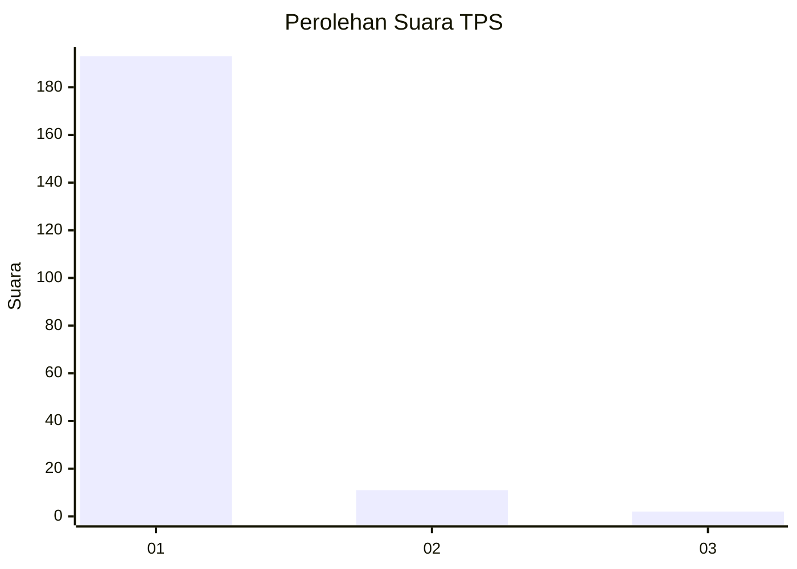
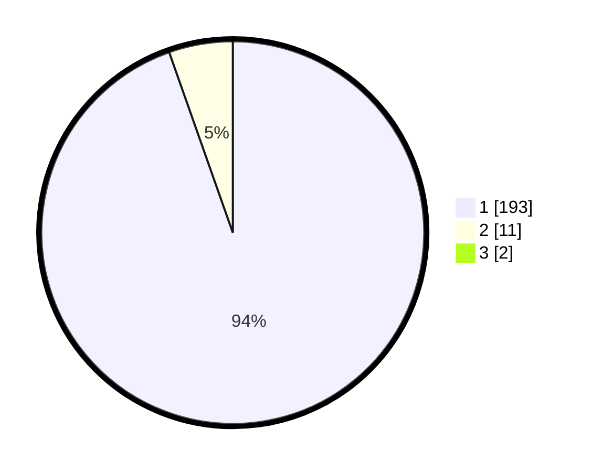

# Hasil

## Grafik

## Tabel

| No. | Nama Paslon    | Suara | Suara (raw) | Persentase |
|:--- |:-------------- | -----:| -----------:| ----------:|
| 1   | ANIES MUHAIMIN | 193   | [193][p-1]  | 93,69      |
| 2   | PRABOWO GIBRAN | 11    | [11][p-2]   | 5,34       |
| 3   | GANJAR MAHFUD  | 2     | [2][p-3]    | 0,97       |

[p-1]: https://github.com/gigit-pemilu/pemilu-2024-11-aceh/blob/main/pilpres/hitung-suara/sub/11-aceh/sub/03-aceh-timur/sub/07-peureulak/sub/2014-bangka-rimung/sub/001-tps/sub/paslon-1.txt
[p-2]: https://github.com/gigit-pemilu/pemilu-2024-11-aceh/blob/main/pilpres/hitung-suara/sub/11-aceh/sub/03-aceh-timur/sub/07-peureulak/sub/2014-bangka-rimung/sub/001-tps/sub/paslon-2.txt
[p-3]: https://github.com/gigit-pemilu/pemilu-2024-11-aceh/blob/main/pilpres/hitung-suara/sub/11-aceh/sub/03-aceh-timur/sub/07-peureulak/sub/2014-bangka-rimung/sub/001-tps/sub/paslon-3.txt

## Foto C Plano

https://sirekap-obj-formc.kpu.go.id/980e/pemilu/ppwp/11/03/07/20/14/1103072014001-20240215-071537--a6775d8f-99e1-4ca2-9268-da6350401505.jpg

https://sirekap-obj-formc.kpu.go.id/980e/pemilu/ppwp/11/03/07/20/14/1103072014001-20240215-065829--6236d568-d2df-430a-95a2-a99c08cf5056.jpg

https://sirekap-obj-formc.kpu.go.id/980e/pemilu/ppwp/11/03/07/20/14/1103072014001-20240215-070131--2c0a326c-994b-43ad-8bdc-1d0774367efc.jpg

## Metadata

| Key        | Value               |
| ---------- | ------------------- |
| Time Stamp | 2024-02-19 13:00:00 |

