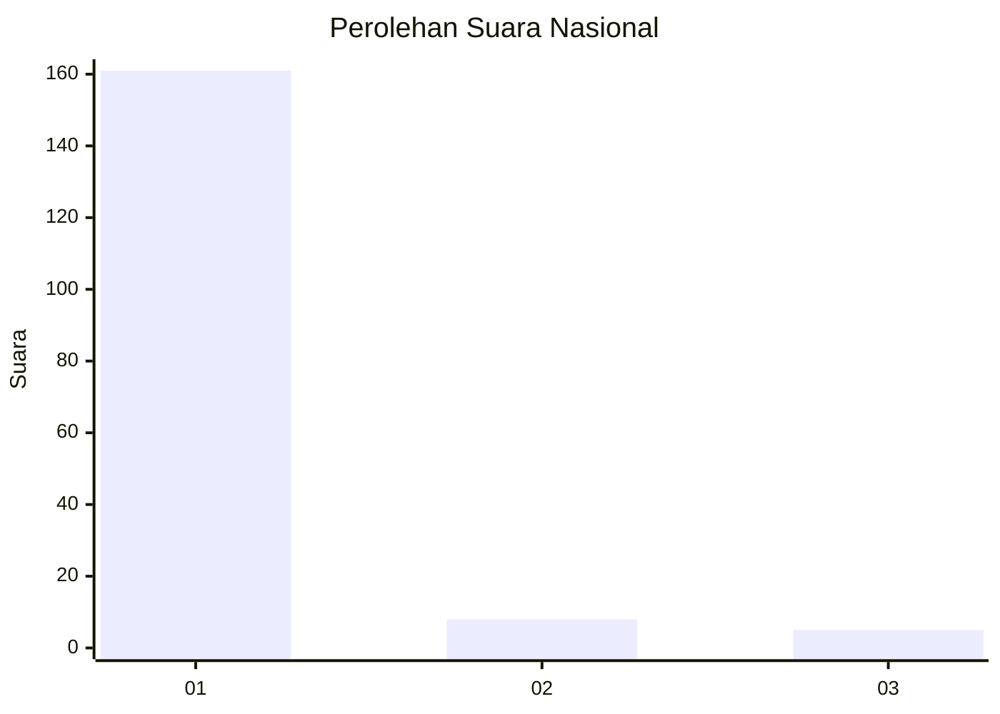
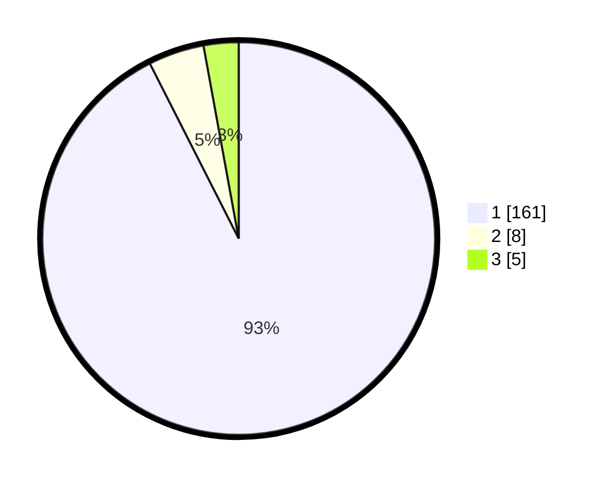

# Hasil

## Grafik

## Tabel

| No. | Nama Paslon    | Suara | Suara (raw) | Persentase |
|:--- |:-------------- | -----:| -----------:| ----------:|
| 1   | ANIES MUHAIMIN | 161   | [161][p-1]  | 92,53      |
| 2   | PRABOWO GIBRAN | 8     | [8][p-2]    | 4,60       |
| 3   | GANJAR MAHFUD  | 5     | [5][p-3]    | 2,87       |

[p-1]: https://github.com/gigit-pemilu/pemilu-2024/blob/main/pilpres/hitung-suara/sub/11-aceh/sub/03-aceh-timur/sub/07-peureulak/sub/2014-bangka-rimung/sub/003-tps/sub/paslon-1.txt
[p-2]: https://github.com/gigit-pemilu/pemilu-2024/blob/main/pilpres/hitung-suara/sub/11-aceh/sub/03-aceh-timur/sub/07-peureulak/sub/2014-bangka-rimung/sub/003-tps/sub/paslon-2.txt
[p-3]: https://github.com/gigit-pemilu/pemilu-2024/blob/main/pilpres/hitung-suara/sub/11-aceh/sub/03-aceh-timur/sub/07-peureulak/sub/2014-bangka-rimung/sub/003-tps/sub/paslon-3.txt

## Foto C Plano

https://sirekap-obj-formc.kpu.go.id/4e5c/pemilu/ppwp/11/03/07/20/14/1103072014003-20240214-222751--009be643-e989-45f8-bd8a-6af6d041c6c9.jpg

https://sirekap-obj-formc.kpu.go.id/4e5c/pemilu/ppwp/11/03/07/20/14/1103072014003-20240214-221900--d10d57dd-8911-4113-a221-fbe77c56cee8.jpg

https://sirekap-obj-formc.kpu.go.id/4e5c/pemilu/ppwp/11/03/07/20/14/1103072014003-20240215-075447--5f276775-0201-464f-9000-2abb7c12c5ed.jpg

## Metadata

| Key        | Value               |
| ---------- | ------------------- |
| Time Stamp | 2024-02-19 13:00:00 |

