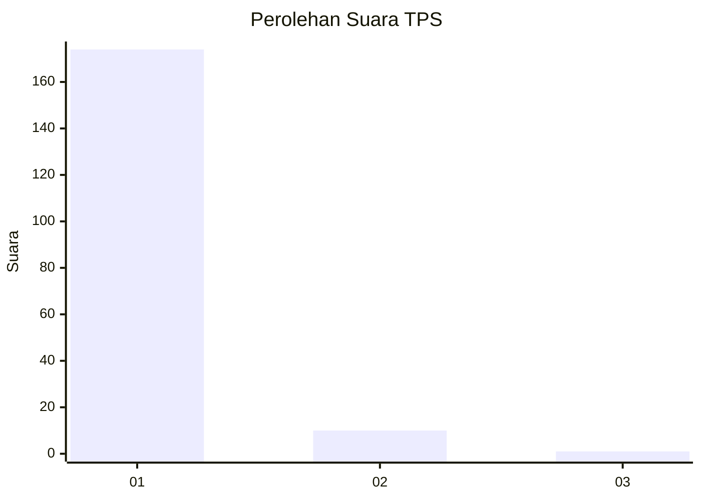
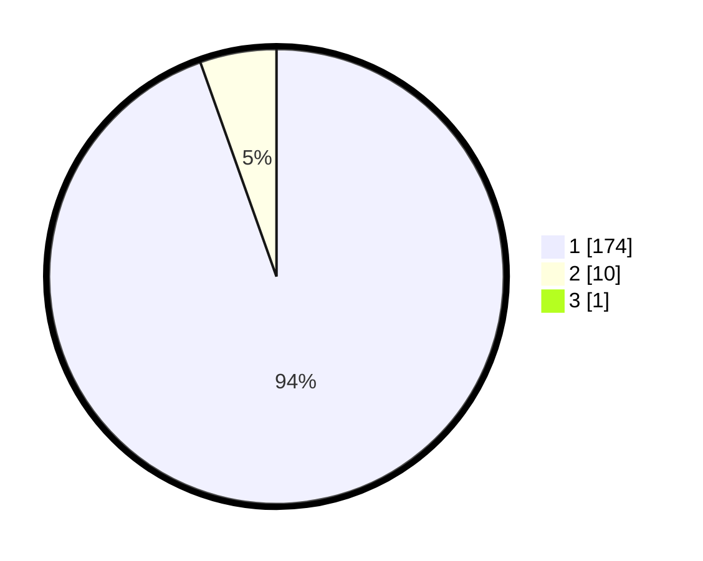

# Hasil

## Grafik

## Tabel

| No. | Nama Paslon    | Suara | Suara (raw) | Persentase |
|:--- |:-------------- | -----:| -----------:| ----------:|
| 1   | ANIES MUHAIMIN | 174   | [174][p-1]  | 94,05      |
| 2   | PRABOWO GIBRAN | 10    | [10][p-2]   | 5,41       |
| 3   | GANJAR MAHFUD  | 1     | [1][p-3]    | 0,54       |

[p-1]: https://github.com/gigit-pemilu/pemilu-2024-11-aceh/blob/main/pilpres/hitung-suara/sub/11-aceh/sub/03-aceh-timur/sub/07-peureulak/sub/2015-tanoh-rata/sub/001-tps/sub/paslon-1.txt
[p-2]: https://github.com/gigit-pemilu/pemilu-2024-11-aceh/blob/main/pilpres/hitung-suara/sub/11-aceh/sub/03-aceh-timur/sub/07-peureulak/sub/2015-tanoh-rata/sub/001-tps/sub/paslon-2.txt
[p-3]: https://github.com/gigit-pemilu/pemilu-2024-11-aceh/blob/main/pilpres/hitung-suara/sub/11-aceh/sub/03-aceh-timur/sub/07-peureulak/sub/2015-tanoh-rata/sub/001-tps/sub/paslon-3.txt

## Foto C Plano

https://sirekap-obj-formc.kpu.go.id/1284/pemilu/ppwp/11/03/07/20/15/1103072015001-20240215-091439--e3c75905-0d94-4933-8d76-bed6319f1b6a.jpg

https://sirekap-obj-formc.kpu.go.id/1284/pemilu/ppwp/11/03/07/20/15/1103072015001-20240215-091546--94bed6ce-08fb-4f82-bf0a-df3192577d5c.jpg

https://sirekap-obj-formc.kpu.go.id/1284/pemilu/ppwp/11/03/07/20/15/1103072015001-20240215-091802--fe210edd-ba03-4bec-a1d1-86efcc852f48.jpg

## Metadata

| Key        | Value               |
| ---------- | ------------------- |
| Time Stamp | 2024-02-19 13:00:00 |

