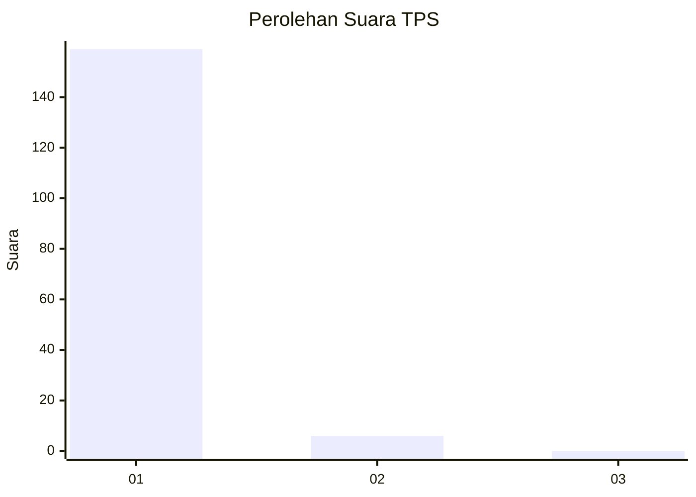
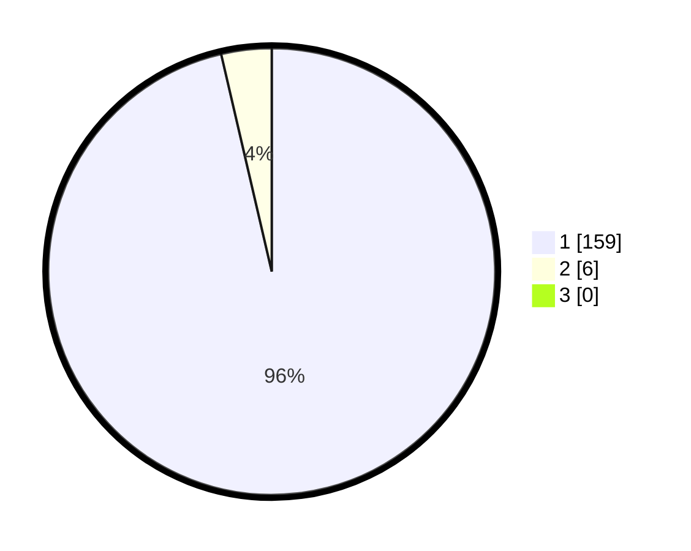

# Hasil

## Grafik

## Tabel

| No. | Nama Paslon    | Suara | Suara (raw) | Persentase |
|:--- |:-------------- | -----:| -----------:| ----------:|
| 1   | ANIES MUHAIMIN | 159   | [159][p-1]  | 96,36      |
| 2   | PRABOWO GIBRAN | 6     | [6][p-2]    | 3,64       |
| 3   | GANJAR MAHFUD  | 0     | [0][p-3]    | 0,00       |

[p-1]: https://github.com/gigit-pemilu/pemilu-2024-11-aceh/blob/main/pilpres/hitung-suara/sub/11-aceh/sub/03-aceh-timur/sub/07-peureulak/sub/2015-tanoh-rata/sub/002-tps/sub/paslon-1.txt
[p-2]: https://github.com/gigit-pemilu/pemilu-2024-11-aceh/blob/main/pilpres/hitung-suara/sub/11-aceh/sub/03-aceh-timur/sub/07-peureulak/sub/2015-tanoh-rata/sub/002-tps/sub/paslon-2.txt
[p-3]: https://github.com/gigit-pemilu/pemilu-2024-11-aceh/blob/main/pilpres/hitung-suara/sub/11-aceh/sub/03-aceh-timur/sub/07-peureulak/sub/2015-tanoh-rata/sub/002-tps/sub/paslon-3.txt

## Foto C Plano

https://sirekap-obj-formc.kpu.go.id/0c12/pemilu/ppwp/11/03/07/20/15/1103072015002-20240215-091131--eaf5350c-ce7a-4861-bec4-28166d9b1471.jpg

https://sirekap-obj-formc.kpu.go.id/0c12/pemilu/ppwp/11/03/07/20/15/1103072015002-20240215-091339--25b4b3f1-c3a1-4f2c-b09a-9b448d1f0817.jpg

https://sirekap-obj-formc.kpu.go.id/0c12/pemilu/ppwp/11/03/07/20/15/1103072015002-20240215-091550--7e7ec3e2-15ec-40f1-bcc5-fa89636545d9.jpg

## Metadata

| Key        | Value               |
| ---------- | ------------------- |
| Time Stamp | 2024-02-19 13:00:00 |

