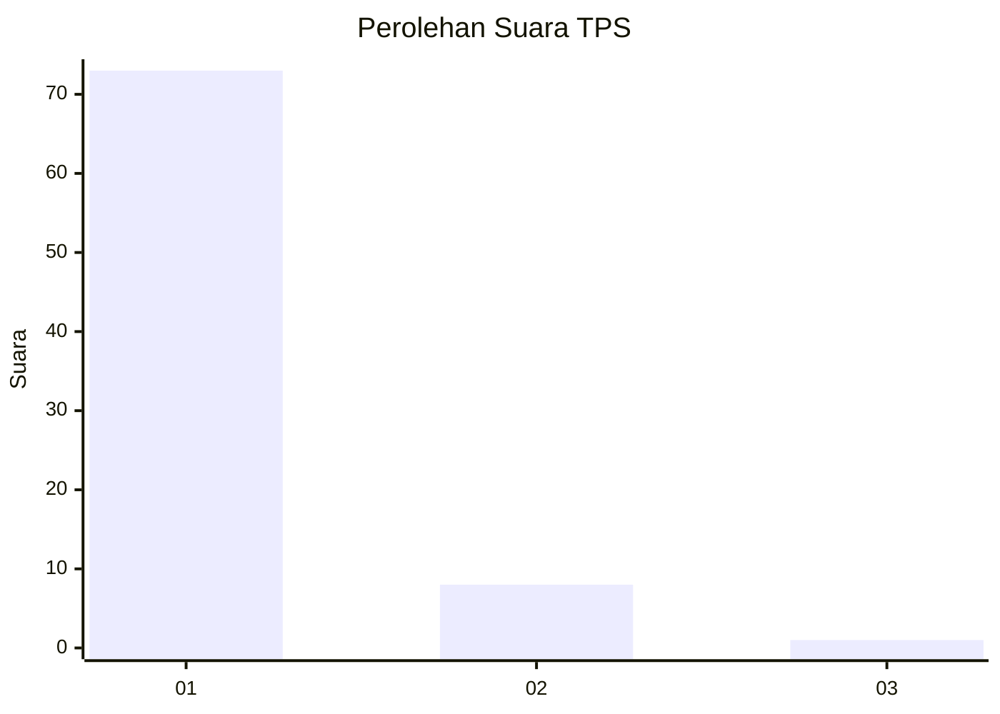
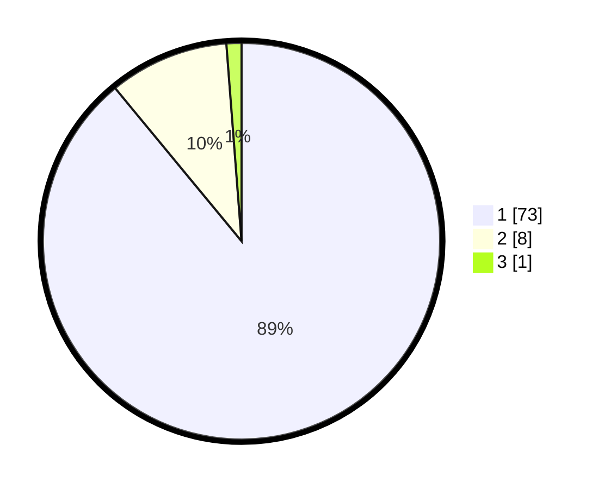

# Hasil

## Grafik

## Tabel

| No. | Nama Paslon    | Suara | Suara (raw) | Persentase |
|:--- |:-------------- | -----:| -----------:| ----------:|
| 1   | ANIES MUHAIMIN | 73    | [73][p-1]   | 89,02      |
| 2   | PRABOWO GIBRAN | 8     | [8][p-2]    | 9,76       |
| 3   | GANJAR MAHFUD  | 1     | [1][p-3]    | 1,22       |

[p-1]: https://github.com/gigit-pemilu/pemilu-2024-11-aceh/blob/main/pilpres/hitung-suara/sub/11-aceh/sub/03-aceh-timur/sub/07-peureulak/sub/2016-bandrong/sub/003-tps/sub/paslon-1.txt
[p-2]: https://github.com/gigit-pemilu/pemilu-2024-11-aceh/blob/main/pilpres/hitung-suara/sub/11-aceh/sub/03-aceh-timur/sub/07-peureulak/sub/2016-bandrong/sub/003-tps/sub/paslon-2.txt
[p-3]: https://github.com/gigit-pemilu/pemilu-2024-11-aceh/blob/main/pilpres/hitung-suara/sub/11-aceh/sub/03-aceh-timur/sub/07-peureulak/sub/2016-bandrong/sub/003-tps/sub/paslon-3.txt

## Foto C Plano

https://sirekap-obj-formc.kpu.go.id/7bb2/pemilu/ppwp/11/03/07/20/16/1103072016003-20240216-163852--d9a66ad3-d165-4a35-b839-a44085e86450.jpg

https://sirekap-obj-formc.kpu.go.id/7bb2/pemilu/ppwp/11/03/07/20/16/1103072016003-20240216-163853--565b2d64-a4e6-4c48-b639-713e18aaff79.jpg

https://sirekap-obj-formc.kpu.go.id/7bb2/pemilu/ppwp/11/03/07/20/16/1103072016003-20240216-163852--0a625bed-1a91-40b0-8547-0ad1d92edf3a.jpg

## Metadata

| Key        | Value               |
| ---------- | ------------------- |
| Time Stamp | 2024-02-17 13:37:34 |

## DATA PEMILIH TETAP

Jumlah pemilih dalam DPT: **102**.
 * L: **49**.
 * P: **53**.

## DATA PENGGUNA HAK PILIH

Jumlah pengguna hak pilih dalam DPT: **78**.
 * L: **37**.
 * P: **41**.

Jumlah pengguna hak pilih dalam DPTb: **0**.
 * L: **0**.
 * P: **0**.

Jumlah pengguna hak pilih dalam DPK: **4**.
 * L: **2**.
 * P: **2**.

Jumlah pengguna hak pilih: **82**.
 * L: **39**.
 * P: **43**.

## JUMLAH SUARA SAH DAN TIDAK SAH

JUMLAH SELURUH SUARA SAH: **82**.

JUMLAH SUARA TIDAK SAH: **0**.

JUMLAH SELURUH SUARA SAH DAN SUARA TIDAK SAH: **82**.

