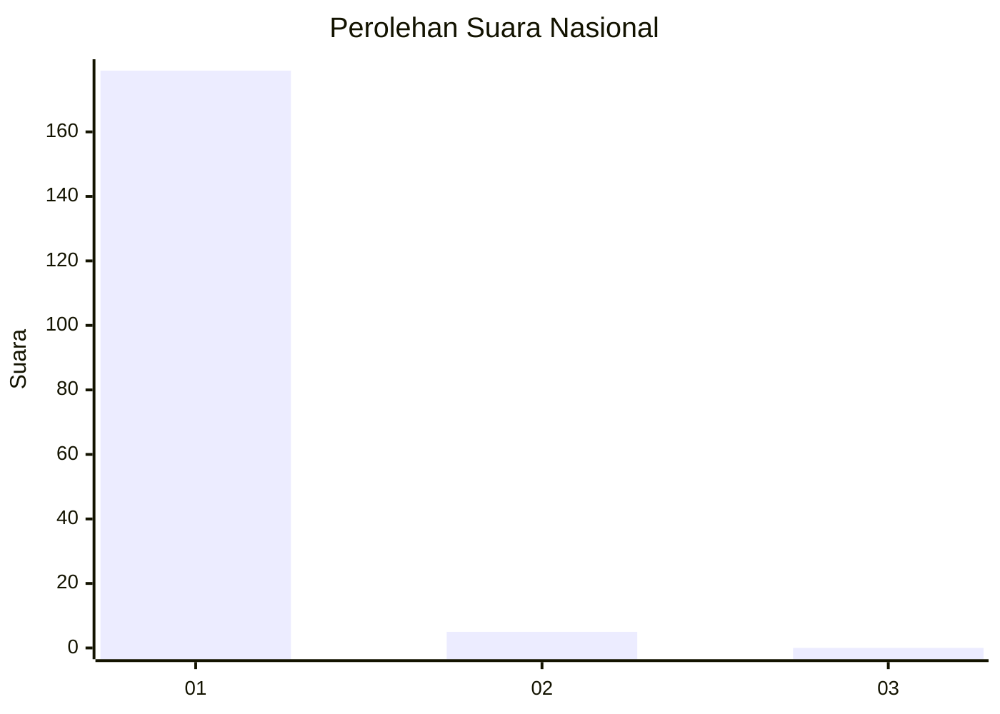
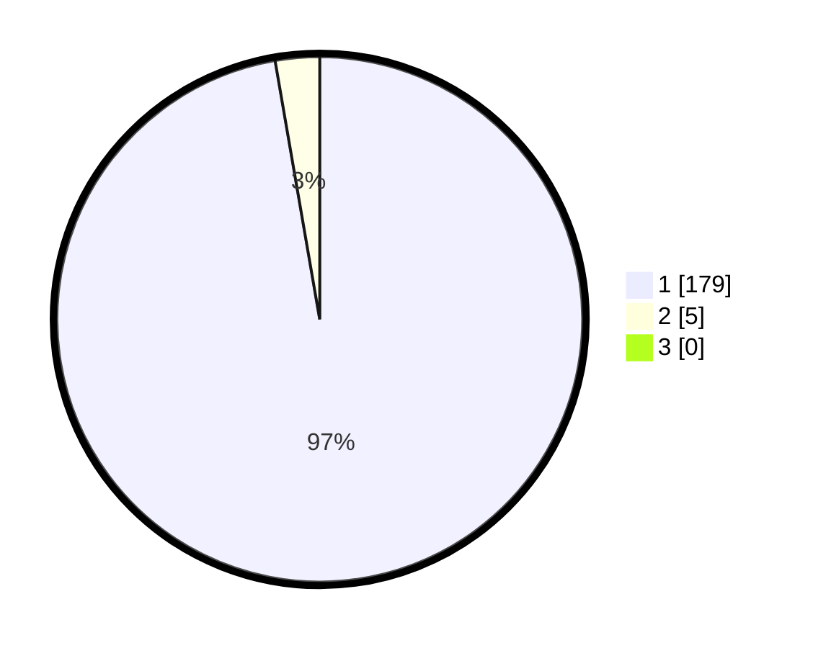

# Hasil

## Grafik

## Tabel

| No. | Nama Paslon    | Suara | Suara (raw) | Persentase |
|:--- |:-------------- | -----:| -----------:| ----------:|
| 1   | ANIES MUHAIMIN | 179   | [179][p-1]  | 97,28      |
| 2   | PRABOWO GIBRAN | 5     | [5][p-2]    | 2,72       |
| 3   | GANJAR MAHFUD  | 0     | [0][p-3]    | 0,00       |

[p-1]: https://github.com/gigit-pemilu/pemilu-2024/blob/main/pilpres/hitung-suara/sub/11-aceh/sub/03-aceh-timur/sub/07-peureulak/sub/2020-kuala-leuge/sub/001-tps/sub/paslon-1.txt
[p-2]: https://github.com/gigit-pemilu/pemilu-2024/blob/main/pilpres/hitung-suara/sub/11-aceh/sub/03-aceh-timur/sub/07-peureulak/sub/2020-kuala-leuge/sub/001-tps/sub/paslon-2.txt
[p-3]: https://github.com/gigit-pemilu/pemilu-2024/blob/main/pilpres/hitung-suara/sub/11-aceh/sub/03-aceh-timur/sub/07-peureulak/sub/2020-kuala-leuge/sub/001-tps/sub/paslon-3.txt

## Foto C Plano

https://sirekap-obj-formc.kpu.go.id/827b/pemilu/ppwp/11/03/07/20/20/1103072020001-20240215-185441--0caa3e05-051e-4ff8-aed1-af5a17df9e9c.jpg

https://sirekap-obj-formc.kpu.go.id/827b/pemilu/ppwp/11/03/07/20/20/1103072020001-20240215-185454--2eaca29d-17bb-4137-ac0d-7f5577450cae.jpg

https://sirekap-obj-formc.kpu.go.id/827b/pemilu/ppwp/11/03/07/20/20/1103072020001-20240215-185508--89e0d978-b8b9-4e35-9c03-3aced7942a27.jpg

## Metadata

| Key        | Value               |
| ---------- | ------------------- |
| Time Stamp | 2024-02-22 17:00:00 |

