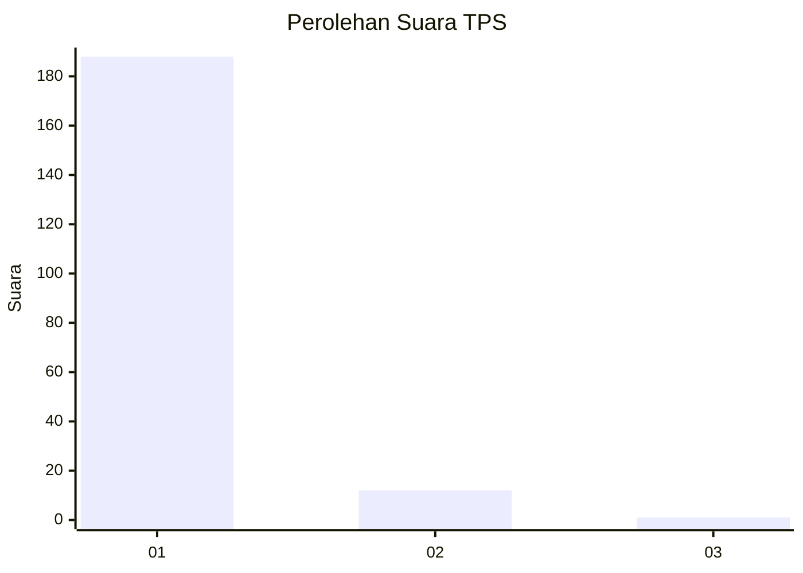
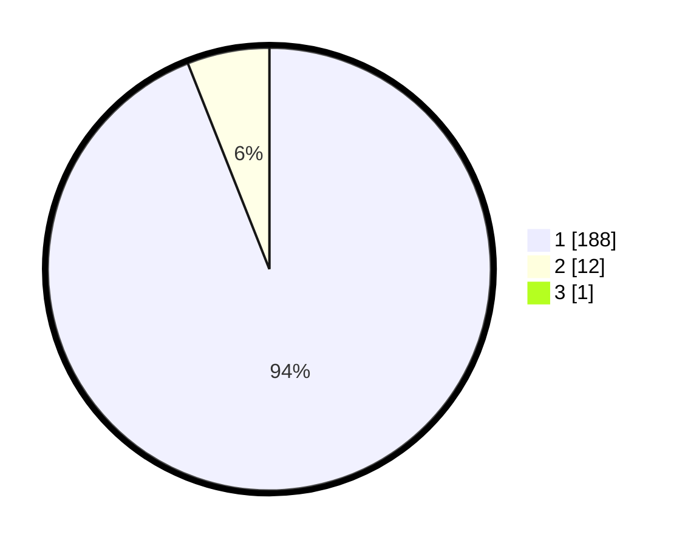

# Hasil

## Grafik

## Tabel

| No. | Nama Paslon    | Suara | Suara (raw) | Persentase |
|:--- |:-------------- | -----:| -----------:| ----------:|
| 1   | ANIES MUHAIMIN | 188   | [188][p-1]  | 93,53      |
| 2   | PRABOWO GIBRAN | 12    | [12][p-2]   | 5,97       |
| 3   | GANJAR MAHFUD  | 1     | [1][p-3]    | 0,50       |

[p-1]: https://github.com/gigit-pemilu/pemilu-2024-11-aceh/blob/main/pilpres/hitung-suara/sub/11-aceh/sub/03-aceh-timur/sub/07-peureulak/sub/2020-kuala-leuge/sub/002-tps/sub/paslon-1.txt
[p-2]: https://github.com/gigit-pemilu/pemilu-2024-11-aceh/blob/main/pilpres/hitung-suara/sub/11-aceh/sub/03-aceh-timur/sub/07-peureulak/sub/2020-kuala-leuge/sub/002-tps/sub/paslon-2.txt
[p-3]: https://github.com/gigit-pemilu/pemilu-2024-11-aceh/blob/main/pilpres/hitung-suara/sub/11-aceh/sub/03-aceh-timur/sub/07-peureulak/sub/2020-kuala-leuge/sub/002-tps/sub/paslon-3.txt

## Foto C Plano

https://sirekap-obj-formc.kpu.go.id/c779/pemilu/ppwp/11/03/07/20/20/1103072020002-20240215-033402--0379a69a-8040-4ae6-b165-1af1e539a1d8.jpg

https://sirekap-obj-formc.kpu.go.id/c779/pemilu/ppwp/11/03/07/20/20/1103072020002-20240215-033536--f051e9a1-ae9c-45c9-9c62-247a62c3fa92.jpg

https://sirekap-obj-formc.kpu.go.id/c779/pemilu/ppwp/11/03/07/20/20/1103072020002-20240215-012013--564696e3-df41-4ba6-9943-439b8ef89c5c.jpg

## Metadata

| Key        | Value               |
| ---------- | ------------------- |
| Time Stamp | 2024-02-22 17:00:00 |

