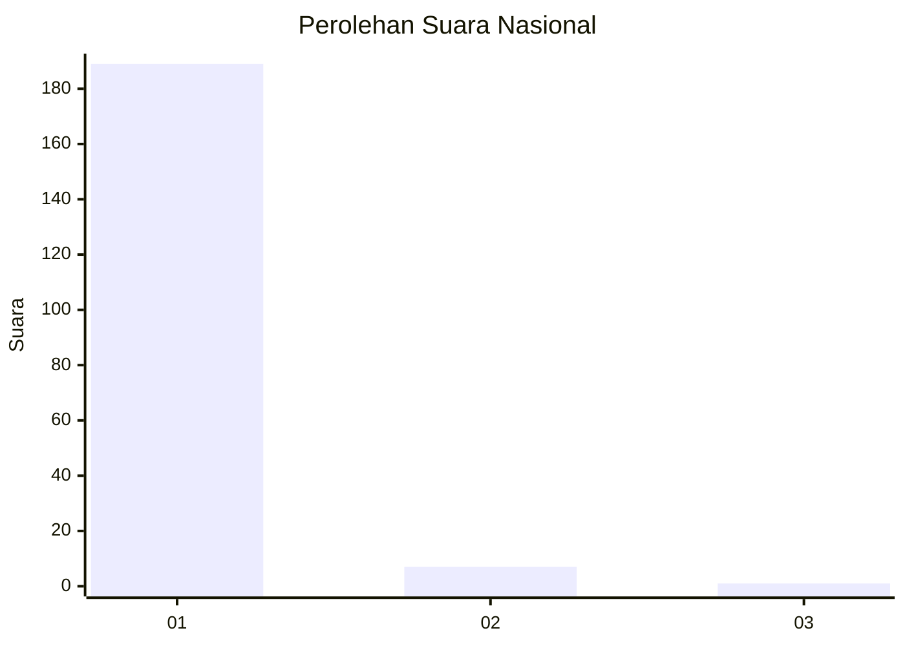
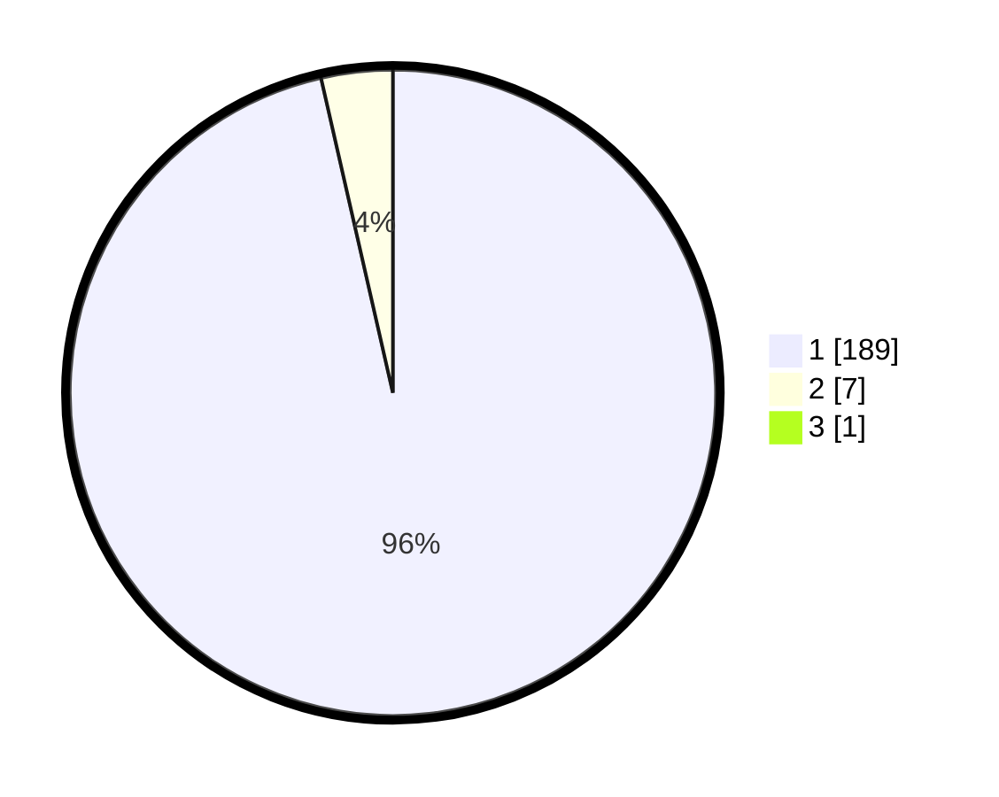

# Hasil

## Grafik

## Tabel

| No. | Nama Paslon    | Suara | Suara (raw) | Persentase |
|:--- |:-------------- | -----:| -----------:| ----------:|
| 1   | ANIES MUHAIMIN | 189   | [189][p-1]  | 95,94      |
| 2   | PRABOWO GIBRAN | 7     | [7][p-2]    | 3,55       |
| 3   | GANJAR MAHFUD  | 1     | [1][p-3]    | 0,51       |

[p-1]: https://github.com/gigit-pemilu/pemilu-2024/blob/main/pilpres/hitung-suara/sub/11-aceh/sub/03-aceh-timur/sub/07-peureulak/sub/2020-kuala-leuge/sub/003-tps/sub/paslon-1.txt
[p-2]: https://github.com/gigit-pemilu/pemilu-2024/blob/main/pilpres/hitung-suara/sub/11-aceh/sub/03-aceh-timur/sub/07-peureulak/sub/2020-kuala-leuge/sub/003-tps/sub/paslon-2.txt
[p-3]: https://github.com/gigit-pemilu/pemilu-2024/blob/main/pilpres/hitung-suara/sub/11-aceh/sub/03-aceh-timur/sub/07-peureulak/sub/2020-kuala-leuge/sub/003-tps/sub/paslon-3.txt

## Foto C Plano

https://sirekap-obj-formc.kpu.go.id/b0bd/pemilu/ppwp/11/03/07/20/20/1103072020003-20240215-090858--261d77fd-b6ba-4e47-bdee-ecb31f1e0a61.jpg

https://sirekap-obj-formc.kpu.go.id/b0bd/pemilu/ppwp/11/03/07/20/20/1103072020003-20240215-091157--6b06c7f6-bec2-4d3e-96fb-af095575d212.jpg

https://sirekap-obj-formc.kpu.go.id/b0bd/pemilu/ppwp/11/03/07/20/20/1103072020003-20240215-091257--2c1cc43f-b1c9-49c6-b6b3-a7d1da01d9c5.jpg

## Metadata

| Key        | Value               |
| ---------- | ------------------- |
| Time Stamp | 2024-02-19 13:00:00 |

