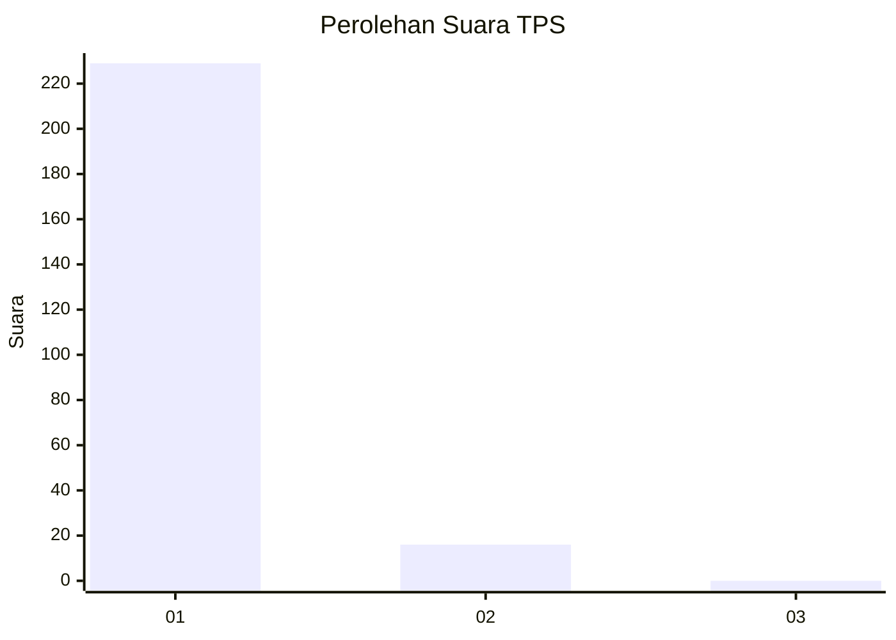
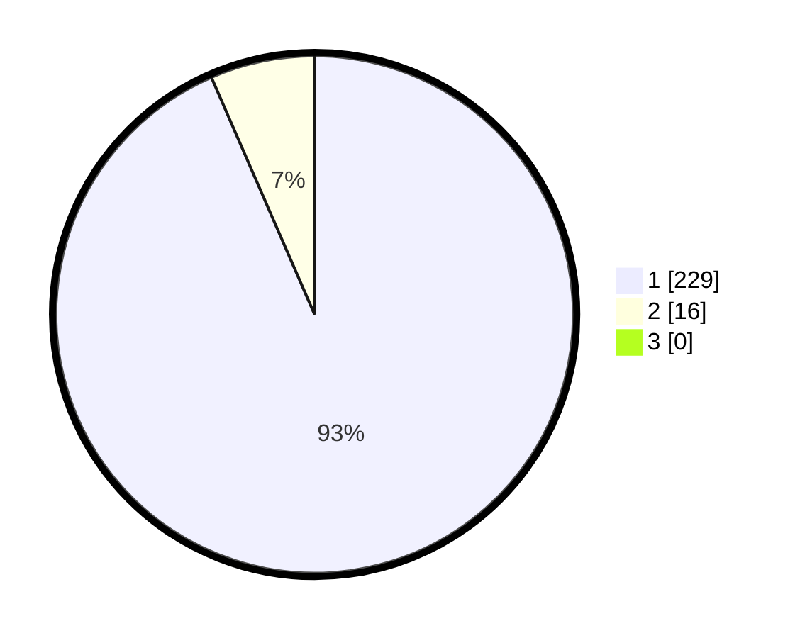

# Hasil

## Grafik

## Tabel

| No. | Nama Paslon    | Suara | Suara (raw) | Persentase |
|:--- |:-------------- | -----:| -----------:| ----------:|
| 1   | ANIES MUHAIMIN | 229   | [229][p-1]  | 93,47      |
| 2   | PRABOWO GIBRAN | 16    | [16][p-2]   | 6,53       |
| 3   | GANJAR MAHFUD  | 0     | [0][p-3]    | 0,00       |

[p-1]: https://github.com/gigit-pemilu/pemilu-2024-11-aceh/blob/main/pilpres/hitung-suara/sub/11-aceh/sub/03-aceh-timur/sub/07-peureulak/sub/2021-balee-buya/sub/001-tps/sub/paslon-1.txt
[p-2]: https://github.com/gigit-pemilu/pemilu-2024-11-aceh/blob/main/pilpres/hitung-suara/sub/11-aceh/sub/03-aceh-timur/sub/07-peureulak/sub/2021-balee-buya/sub/001-tps/sub/paslon-2.txt
[p-3]: https://github.com/gigit-pemilu/pemilu-2024-11-aceh/blob/main/pilpres/hitung-suara/sub/11-aceh/sub/03-aceh-timur/sub/07-peureulak/sub/2021-balee-buya/sub/001-tps/sub/paslon-3.txt

## Foto C Plano

https://sirekap-obj-formc.kpu.go.id/185c/pemilu/ppwp/11/03/07/20/21/1103072021001-20240215-091641--d0f6bc47-e21f-4b16-8c4c-7862dab25922.jpg

https://sirekap-obj-formc.kpu.go.id/185c/pemilu/ppwp/11/03/07/20/21/1103072021001-20240215-091940--e020e70c-9d80-4ca3-ae0a-274f1952f291.jpg

https://sirekap-obj-formc.kpu.go.id/185c/pemilu/ppwp/11/03/07/20/21/1103072021001-20240215-093049--ab4d6fdb-4d5c-4219-aa7e-0042210b1d43.jpg

## Metadata

| Key        | Value               |
| ---------- | ------------------- |
| Time Stamp | 2024-02-19 13:00:00 |

