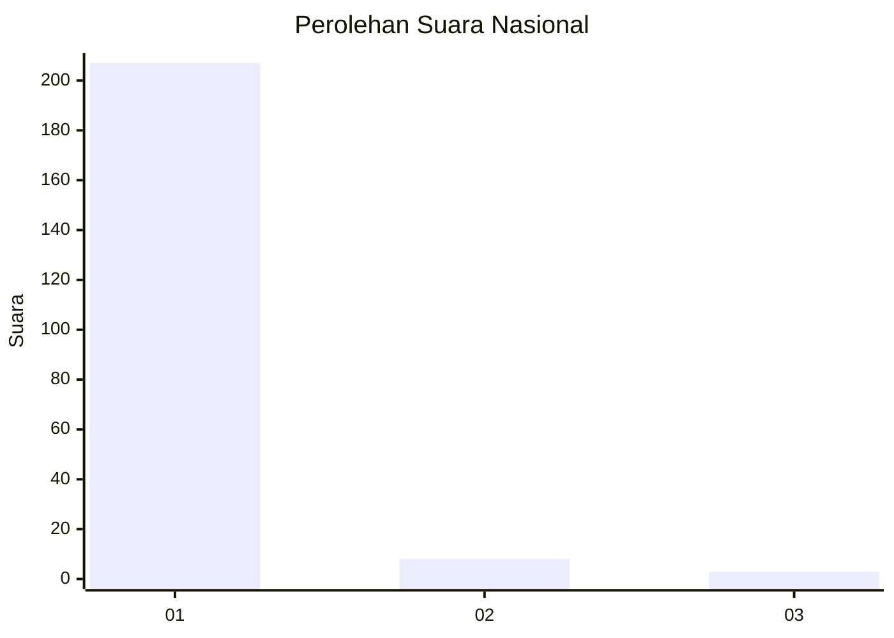
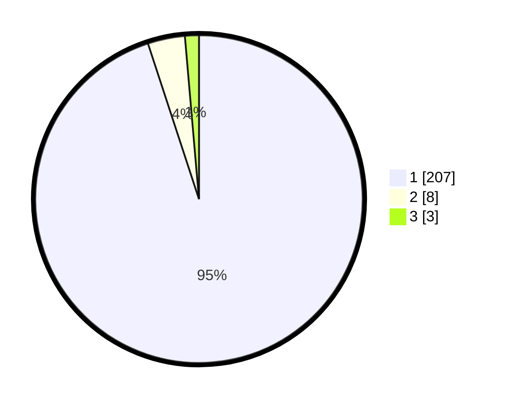

# Hasil

## Grafik

## Tabel

| No. | Nama Paslon    | Suara | Suara (raw) | Persentase |
|:--- |:-------------- | -----:| -----------:| ----------:|
| 1   | ANIES MUHAIMIN | 207   | [207][p-1]  | 94,95      |
| 2   | PRABOWO GIBRAN | 8     | [8][p-2]    | 3,67       |
| 3   | GANJAR MAHFUD  | 3     | [3][p-3]    | 1,38       |

[p-1]: https://github.com/gigit-pemilu/pemilu-2024/blob/main/pilpres/hitung-suara/sub/11-aceh/sub/03-aceh-timur/sub/07-peureulak/sub/2021-balee-buya/sub/002-tps/sub/paslon-1.txt
[p-2]: https://github.com/gigit-pemilu/pemilu-2024/blob/main/pilpres/hitung-suara/sub/11-aceh/sub/03-aceh-timur/sub/07-peureulak/sub/2021-balee-buya/sub/002-tps/sub/paslon-2.txt
[p-3]: https://github.com/gigit-pemilu/pemilu-2024/blob/main/pilpres/hitung-suara/sub/11-aceh/sub/03-aceh-timur/sub/07-peureulak/sub/2021-balee-buya/sub/002-tps/sub/paslon-3.txt

## Foto C Plano

https://sirekap-obj-formc.kpu.go.id/d0b9/pemilu/ppwp/11/03/07/20/21/1103072021002-20240215-110132--5bd17e18-62f6-4a80-b7e4-968cb0a0f8eb.jpg

https://sirekap-obj-formc.kpu.go.id/d0b9/pemilu/ppwp/11/03/07/20/21/1103072021002-20240215-110244--cd787c6a-2989-484b-8c6c-67be6d8f593d.jpg

https://sirekap-obj-formc.kpu.go.id/d0b9/pemilu/ppwp/11/03/07/20/21/1103072021002-20240215-110349--a4b68e8c-a56d-42b7-99b7-0d9c859b5711.jpg

## Metadata

| Key        | Value               |
| ---------- | ------------------- |
| Time Stamp | 2024-02-19 13:00:00 |

