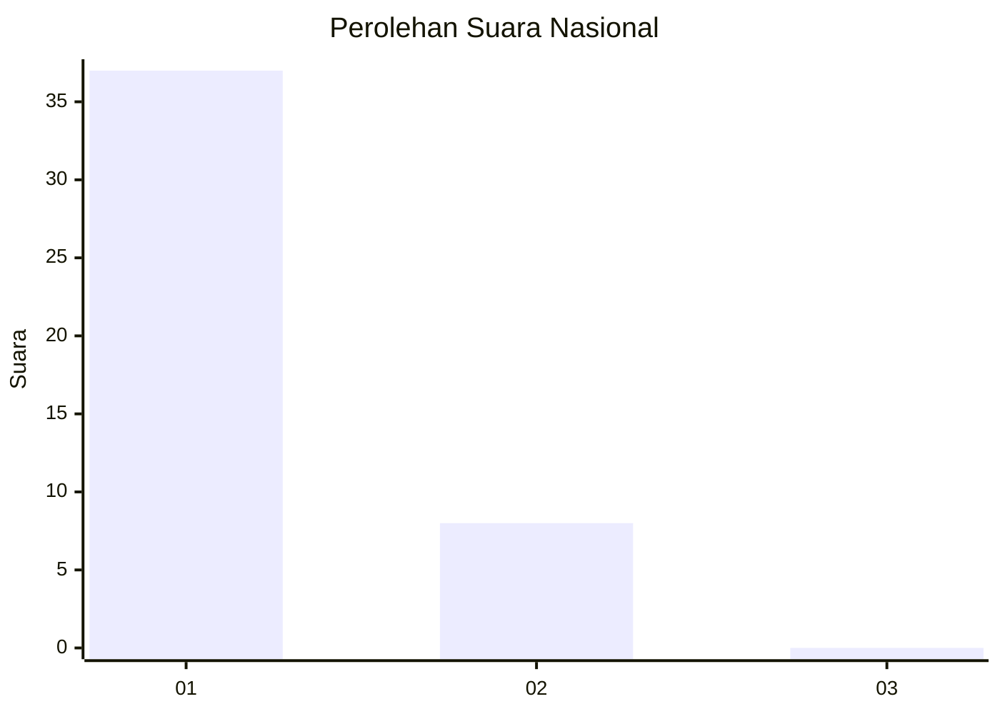
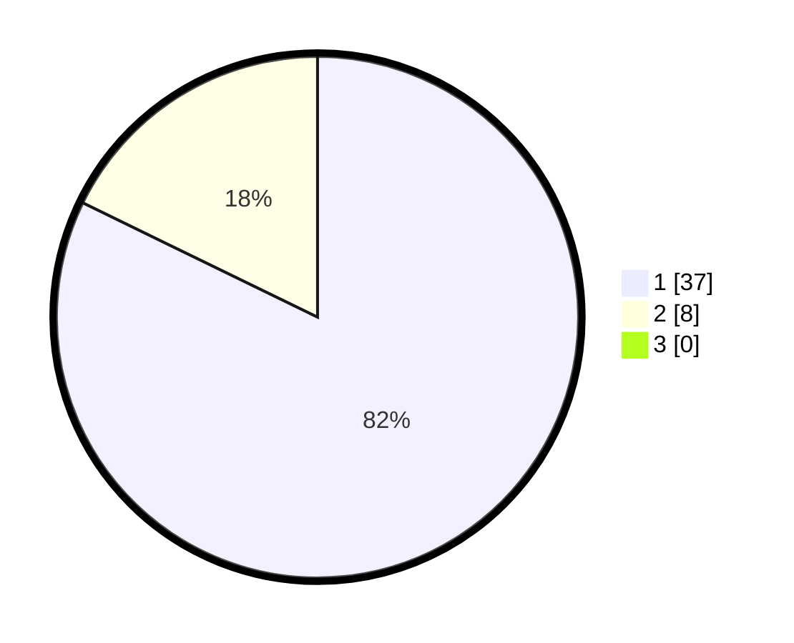

# Hasil

## Grafik

## Tabel

| No. | Nama Paslon    | Suara | Suara (raw) | Persentase |
|:--- |:-------------- | -----:| -----------:| ----------:|
| 1   | ANIES MUHAIMIN | 37    | [37][p-1]   | 82,22      |
| 2   | PRABOWO GIBRAN | 8     | [8][p-2]    | 17,78      |
| 3   | GANJAR MAHFUD  | 0     | [0][p-3]    | 0,00       |

[p-1]: https://github.com/gigit-pemilu/pemilu-2024/blob/main/pilpres/hitung-suara/sub/11-aceh/sub/03-aceh-timur/sub/07-peureulak/sub/2021-balee-buya/sub/003-tps/sub/paslon-1.txt
[p-2]: https://github.com/gigit-pemilu/pemilu-2024/blob/main/pilpres/hitung-suara/sub/11-aceh/sub/03-aceh-timur/sub/07-peureulak/sub/2021-balee-buya/sub/003-tps/sub/paslon-2.txt
[p-3]: https://github.com/gigit-pemilu/pemilu-2024/blob/main/pilpres/hitung-suara/sub/11-aceh/sub/03-aceh-timur/sub/07-peureulak/sub/2021-balee-buya/sub/003-tps/sub/paslon-3.txt

## Foto C Plano

https://sirekap-obj-formc.kpu.go.id/073c/pemilu/ppwp/11/03/07/20/21/1103072021003-20240214-213301--d6ee8c75-7e72-4589-84e4-05b28c684aec.jpg

https://sirekap-obj-formc.kpu.go.id/073c/pemilu/ppwp/11/03/07/20/21/1103072021003-20240214-213817--192e4df9-b30e-4f2e-96f2-f9d3c9f8d556.jpg

https://sirekap-obj-formc.kpu.go.id/073c/pemilu/ppwp/11/03/07/20/21/1103072021003-20240214-213936--3b5a267f-5715-4bde-a77a-86fe5b76714b.jpg

## Metadata

| Key        | Value               |
| ---------- | ------------------- |
| Time Stamp | 2024-02-19 13:00:00 |

