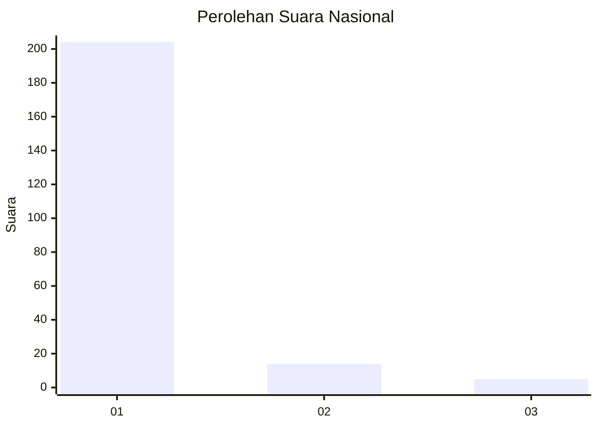
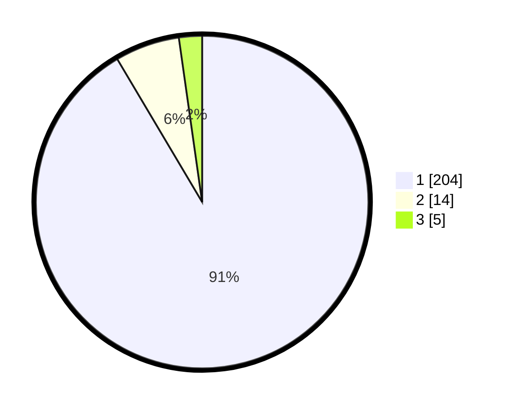

# Hasil

## Grafik

## Tabel

| No. | Nama Paslon    | Suara | Suara (raw) | Persentase |
|:--- |:-------------- | -----:| -----------:| ----------:|
| 1   | ANIES MUHAIMIN | 204   | [204][p-1]  | 91,48      |
| 2   | PRABOWO GIBRAN | 14    | [14][p-2]   | 6,28       |
| 3   | GANJAR MAHFUD  | 5     | [5][p-3]    | 2,24       |

[p-1]: https://github.com/gigit-pemilu/pemilu-2024/blob/main/pilpres/hitung-suara/sub/11-aceh/sub/03-aceh-timur/sub/07-peureulak/sub/2022-alue-nibong/sub/002-tps/sub/paslon-1.txt
[p-2]: https://github.com/gigit-pemilu/pemilu-2024/blob/main/pilpres/hitung-suara/sub/11-aceh/sub/03-aceh-timur/sub/07-peureulak/sub/2022-alue-nibong/sub/002-tps/sub/paslon-2.txt
[p-3]: https://github.com/gigit-pemilu/pemilu-2024/blob/main/pilpres/hitung-suara/sub/11-aceh/sub/03-aceh-timur/sub/07-peureulak/sub/2022-alue-nibong/sub/002-tps/sub/paslon-3.txt

## Foto C Plano

https://sirekap-obj-formc.kpu.go.id/ed41/pemilu/ppwp/11/03/07/20/22/1103072022002-20240216-103457--d7d79a48-1ced-42c4-a981-fb502a498f44.jpg

https://sirekap-obj-formc.kpu.go.id/ed41/pemilu/ppwp/11/03/07/20/22/1103072022002-20240215-032858--9fd9abe8-41db-4e75-98ca-e402a7beec05.jpg

https://sirekap-obj-formc.kpu.go.id/ed41/pemilu/ppwp/11/03/07/20/22/1103072022002-20240215-032917--6150dd04-138c-4581-95ac-d3cf1f5b06e5.jpg

## Metadata

| Key        | Value               |
| ---------- | ------------------- |
| Time Stamp | 2024-02-19 13:00:00 |

