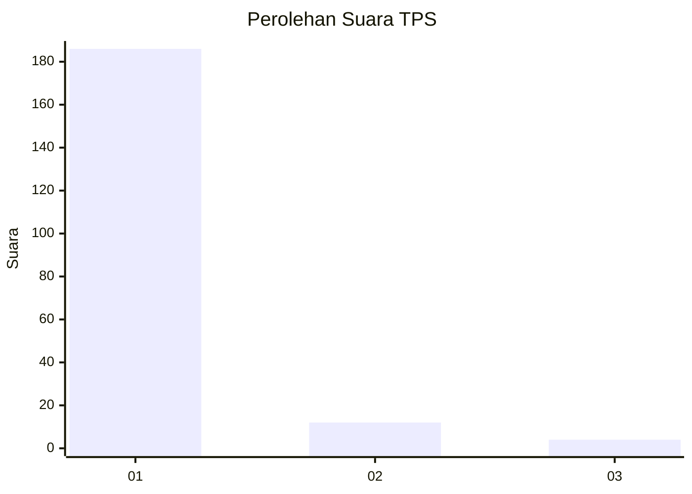
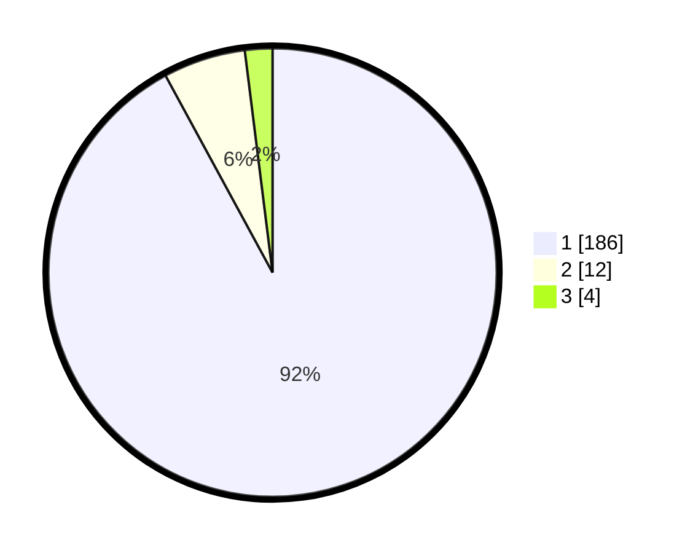

# Hasil

## Grafik

## Tabel

| No. | Nama Paslon    | Suara | Suara (raw) | Persentase |
|:--- |:-------------- | -----:| -----------:| ----------:|
| 1   | ANIES MUHAIMIN | 186   | [186][p-1]  | 92,08      |
| 2   | PRABOWO GIBRAN | 12    | [12][p-2]   | 5,94       |
| 3   | GANJAR MAHFUD  | 4     | [4][p-3]    | 1,98       |

[p-1]: https://github.com/gigit-pemilu/pemilu-2024-11-aceh/blob/main/pilpres/hitung-suara/sub/11-aceh/sub/03-aceh-timur/sub/07-peureulak/sub/2023-seuneubok-peusangan/sub/001-tps/sub/paslon-1.txt
[p-2]: https://github.com/gigit-pemilu/pemilu-2024-11-aceh/blob/main/pilpres/hitung-suara/sub/11-aceh/sub/03-aceh-timur/sub/07-peureulak/sub/2023-seuneubok-peusangan/sub/001-tps/sub/paslon-2.txt
[p-3]: https://github.com/gigit-pemilu/pemilu-2024-11-aceh/blob/main/pilpres/hitung-suara/sub/11-aceh/sub/03-aceh-timur/sub/07-peureulak/sub/2023-seuneubok-peusangan/sub/001-tps/sub/paslon-3.txt

## Foto C Plano

https://sirekap-obj-formc.kpu.go.id/dc0b/pemilu/ppwp/11/03/07/20/23/1103072023001-20240216-054905--196700ae-2366-4330-85ae-df30ce985387.jpg

https://sirekap-obj-formc.kpu.go.id/dc0b/pemilu/ppwp/11/03/07/20/23/1103072023001-20240216-054913--dd91b46d-5762-410a-b86c-5730bc843e15.jpg

https://sirekap-obj-formc.kpu.go.id/dc0b/pemilu/ppwp/11/03/07/20/23/1103072023001-20240216-054909--9e57093e-bc74-45e3-a195-5e9f124a0be4.jpg

## Metadata

| Key        | Value               |
| ---------- | ------------------- |
| Time Stamp | 2024-02-17 13:37:34 |

## DATA PEMILIH TETAP

Jumlah pemilih dalam DPT: **275**.
 * L: **129**.
 * P: **146**.

## DATA PENGGUNA HAK PILIH

Jumlah pengguna hak pilih dalam DPT: **203**.
 * L: **86**.
 * P: **117**.

Jumlah pengguna hak pilih dalam DPTb: **0**.
 * L: **0**.
 * P: **0**.

Jumlah pengguna hak pilih dalam DPK: **4**.
 * L: **2**.
 * P: **2**.

Jumlah pengguna hak pilih: **207**.
 * L: **88**.
 * P: **119**.

## JUMLAH SUARA SAH DAN TIDAK SAH

JUMLAH SELURUH SUARA SAH: **207**.

JUMLAH SUARA TIDAK SAH: **74**.

JUMLAH SELURUH SUARA SAH DAN SUARA TIDAK SAH: **281**.

