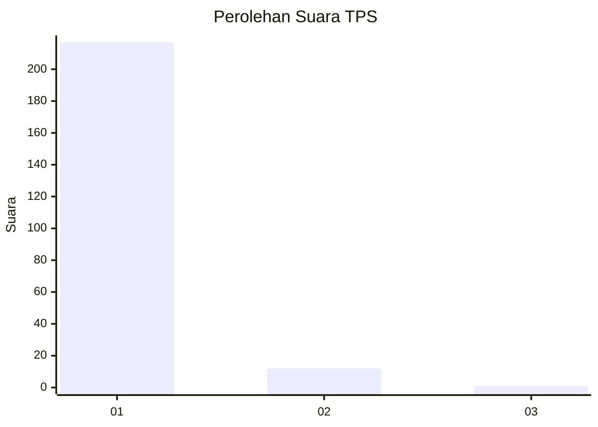
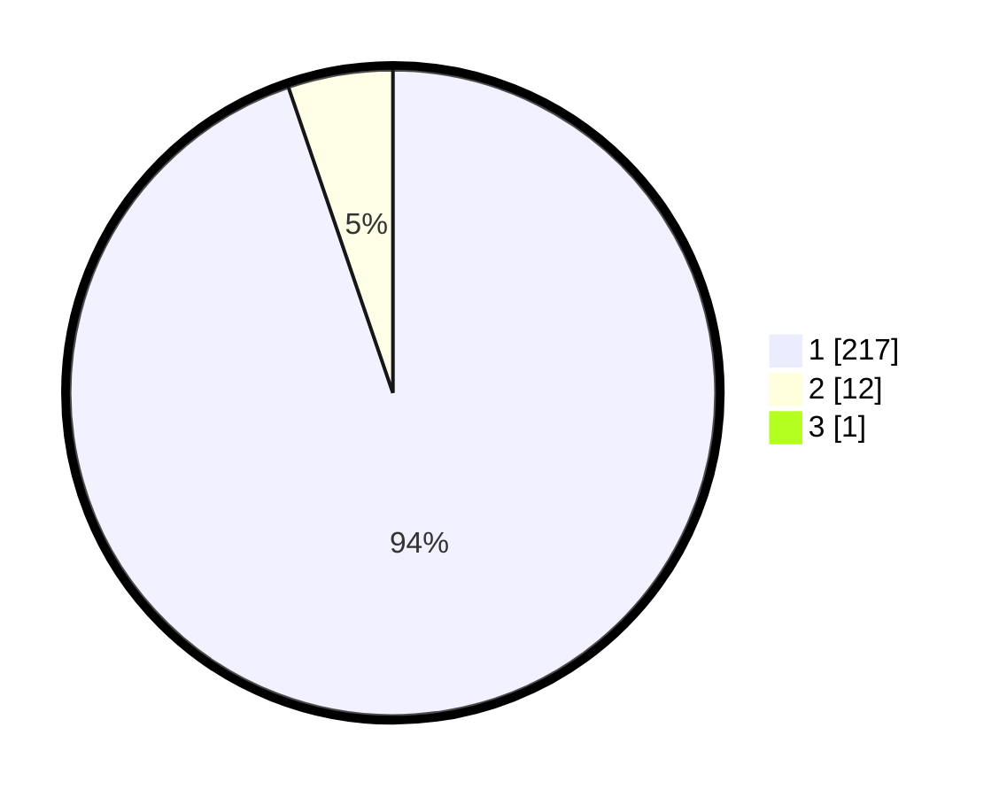

# Hasil

## Grafik

## Tabel

| No. | Nama Paslon    | Suara | Suara (raw) | Persentase |
|:--- |:-------------- | -----:| -----------:| ----------:|
| 1   | ANIES MUHAIMIN | 217   | [217][p-1]  | 94,35      |
| 2   | PRABOWO GIBRAN | 12    | [12][p-2]   | 5,22       |
| 3   | GANJAR MAHFUD  | 1     | [1][p-3]    | 0,43       |

[p-1]: https://github.com/gigit-pemilu/pemilu-2024-11-aceh/blob/main/pilpres/hitung-suara/sub/11-aceh/sub/03-aceh-timur/sub/07-peureulak/sub/2023-seuneubok-peusangan/sub/002-tps/sub/paslon-1.txt
[p-2]: https://github.com/gigit-pemilu/pemilu-2024-11-aceh/blob/main/pilpres/hitung-suara/sub/11-aceh/sub/03-aceh-timur/sub/07-peureulak/sub/2023-seuneubok-peusangan/sub/002-tps/sub/paslon-2.txt
[p-3]: https://github.com/gigit-pemilu/pemilu-2024-11-aceh/blob/main/pilpres/hitung-suara/sub/11-aceh/sub/03-aceh-timur/sub/07-peureulak/sub/2023-seuneubok-peusangan/sub/002-tps/sub/paslon-3.txt

## Foto C Plano

https://sirekap-obj-formc.kpu.go.id/2feb/pemilu/ppwp/11/03/07/20/23/1103072023002-20240215-040052--3db8c2fd-7a46-42e1-9a1c-46cbfe2efb28.jpg

https://sirekap-obj-formc.kpu.go.id/2feb/pemilu/ppwp/11/03/07/20/23/1103072023002-20240215-040319--4c954e06-7711-43bc-afed-522822c643b1.jpg

https://sirekap-obj-formc.kpu.go.id/2feb/pemilu/ppwp/11/03/07/20/23/1103072023002-20240215-040555--8df59834-63c1-47bc-8d4a-736b4d1033e5.jpg

## Metadata

| Key        | Value               |
| ---------- | ------------------- |
| Time Stamp | 2024-02-22 17:00:00 |

