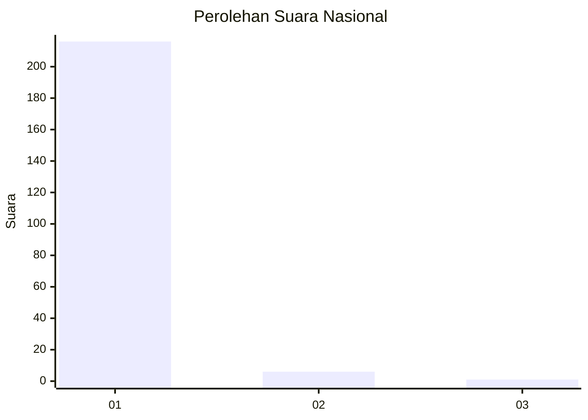
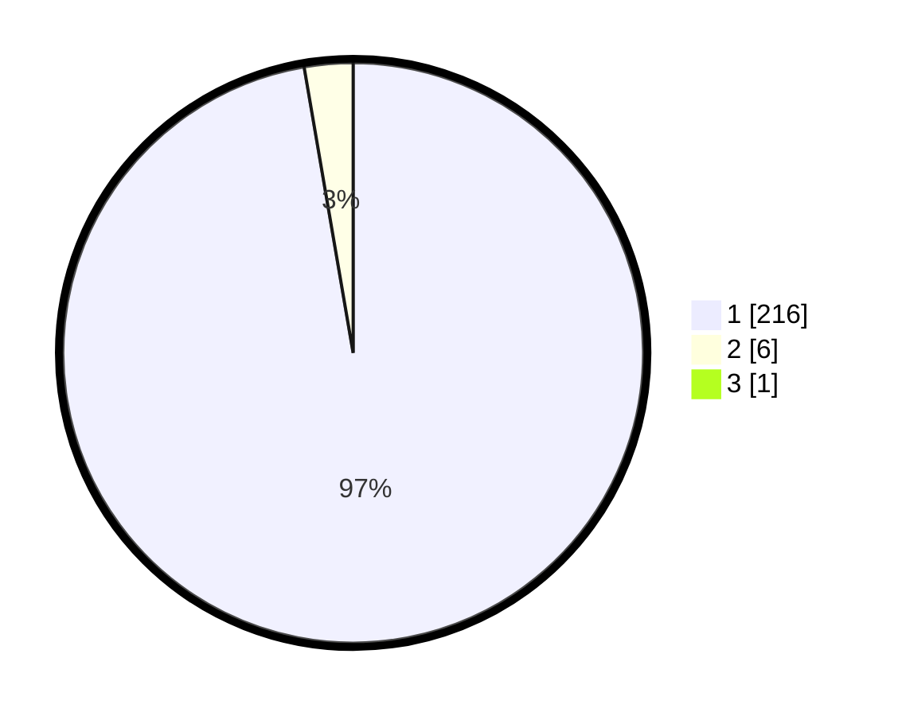

# Hasil

## Grafik

## Tabel

| No. | Nama Paslon    | Suara | Suara (raw) | Persentase |
|:--- |:-------------- | -----:| -----------:| ----------:|
| 1   | ANIES MUHAIMIN | 216   | [216][p-1]  | 96,86      |
| 2   | PRABOWO GIBRAN | 6     | [6][p-2]    | 2,69       |
| 3   | GANJAR MAHFUD  | 1     | [1][p-3]    | 0,45       |

[p-1]: https://github.com/gigit-pemilu/pemilu-2024/blob/main/pilpres/hitung-suara/sub/11-aceh/sub/03-aceh-timur/sub/07-peureulak/sub/2025-seuneubok-pidie/sub/001-tps/sub/paslon-1.txt
[p-2]: https://github.com/gigit-pemilu/pemilu-2024/blob/main/pilpres/hitung-suara/sub/11-aceh/sub/03-aceh-timur/sub/07-peureulak/sub/2025-seuneubok-pidie/sub/001-tps/sub/paslon-2.txt
[p-3]: https://github.com/gigit-pemilu/pemilu-2024/blob/main/pilpres/hitung-suara/sub/11-aceh/sub/03-aceh-timur/sub/07-peureulak/sub/2025-seuneubok-pidie/sub/001-tps/sub/paslon-3.txt

## Foto C Plano

https://sirekap-obj-formc.kpu.go.id/68eb/pemilu/ppwp/11/03/07/20/25/1103072025001-20240215-061622--bdac94a9-9f45-42af-81fb-eb00657cbbaf.jpg

https://sirekap-obj-formc.kpu.go.id/68eb/pemilu/ppwp/11/03/07/20/25/1103072025001-20240214-222933--73320f7c-df87-419b-8bd9-17002d66ac53.jpg

https://sirekap-obj-formc.kpu.go.id/68eb/pemilu/ppwp/11/03/07/20/25/1103072025001-20240214-223530--6daef473-50c9-4390-80bc-5d6aeb51e905.jpg

## Metadata

| Key        | Value               |
| ---------- | ------------------- |
| Time Stamp | 2024-02-15 17:30:25 |

