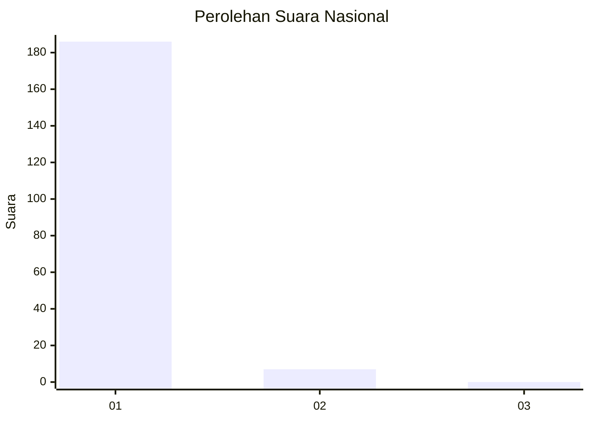
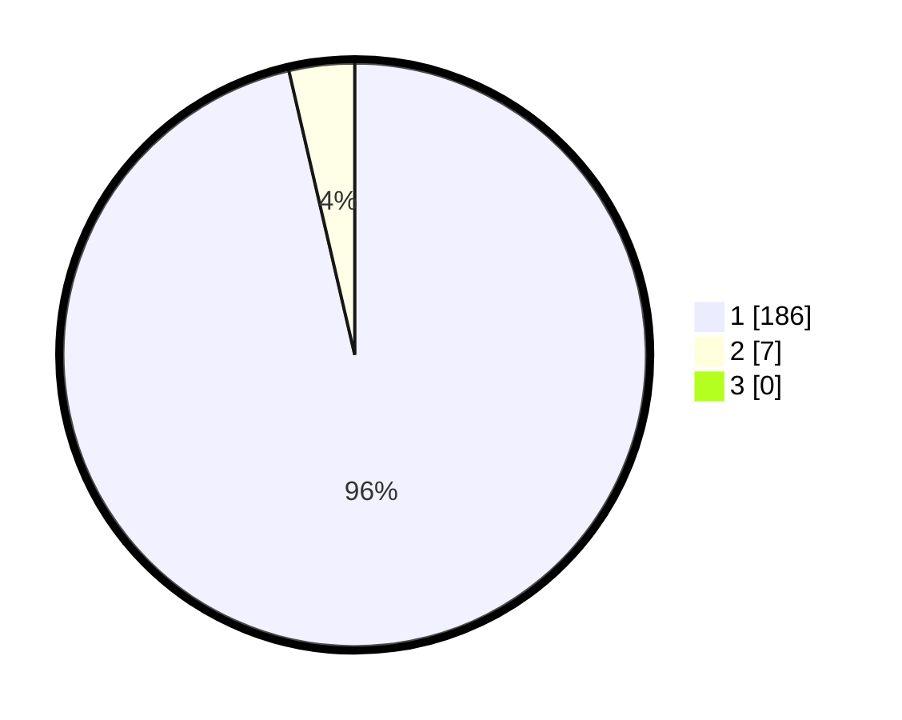

# Hasil

## Grafik

## Tabel

| No. | Nama Paslon    | Suara | Suara (raw) | Persentase |
|:--- |:-------------- | -----:| -----------:| ----------:|
| 1   | ANIES MUHAIMIN | 186   | [186][p-1]  | 96,37      |
| 2   | PRABOWO GIBRAN | 7     | [7][p-2]    | 3,63       |
| 3   | GANJAR MAHFUD  | 0     | [0][p-3]    | 0,00       |

[p-1]: https://github.com/gigit-pemilu/pemilu-2024/blob/main/pilpres/hitung-suara/sub/11-aceh/sub/03-aceh-timur/sub/07-peureulak/sub/2025-seuneubok-pidie/sub/002-tps/sub/paslon-1.txt
[p-2]: https://github.com/gigit-pemilu/pemilu-2024/blob/main/pilpres/hitung-suara/sub/11-aceh/sub/03-aceh-timur/sub/07-peureulak/sub/2025-seuneubok-pidie/sub/002-tps/sub/paslon-2.txt
[p-3]: https://github.com/gigit-pemilu/pemilu-2024/blob/main/pilpres/hitung-suara/sub/11-aceh/sub/03-aceh-timur/sub/07-peureulak/sub/2025-seuneubok-pidie/sub/002-tps/sub/paslon-3.txt

## Foto C Plano

https://sirekap-obj-formc.kpu.go.id/1d57/pemilu/ppwp/11/03/07/20/25/1103072025002-20240215-063533--894e813f-982a-4e79-b2e8-e494388fc21a.jpg

https://sirekap-obj-formc.kpu.go.id/1d57/pemilu/ppwp/11/03/07/20/25/1103072025002-20240215-064215--8024f62a-f557-4151-9596-41550d668edf.jpg

https://sirekap-obj-formc.kpu.go.id/1d57/pemilu/ppwp/11/03/07/20/25/1103072025002-20240215-062535--0cd256da-49b6-494f-98d3-3165dbb92e20.jpg

## Metadata

| Key        | Value               |
| ---------- | ------------------- |
| Time Stamp | 2024-02-19 13:00:00 |

