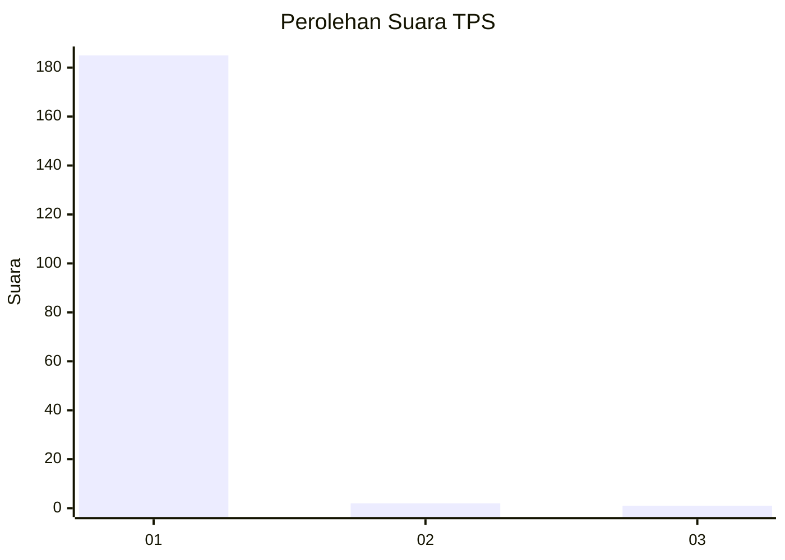
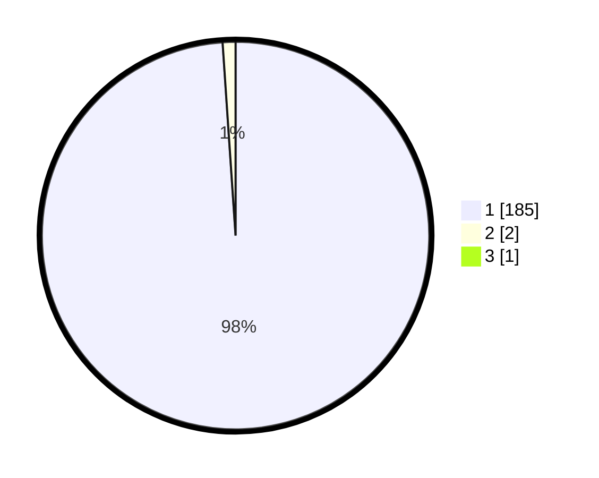

# Hasil

## Grafik

## Tabel

| No. | Nama Paslon    | Suara | Suara (raw) | Persentase |
|:--- |:-------------- | -----:| -----------:| ----------:|
| 1   | ANIES MUHAIMIN | 185   | [185][p-1]  | 98,40      |
| 2   | PRABOWO GIBRAN | 2     | [2][p-2]    | 1,06       |
| 3   | GANJAR MAHFUD  | 1     | [1][p-3]    | 0,53       |

[p-1]: https://github.com/gigit-pemilu/pemilu-2024-11-aceh/blob/main/pilpres/hitung-suara/sub/11-aceh/sub/03-aceh-timur/sub/07-peureulak/sub/2025-seuneubok-pidie/sub/003-tps/sub/paslon-1.txt
[p-2]: https://github.com/gigit-pemilu/pemilu-2024-11-aceh/blob/main/pilpres/hitung-suara/sub/11-aceh/sub/03-aceh-timur/sub/07-peureulak/sub/2025-seuneubok-pidie/sub/003-tps/sub/paslon-2.txt
[p-3]: https://github.com/gigit-pemilu/pemilu-2024-11-aceh/blob/main/pilpres/hitung-suara/sub/11-aceh/sub/03-aceh-timur/sub/07-peureulak/sub/2025-seuneubok-pidie/sub/003-tps/sub/paslon-3.txt

## Foto C Plano

https://sirekap-obj-formc.kpu.go.id/ed84/pemilu/ppwp/11/03/07/20/25/1103072025003-20240215-005803--af271bd5-d804-4bed-b7f6-19791a481988.jpg

https://sirekap-obj-formc.kpu.go.id/ed84/pemilu/ppwp/11/03/07/20/25/1103072025003-20240214-231717--abead6a0-67c4-419d-a587-8e2956e57070.jpg

https://sirekap-obj-formc.kpu.go.id/ed84/pemilu/ppwp/11/03/07/20/25/1103072025003-20240214-232100--654535c9-d531-4098-ba07-749bb8ed7073.jpg

## Metadata

| Key        | Value               |
| ---------- | ------------------- |
| Time Stamp | 2024-02-19 13:00:00 |

