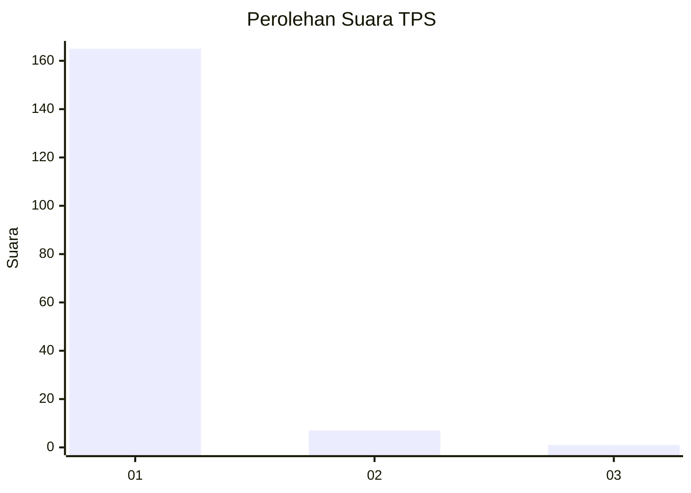
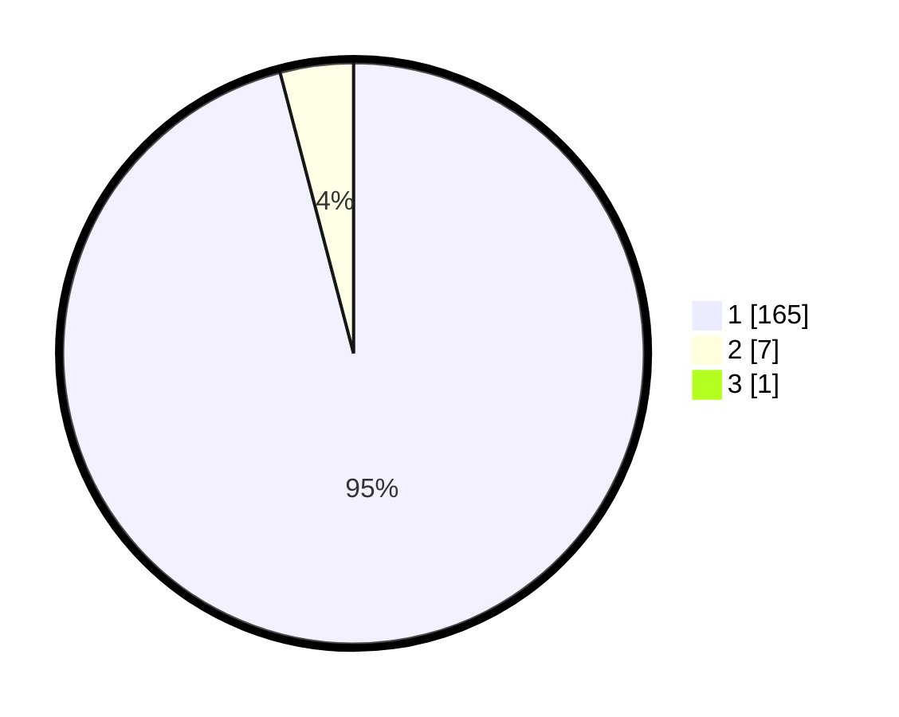

# Hasil

## Grafik

## Tabel

| No. | Nama Paslon    | Suara | Suara (raw) | Persentase |
|:--- |:-------------- | -----:| -----------:| ----------:|
| 1   | ANIES MUHAIMIN | 165   | [165][p-1]  | 95,38      |
| 2   | PRABOWO GIBRAN | 7     | [7][p-2]    | 4,05       |
| 3   | GANJAR MAHFUD  | 1     | [1][p-3]    | 0,58       |

[p-1]: https://github.com/gigit-pemilu/pemilu-2024-11-aceh/blob/main/pilpres/hitung-suara/sub/11-aceh/sub/03-aceh-timur/sub/07-peureulak/sub/2025-seuneubok-pidie/sub/004-tps/sub/paslon-1.txt
[p-2]: https://github.com/gigit-pemilu/pemilu-2024-11-aceh/blob/main/pilpres/hitung-suara/sub/11-aceh/sub/03-aceh-timur/sub/07-peureulak/sub/2025-seuneubok-pidie/sub/004-tps/sub/paslon-2.txt
[p-3]: https://github.com/gigit-pemilu/pemilu-2024-11-aceh/blob/main/pilpres/hitung-suara/sub/11-aceh/sub/03-aceh-timur/sub/07-peureulak/sub/2025-seuneubok-pidie/sub/004-tps/sub/paslon-3.txt

## Foto C Plano

https://sirekap-obj-formc.kpu.go.id/3968/pemilu/ppwp/11/03/07/20/25/1103072025004-20240215-063014--62272e72-39a1-4b0f-a859-e6b05fbb72cb.jpg

https://sirekap-obj-formc.kpu.go.id/3968/pemilu/ppwp/11/03/07/20/25/1103072025004-20240215-063223--72014171-fef3-4466-b7d9-951da590f3b7.jpg

https://sirekap-obj-formc.kpu.go.id/3968/pemilu/ppwp/11/03/07/20/25/1103072025004-20240215-063406--124d4b97-d836-4797-b265-1f64abc8abb7.jpg

## Metadata

| Key        | Value               |
| ---------- | ------------------- |
| Time Stamp | 2024-02-19 13:00:00 |

