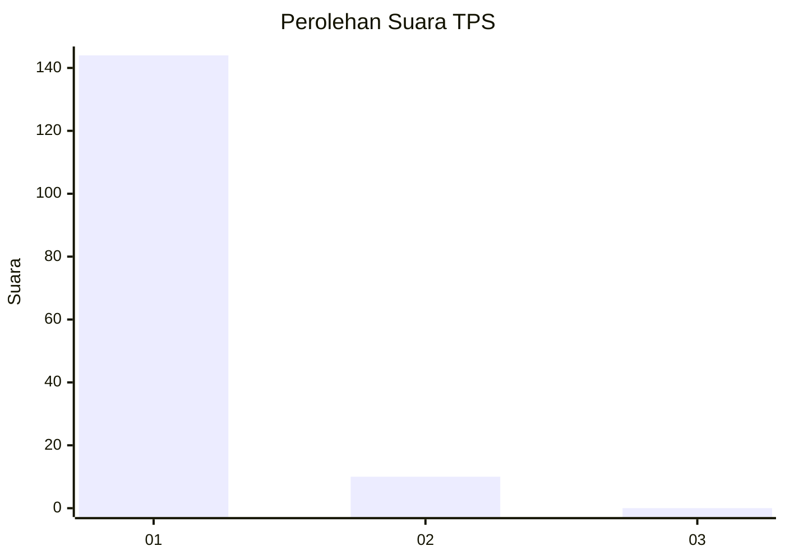
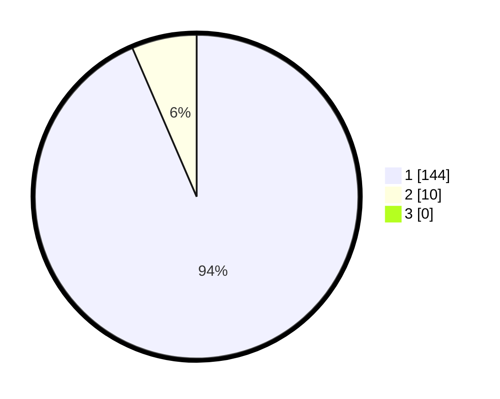

# Hasil

## Grafik

## Tabel

| No. | Nama Paslon    | Suara | Suara (raw) | Persentase |
|:--- |:-------------- | -----:| -----------:| ----------:|
| 1   | ANIES MUHAIMIN | 144   | [144][p-1]  | 93,51      |
| 2   | PRABOWO GIBRAN | 10    | [10][p-2]   | 6,49       |
| 3   | GANJAR MAHFUD  | 0     | [0][p-3]    | 0,00       |

[p-1]: https://github.com/gigit-pemilu/pemilu-2024-11-aceh/blob/main/pilpres/hitung-suara/sub/11-aceh/sub/03-aceh-timur/sub/07-peureulak/sub/2026-dama-tutong/sub/004-tps/sub/paslon-1.txt
[p-2]: https://github.com/gigit-pemilu/pemilu-2024-11-aceh/blob/main/pilpres/hitung-suara/sub/11-aceh/sub/03-aceh-timur/sub/07-peureulak/sub/2026-dama-tutong/sub/004-tps/sub/paslon-2.txt
[p-3]: https://github.com/gigit-pemilu/pemilu-2024-11-aceh/blob/main/pilpres/hitung-suara/sub/11-aceh/sub/03-aceh-timur/sub/07-peureulak/sub/2026-dama-tutong/sub/004-tps/sub/paslon-3.txt

## Foto C Plano

https://sirekap-obj-formc.kpu.go.id/4775/pemilu/ppwp/11/03/07/20/26/1103072026004-20240215-022725--69dc1178-4cc1-4771-9132-34b27c7b7c90.jpg

https://sirekap-obj-formc.kpu.go.id/4775/pemilu/ppwp/11/03/07/20/26/1103072026004-20240215-022928--039ce3bf-f95b-4352-a160-733cdbe7afdb.jpg

https://sirekap-obj-formc.kpu.go.id/4775/pemilu/ppwp/11/03/07/20/26/1103072026004-20240215-023001--05659e9e-658b-4850-9e22-8fc7d0d7b9c1.jpg

## Metadata

| Key        | Value               |
| ---------- | ------------------- |
| Time Stamp | 2024-02-19 13:00:00 |

