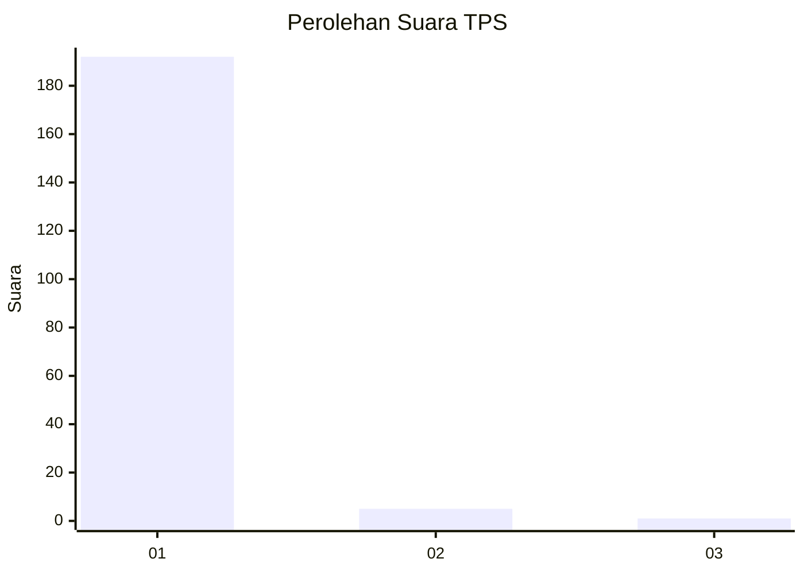
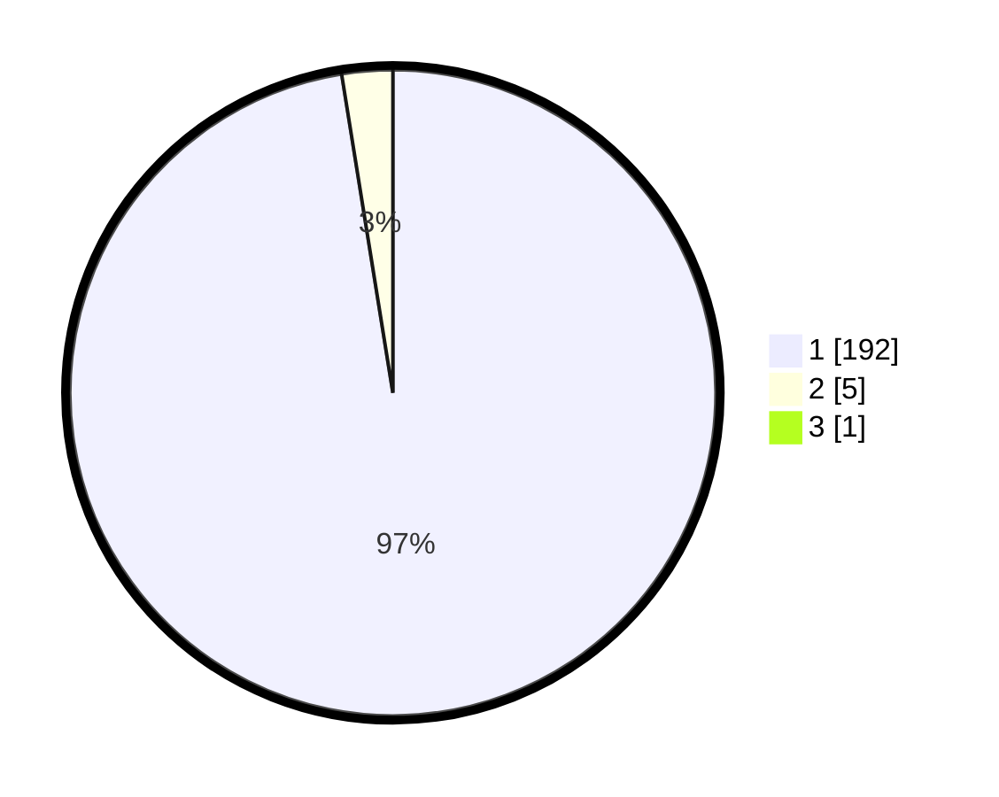

# Hasil

## Grafik

## Tabel

| No. | Nama Paslon    | Suara | Suara (raw) | Persentase |
|:--- |:-------------- | -----:| -----------:| ----------:|
| 1   | ANIES MUHAIMIN | 192   | [192][p-1]  | 96,97      |
| 2   | PRABOWO GIBRAN | 5     | [5][p-2]    | 2,53       |
| 3   | GANJAR MAHFUD  | 1     | [1][p-3]    | 0,51       |

[p-1]: https://github.com/gigit-pemilu/pemilu-2024-11-aceh/blob/main/pilpres/hitung-suara/sub/11-aceh/sub/03-aceh-timur/sub/07-peureulak/sub/2027-matang-gleum/sub/002-tps/sub/paslon-1.txt
[p-2]: https://github.com/gigit-pemilu/pemilu-2024-11-aceh/blob/main/pilpres/hitung-suara/sub/11-aceh/sub/03-aceh-timur/sub/07-peureulak/sub/2027-matang-gleum/sub/002-tps/sub/paslon-2.txt
[p-3]: https://github.com/gigit-pemilu/pemilu-2024-11-aceh/blob/main/pilpres/hitung-suara/sub/11-aceh/sub/03-aceh-timur/sub/07-peureulak/sub/2027-matang-gleum/sub/002-tps/sub/paslon-3.txt

## Foto C Plano

https://sirekap-obj-formc.kpu.go.id/dea7/pemilu/ppwp/11/03/07/20/27/1103072027002-20240215-004323--32133e05-bac7-4c1f-8353-aeb0cd446a80.jpg

https://sirekap-obj-formc.kpu.go.id/dea7/pemilu/ppwp/11/03/07/20/27/1103072027002-20240215-004727--2f8a8f11-2808-474c-9013-be1397acdc1a.jpg

https://sirekap-obj-formc.kpu.go.id/dea7/pemilu/ppwp/11/03/07/20/27/1103072027002-20240215-004930--3260f272-747b-49c5-aecc-4b1e5178a470.jpg

## Metadata

| Key        | Value               |
| ---------- | ------------------- |
| Time Stamp | 2024-02-19 13:00:00 |

