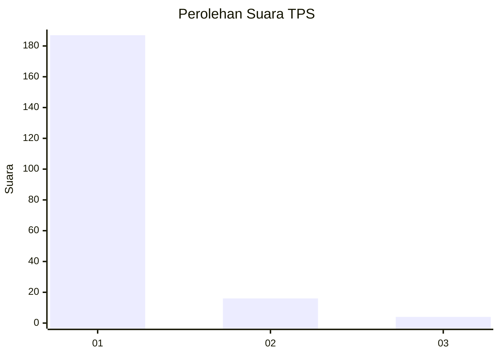
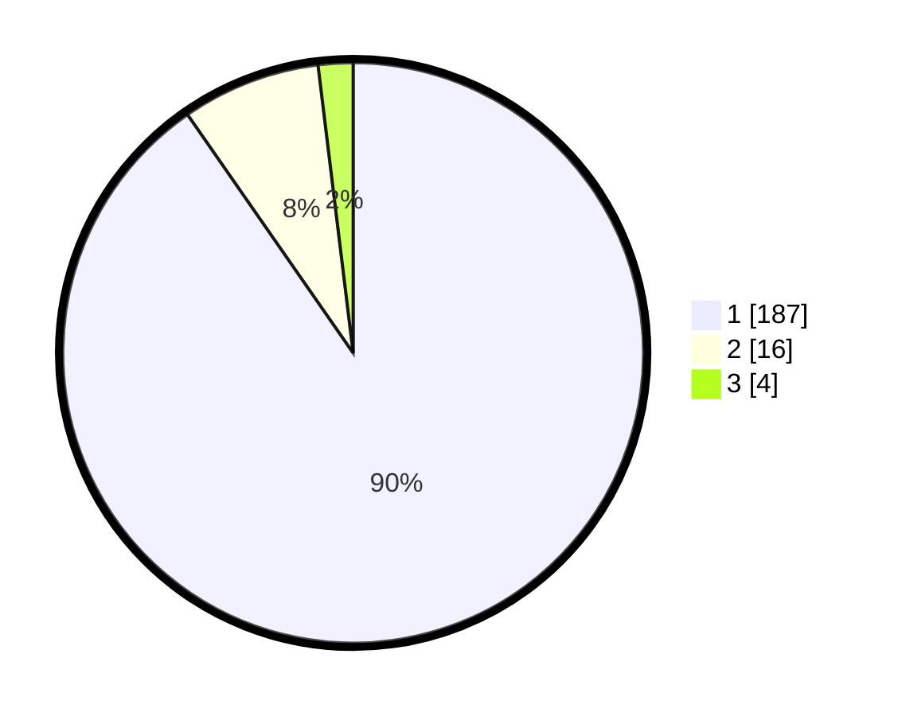

# Hasil

## Grafik

## Tabel

| No. | Nama Paslon    | Suara | Suara (raw) | Persentase |
|:--- |:-------------- | -----:| -----------:| ----------:|
| 1   | ANIES MUHAIMIN | 187   | [187][p-1]  | 90,34      |
| 2   | PRABOWO GIBRAN | 16    | [16][p-2]   | 7,73       |
| 3   | GANJAR MAHFUD  | 4     | [4][p-3]    | 1,93       |

[p-1]: https://github.com/gigit-pemilu/pemilu-2024-11-aceh/blob/main/pilpres/hitung-suara/sub/11-aceh/sub/03-aceh-timur/sub/07-peureulak/sub/2029-buket-pala/sub/001-tps/sub/paslon-1.txt
[p-2]: https://github.com/gigit-pemilu/pemilu-2024-11-aceh/blob/main/pilpres/hitung-suara/sub/11-aceh/sub/03-aceh-timur/sub/07-peureulak/sub/2029-buket-pala/sub/001-tps/sub/paslon-2.txt
[p-3]: https://github.com/gigit-pemilu/pemilu-2024-11-aceh/blob/main/pilpres/hitung-suara/sub/11-aceh/sub/03-aceh-timur/sub/07-peureulak/sub/2029-buket-pala/sub/001-tps/sub/paslon-3.txt

## Foto C Plano

https://sirekap-obj-formc.kpu.go.id/b29b/pemilu/ppwp/11/03/07/20/29/1103072029001-20240215-082342--473d0c5b-a4fb-45bf-98de-50b61cbe9f03.jpg

https://sirekap-obj-formc.kpu.go.id/b29b/pemilu/ppwp/11/03/07/20/29/1103072029001-20240215-082522--36243620-54ae-4d16-8ecd-1c6f4c577cbf.jpg

https://sirekap-obj-formc.kpu.go.id/b29b/pemilu/ppwp/11/03/07/20/29/1103072029001-20240215-080054--fff0fff7-deda-41c5-8ca8-d9a313f96ef0.jpg

## Metadata

| Key        | Value               |
| ---------- | ------------------- |
| Time Stamp | 2024-02-19 13:00:00 |

