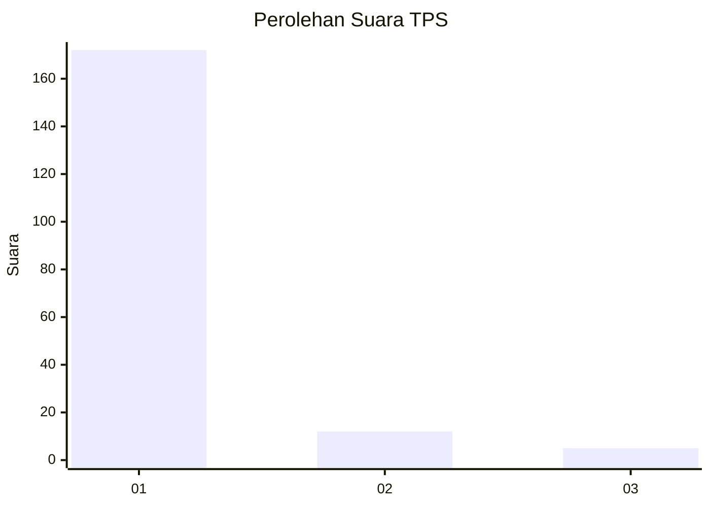
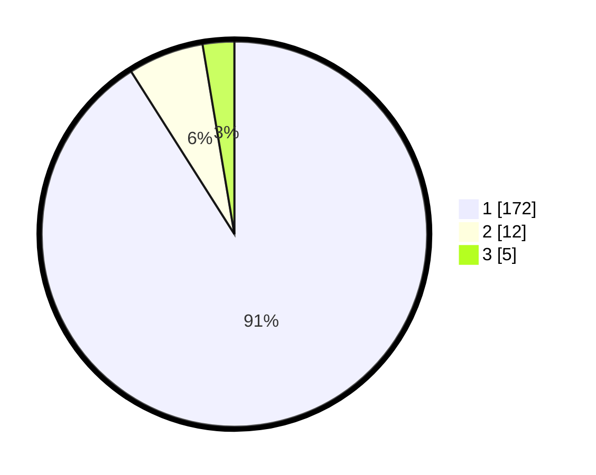

# Hasil

## Grafik

## Tabel

| No. | Nama Paslon    | Suara | Suara (raw) | Persentase |
|:--- |:-------------- | -----:| -----------:| ----------:|
| 1   | ANIES MUHAIMIN | 172   | [172][p-1]  | 91,01      |
| 2   | PRABOWO GIBRAN | 12    | [12][p-2]   | 6,35       |
| 3   | GANJAR MAHFUD  | 5     | [5][p-3]    | 2,65       |

[p-1]: https://github.com/gigit-pemilu/pemilu-2024-11-aceh/blob/main/pilpres/hitung-suara/sub/11-aceh/sub/03-aceh-timur/sub/07-peureulak/sub/2029-buket-pala/sub/002-tps/sub/paslon-1.txt
[p-2]: https://github.com/gigit-pemilu/pemilu-2024-11-aceh/blob/main/pilpres/hitung-suara/sub/11-aceh/sub/03-aceh-timur/sub/07-peureulak/sub/2029-buket-pala/sub/002-tps/sub/paslon-2.txt
[p-3]: https://github.com/gigit-pemilu/pemilu-2024-11-aceh/blob/main/pilpres/hitung-suara/sub/11-aceh/sub/03-aceh-timur/sub/07-peureulak/sub/2029-buket-pala/sub/002-tps/sub/paslon-3.txt

## Foto C Plano

https://sirekap-obj-formc.kpu.go.id/6377/pemilu/ppwp/11/03/07/20/29/1103072029002-20240215-085444--5e0fec57-6739-4a3f-99ee-734dec557ec7.jpg

https://sirekap-obj-formc.kpu.go.id/6377/pemilu/ppwp/11/03/07/20/29/1103072029002-20240215-090012--25282e84-b84f-4648-8969-a37059e9e158.jpg

https://sirekap-obj-formc.kpu.go.id/6377/pemilu/ppwp/11/03/07/20/29/1103072029002-20240215-090201--75644ddb-1715-4c6e-89a7-a17bca3553d7.jpg

## Metadata

| Key        | Value               |
| ---------- | ------------------- |
| Time Stamp | 2024-02-19 13:00:00 |

