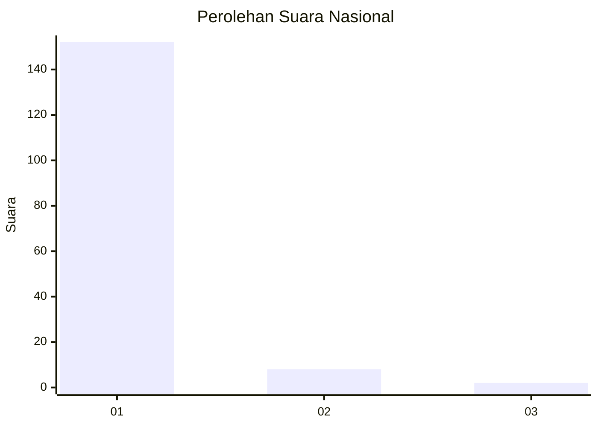
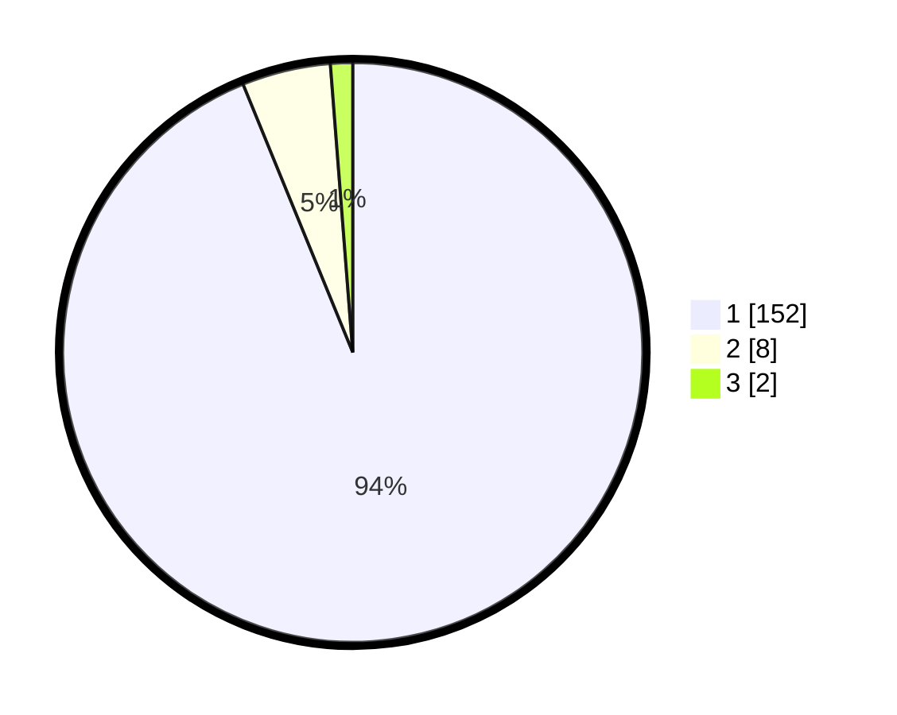

# Hasil

## Grafik

## Tabel

| No. | Nama Paslon    | Suara | Suara (raw) | Persentase |
|:--- |:-------------- | -----:| -----------:| ----------:|
| 1   | ANIES MUHAIMIN | 152   | [152][p-1]  | 93,83      |
| 2   | PRABOWO GIBRAN | 8     | [8][p-2]    | 4,94       |
| 3   | GANJAR MAHFUD  | 2     | [2][p-3]    | 1,23       |

[p-1]: https://github.com/gigit-pemilu/pemilu-2024/blob/main/pilpres/hitung-suara/sub/11-aceh/sub/03-aceh-timur/sub/07-peureulak/sub/2029-buket-pala/sub/003-tps/sub/paslon-1.txt
[p-2]: https://github.com/gigit-pemilu/pemilu-2024/blob/main/pilpres/hitung-suara/sub/11-aceh/sub/03-aceh-timur/sub/07-peureulak/sub/2029-buket-pala/sub/003-tps/sub/paslon-2.txt
[p-3]: https://github.com/gigit-pemilu/pemilu-2024/blob/main/pilpres/hitung-suara/sub/11-aceh/sub/03-aceh-timur/sub/07-peureulak/sub/2029-buket-pala/sub/003-tps/sub/paslon-3.txt

## Foto C Plano

https://sirekap-obj-formc.kpu.go.id/7d24/pemilu/ppwp/11/03/07/20/29/1103072029003-20240215-080058--19c00a88-9515-452f-a69c-d8d0d9f7544e.jpg

https://sirekap-obj-formc.kpu.go.id/7d24/pemilu/ppwp/11/03/07/20/29/1103072029003-20240215-075830--c2bf09f1-3786-46e5-8874-694605562090.jpg

https://sirekap-obj-formc.kpu.go.id/7d24/pemilu/ppwp/11/03/07/20/29/1103072029003-20240215-080016--85728197-23b8-40d6-9239-51e5086dd99a.jpg

## Metadata

| Key        | Value               |
| ---------- | ------------------- |
| Time Stamp | 2024-02-19 13:00:00 |

