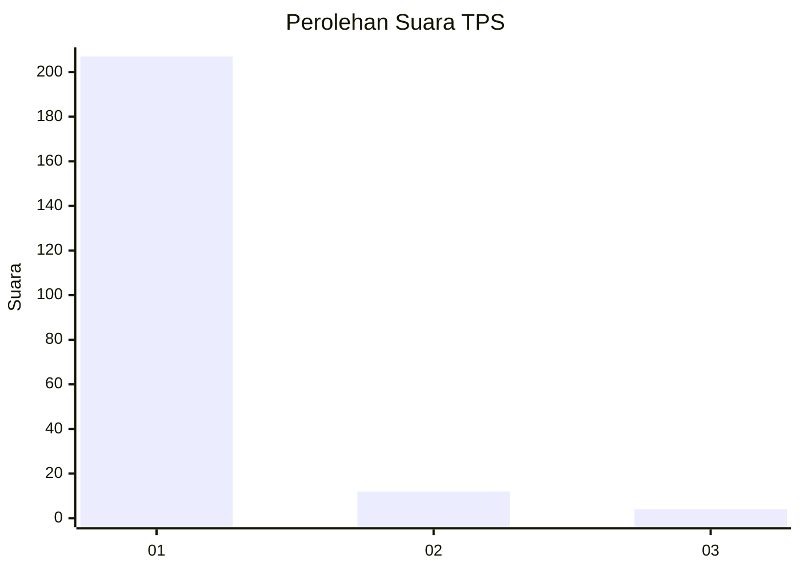
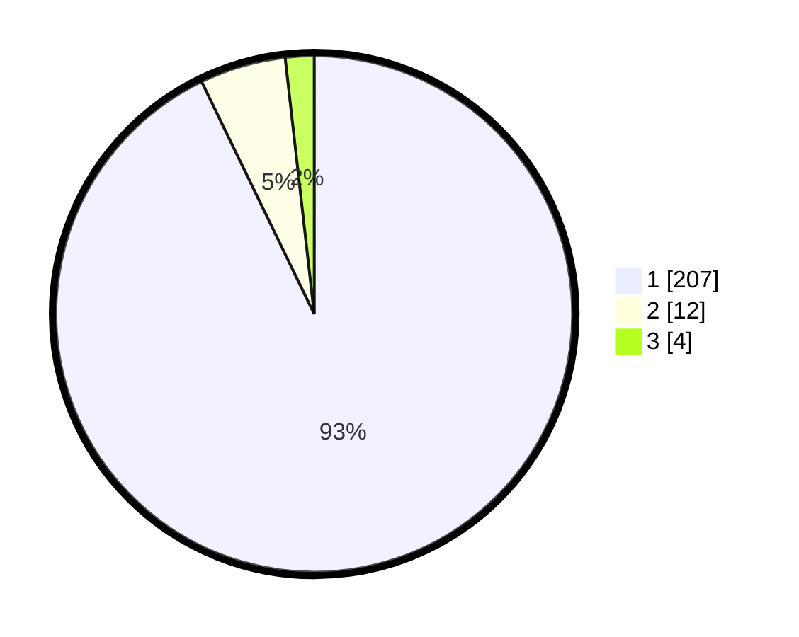

# Hasil

## Grafik

## Tabel

| No. | Nama Paslon    | Suara | Suara (raw) | Persentase |
|:--- |:-------------- | -----:| -----------:| ----------:|
| 1   | ANIES MUHAIMIN | 207   | [207][p-1]  | 92,83      |
| 2   | PRABOWO GIBRAN | 12    | [12][p-2]   | 5,38       |
| 3   | GANJAR MAHFUD  | 4     | [4][p-3]    | 1,79       |

[p-1]: https://github.com/gigit-pemilu/pemilu-2024-11-aceh/blob/main/pilpres/hitung-suara/sub/11-aceh/sub/03-aceh-timur/sub/07-peureulak/sub/2031-cek-mbon/sub/001-tps/sub/paslon-1.txt
[p-2]: https://github.com/gigit-pemilu/pemilu-2024-11-aceh/blob/main/pilpres/hitung-suara/sub/11-aceh/sub/03-aceh-timur/sub/07-peureulak/sub/2031-cek-mbon/sub/001-tps/sub/paslon-2.txt
[p-3]: https://github.com/gigit-pemilu/pemilu-2024-11-aceh/blob/main/pilpres/hitung-suara/sub/11-aceh/sub/03-aceh-timur/sub/07-peureulak/sub/2031-cek-mbon/sub/001-tps/sub/paslon-3.txt

## Foto C Plano

https://sirekap-obj-formc.kpu.go.id/a302/pemilu/ppwp/11/03/07/20/31/1103072031001-20240214-213822--4059be83-250d-40ee-954c-f88915b3debf.jpg

https://sirekap-obj-formc.kpu.go.id/a302/pemilu/ppwp/11/03/07/20/31/1103072031001-20240214-214126--9f374056-a70e-4a34-9719-a85ad5293a03.jpg

https://sirekap-obj-formc.kpu.go.id/a302/pemilu/ppwp/11/03/07/20/31/1103072031001-20240214-214242--98deb26f-b4c9-4819-b45d-a01dfd58f437.jpg

## Metadata

| Key        | Value               |
| ---------- | ------------------- |
| Time Stamp | 2024-02-15 09:00:24 |

