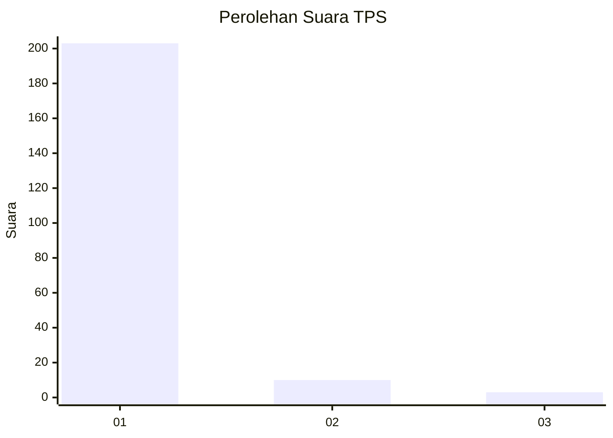
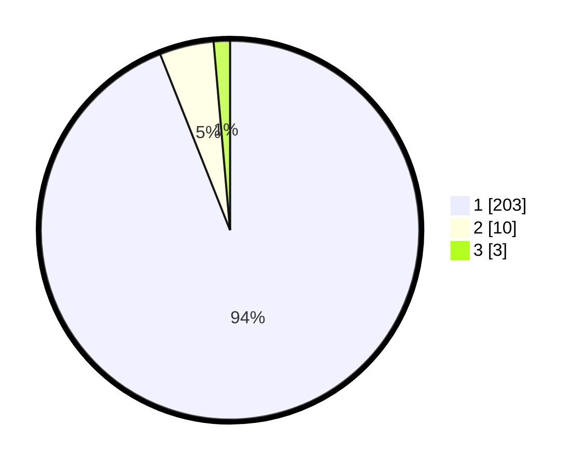

# Hasil

## Grafik

## Tabel

| No. | Nama Paslon    | Suara | Suara (raw) | Persentase |
|:--- |:-------------- | -----:| -----------:| ----------:|
| 1   | ANIES MUHAIMIN | 203   | [203][p-1]  | 93,98      |
| 2   | PRABOWO GIBRAN | 10    | [10][p-2]   | 4,63       |
| 3   | GANJAR MAHFUD  | 3     | [3][p-3]    | 1,39       |

[p-1]: https://github.com/gigit-pemilu/pemilu-2024-11-aceh/blob/main/pilpres/hitung-suara/sub/11-aceh/sub/03-aceh-timur/sub/07-peureulak/sub/2031-cek-mbon/sub/002-tps/sub/paslon-1.txt
[p-2]: https://github.com/gigit-pemilu/pemilu-2024-11-aceh/blob/main/pilpres/hitung-suara/sub/11-aceh/sub/03-aceh-timur/sub/07-peureulak/sub/2031-cek-mbon/sub/002-tps/sub/paslon-2.txt
[p-3]: https://github.com/gigit-pemilu/pemilu-2024-11-aceh/blob/main/pilpres/hitung-suara/sub/11-aceh/sub/03-aceh-timur/sub/07-peureulak/sub/2031-cek-mbon/sub/002-tps/sub/paslon-3.txt

## Foto C Plano

https://sirekap-obj-formc.kpu.go.id/4a6a/pemilu/ppwp/11/03/07/20/31/1103072031002-20240215-070555--ca91dfdd-6a1c-4c3d-967b-9546a7f89450.jpg

https://sirekap-obj-formc.kpu.go.id/4a6a/pemilu/ppwp/11/03/07/20/31/1103072031002-20240215-070938--e30ae0eb-320b-496b-8dcd-98e0b0b28a17.jpg

https://sirekap-obj-formc.kpu.go.id/4a6a/pemilu/ppwp/11/03/07/20/31/1103072031002-20240215-015112--ca19cbaa-baa1-481b-85d6-9cc8512fc1ea.jpg

## Metadata

| Key        | Value               |
| ---------- | ------------------- |
| Time Stamp | 2024-02-19 13:00:00 |

