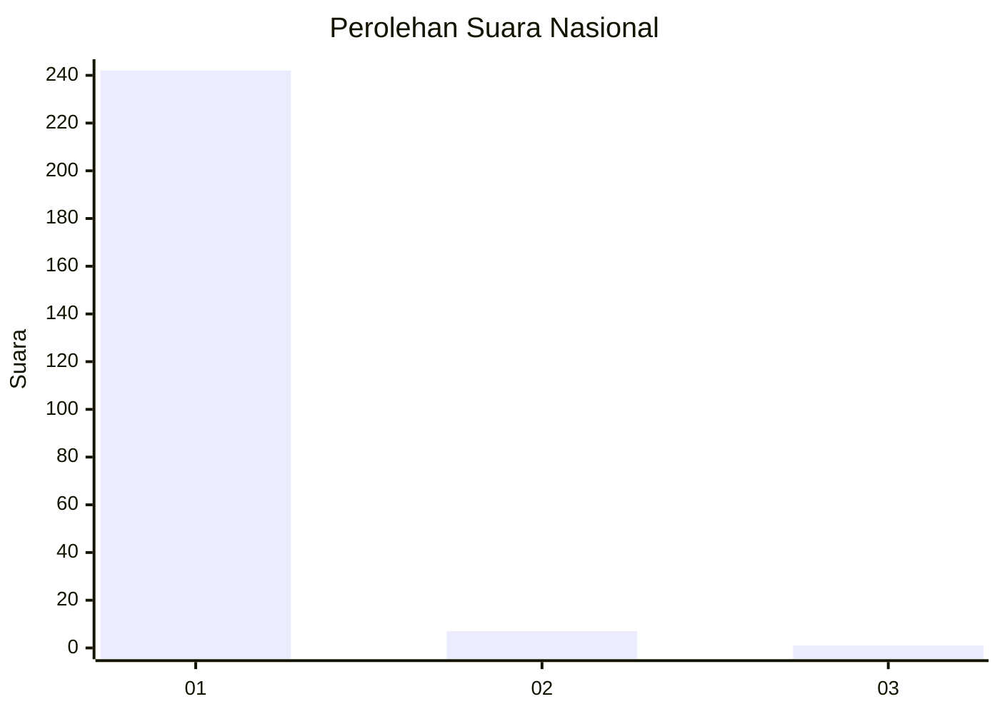
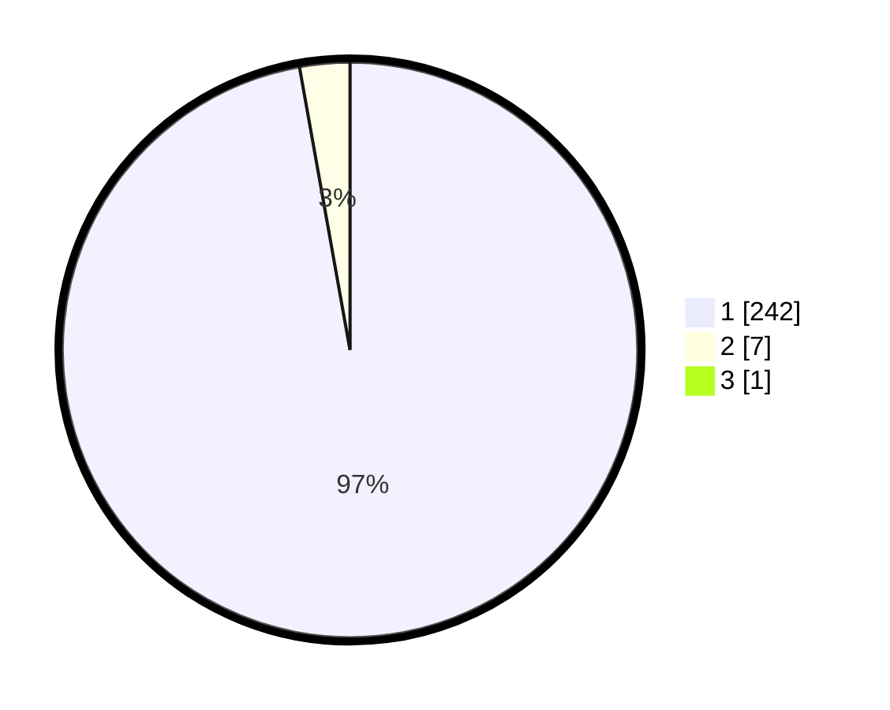

# Hasil

## Grafik

## Tabel

| No. | Nama Paslon    | Suara | Suara (raw) | Persentase |
|:--- |:-------------- | -----:| -----------:| ----------:|
| 1   | ANIES MUHAIMIN | 242   | [242][p-1]  | 96,80      |
| 2   | PRABOWO GIBRAN | 7     | [7][p-2]    | 2,80       |
| 3   | GANJAR MAHFUD  | 1     | [1][p-3]    | 0,40       |

[p-1]: https://github.com/gigit-pemilu/pemilu-2024/blob/main/pilpres/hitung-suara/sub/11-aceh/sub/03-aceh-timur/sub/07-peureulak/sub/2031-cek-mbon/sub/003-tps/sub/paslon-1.txt
[p-2]: https://github.com/gigit-pemilu/pemilu-2024/blob/main/pilpres/hitung-suara/sub/11-aceh/sub/03-aceh-timur/sub/07-peureulak/sub/2031-cek-mbon/sub/003-tps/sub/paslon-2.txt
[p-3]: https://github.com/gigit-pemilu/pemilu-2024/blob/main/pilpres/hitung-suara/sub/11-aceh/sub/03-aceh-timur/sub/07-peureulak/sub/2031-cek-mbon/sub/003-tps/sub/paslon-3.txt

## Foto C Plano

https://sirekap-obj-formc.kpu.go.id/a090/pemilu/ppwp/11/03/07/20/31/1103072031003-20240214-192745--58b9fab5-4f68-4be4-be89-9a5747e2a9b1.jpg

https://sirekap-obj-formc.kpu.go.id/a090/pemilu/ppwp/11/03/07/20/31/1103072031003-20240214-192947--5376b44a-562e-4d47-80aa-8dd2c7469f81.jpg

https://sirekap-obj-formc.kpu.go.id/a090/pemilu/ppwp/11/03/07/20/31/1103072031003-20240214-193155--4d4aaa15-d341-4f61-9e0f-dfc1897eaade.jpg

## Metadata

| Key        | Value               |
| ---------- | ------------------- |
| Time Stamp | 2024-02-14 21:46:01 |

## DATA PEMILIH TETAP

Jumlah pemilih dalam DPT: **296**.
 * L: **161**.
 * P: **135**.

## DATA PENGGUNA HAK PILIH

Jumlah pengguna hak pilih dalam DPT: **229**.
 * L: **119**.
 * P: **110**.

Jumlah pengguna hak pilih dalam DPTb: **0**.
 * L: **0**.
 * P: **0**.

Jumlah pengguna hak pilih dalam DPK: **25**.
 * L: **16**.
 * P: **9**.

Jumlah pengguna hak pilih: **254**.
 * L: **135**.
 * P: **119**.

## JUMLAH SUARA SAH DAN TIDAK SAH

JUMLAH SELURUH SUARA SAH: **250**.

JUMLAH SUARA TIDAK SAH: **4**.

JUMLAH SELURUH SUARA SAH DAN SUARA TIDAK SAH: **254**.

