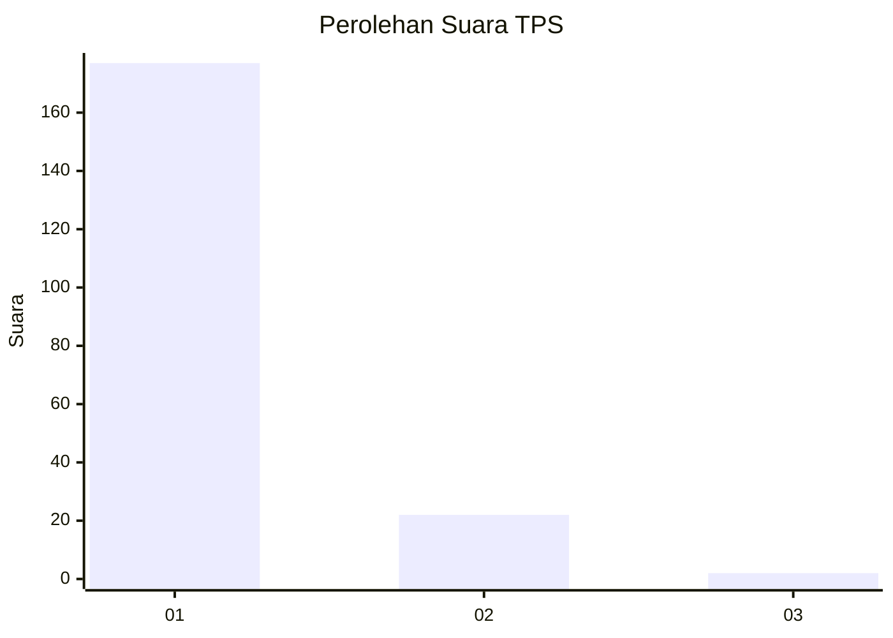
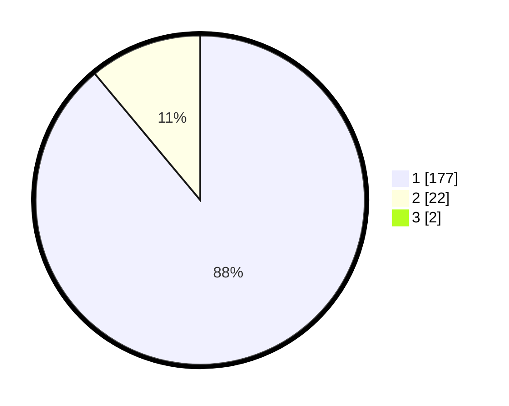

# Hasil

## Grafik

## Tabel

| No. | Nama Paslon    | Suara | Suara (raw) | Persentase |
|:--- |:-------------- | -----:| -----------:| ----------:|
| 1   | ANIES MUHAIMIN | 177   | [177][p-1]  | 88,06      |
| 2   | PRABOWO GIBRAN | 22    | [22][p-2]   | 10,95      |
| 3   | GANJAR MAHFUD  | 2     | [2][p-3]    | 1,00       |

[p-1]: https://github.com/gigit-pemilu/pemilu-2024-11-aceh/blob/main/pilpres/hitung-suara/sub/11-aceh/sub/03-aceh-timur/sub/07-peureulak/sub/2032-paya-meuligou/sub/002-tps/sub/paslon-1.txt
[p-2]: https://github.com/gigit-pemilu/pemilu-2024-11-aceh/blob/main/pilpres/hitung-suara/sub/11-aceh/sub/03-aceh-timur/sub/07-peureulak/sub/2032-paya-meuligou/sub/002-tps/sub/paslon-2.txt
[p-3]: https://github.com/gigit-pemilu/pemilu-2024-11-aceh/blob/main/pilpres/hitung-suara/sub/11-aceh/sub/03-aceh-timur/sub/07-peureulak/sub/2032-paya-meuligou/sub/002-tps/sub/paslon-3.txt

## Foto C Plano

https://sirekap-obj-formc.kpu.go.id/5d33/pemilu/ppwp/11/03/07/20/32/1103072032002-20240215-170241--c5b9d2ef-217c-4a76-bc8d-dc371331a783.jpg

https://sirekap-obj-formc.kpu.go.id/5d33/pemilu/ppwp/11/03/07/20/32/1103072032002-20240215-170410--9b68c223-9a8d-487d-9d02-52f036d40577.jpg

https://sirekap-obj-formc.kpu.go.id/5d33/pemilu/ppwp/11/03/07/20/32/1103072032002-20240215-170539--bb88a98d-8311-4182-a1c2-b6e89035e391.jpg

## Metadata

| Key        | Value               |
| ---------- | ------------------- |
| Time Stamp | 2024-02-19 13:00:00 |

