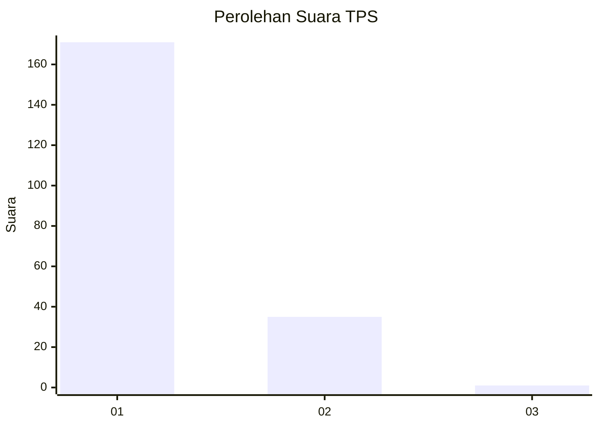
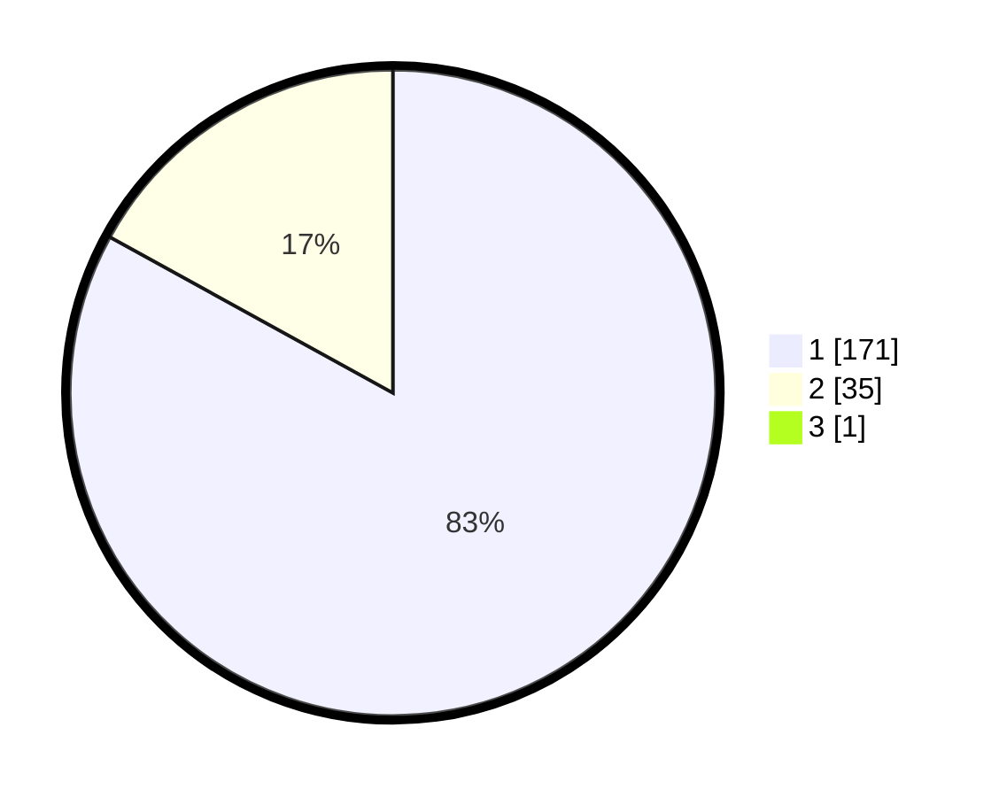

# Hasil

## Grafik

## Tabel

| No. | Nama Paslon    | Suara | Suara (raw) | Persentase |
|:--- |:-------------- | -----:| -----------:| ----------:|
| 1   | ANIES MUHAIMIN | 171   | [171][p-1]  | 82,61      |
| 2   | PRABOWO GIBRAN | 35    | [35][p-2]   | 16,91      |
| 3   | GANJAR MAHFUD  | 1     | [1][p-3]    | 0,48       |

[p-1]: https://github.com/gigit-pemilu/pemilu-2024-11-aceh/blob/main/pilpres/hitung-suara/sub/11-aceh/sub/03-aceh-timur/sub/07-peureulak/sub/2032-paya-meuligou/sub/003-tps/sub/paslon-1.txt
[p-2]: https://github.com/gigit-pemilu/pemilu-2024-11-aceh/blob/main/pilpres/hitung-suara/sub/11-aceh/sub/03-aceh-timur/sub/07-peureulak/sub/2032-paya-meuligou/sub/003-tps/sub/paslon-2.txt
[p-3]: https://github.com/gigit-pemilu/pemilu-2024-11-aceh/blob/main/pilpres/hitung-suara/sub/11-aceh/sub/03-aceh-timur/sub/07-peureulak/sub/2032-paya-meuligou/sub/003-tps/sub/paslon-3.txt

## Foto C Plano

https://sirekap-obj-formc.kpu.go.id/30e0/pemilu/ppwp/11/03/07/20/32/1103072032003-20240215-162647--52624bb1-6123-4c3e-829c-307d39a81b64.jpg

https://sirekap-obj-formc.kpu.go.id/30e0/pemilu/ppwp/11/03/07/20/32/1103072032003-20240215-162822--87faa3c0-a077-427e-afd3-8da216d62323.jpg

https://sirekap-obj-formc.kpu.go.id/30e0/pemilu/ppwp/11/03/07/20/32/1103072032003-20240215-163138--d9d9ff57-5143-4237-b854-ac822402d569.jpg

## Metadata

| Key        | Value               |
| ---------- | ------------------- |
| Time Stamp | 2024-02-16 14:00:34 |

