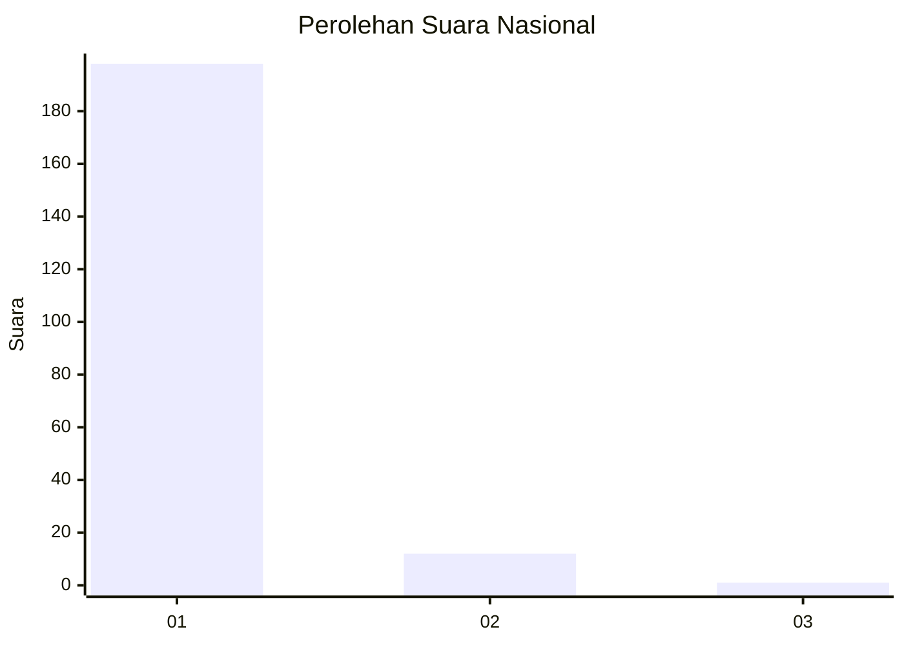
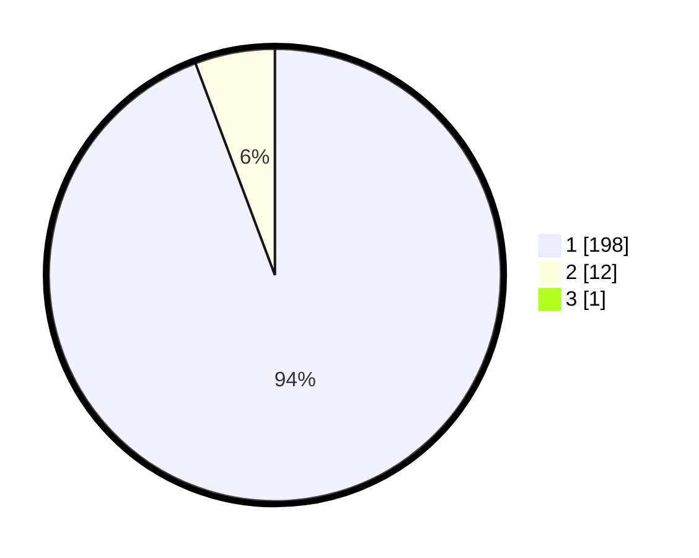

# Hasil

## Grafik

## Tabel

| No. | Nama Paslon    | Suara | Suara (raw) | Persentase |
|:--- |:-------------- | -----:| -----------:| ----------:|
| 1   | ANIES MUHAIMIN | 198   | [198][p-1]  | 93,84      |
| 2   | PRABOWO GIBRAN | 12    | [12][p-2]   | 5,69       |
| 3   | GANJAR MAHFUD  | 1     | [1][p-3]    | 0,47       |

[p-1]: https://github.com/gigit-pemilu/pemilu-2024/blob/main/pilpres/hitung-suara/sub/11-aceh/sub/03-aceh-timur/sub/07-peureulak/sub/2034-blang-batee/sub/002-tps/sub/paslon-1.txt
[p-2]: https://github.com/gigit-pemilu/pemilu-2024/blob/main/pilpres/hitung-suara/sub/11-aceh/sub/03-aceh-timur/sub/07-peureulak/sub/2034-blang-batee/sub/002-tps/sub/paslon-2.txt
[p-3]: https://github.com/gigit-pemilu/pemilu-2024/blob/main/pilpres/hitung-suara/sub/11-aceh/sub/03-aceh-timur/sub/07-peureulak/sub/2034-blang-batee/sub/002-tps/sub/paslon-3.txt

## Foto C Plano

https://sirekap-obj-formc.kpu.go.id/9a2c/pemilu/ppwp/11/03/07/20/34/1103072034002-20240215-123509--153d5fcc-3b6d-4711-9f77-bc68a07459f2.jpg

https://sirekap-obj-formc.kpu.go.id/9a2c/pemilu/ppwp/11/03/07/20/34/1103072034002-20240215-123527--c7024b24-9b43-47d9-94f2-a5b6b926b5f5.jpg

https://sirekap-obj-formc.kpu.go.id/9a2c/pemilu/ppwp/11/03/07/20/34/1103072034002-20240215-123543--60b7b60b-fa29-46d3-ba29-452916050cdf.jpg

## Metadata

| Key        | Value               |
| ---------- | ------------------- |
| Time Stamp | 2024-02-19 13:00:00 |

