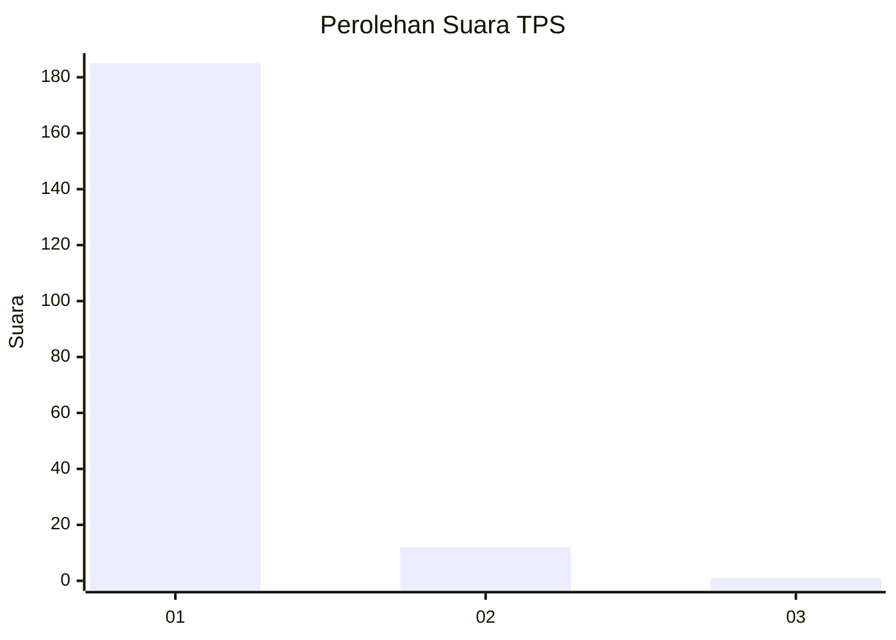
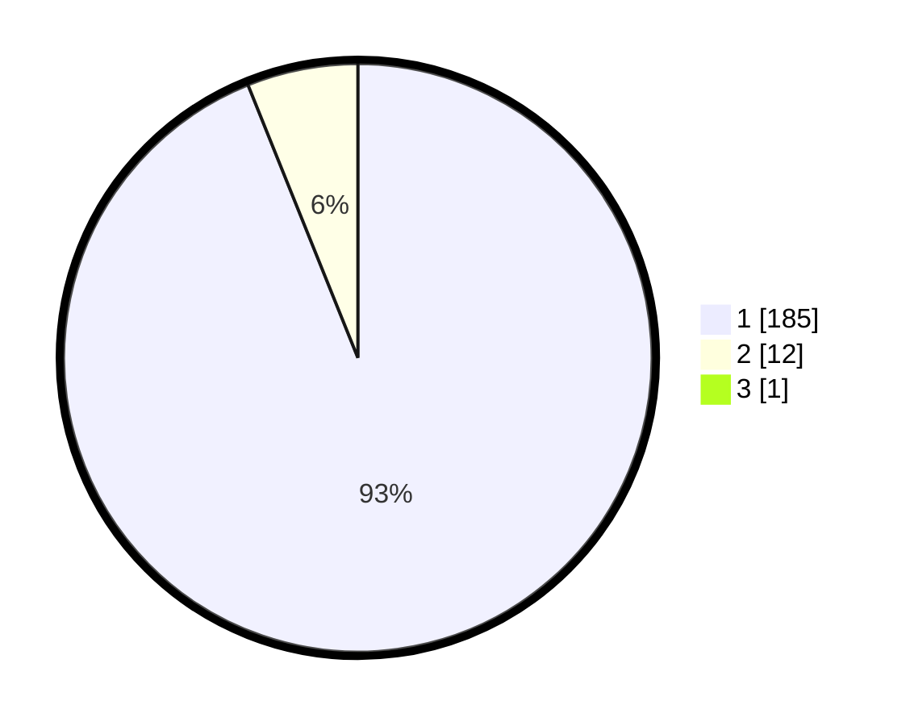

# Hasil

## Grafik

## Tabel

| No. | Nama Paslon    | Suara | Suara (raw) | Persentase |
|:--- |:-------------- | -----:| -----------:| ----------:|
| 1   | ANIES MUHAIMIN | 185   | [185][p-1]  | 93,43      |
| 2   | PRABOWO GIBRAN | 12    | [12][p-2]   | 6,06       |
| 3   | GANJAR MAHFUD  | 1     | [1][p-3]    | 0,51       |

[p-1]: https://github.com/gigit-pemilu/pemilu-2024-11-aceh/blob/main/pilpres/hitung-suara/sub/11-aceh/sub/03-aceh-timur/sub/07-peureulak/sub/2035-matang-peulawi/sub/002-tps/sub/paslon-1.txt
[p-2]: https://github.com/gigit-pemilu/pemilu-2024-11-aceh/blob/main/pilpres/hitung-suara/sub/11-aceh/sub/03-aceh-timur/sub/07-peureulak/sub/2035-matang-peulawi/sub/002-tps/sub/paslon-2.txt
[p-3]: https://github.com/gigit-pemilu/pemilu-2024-11-aceh/blob/main/pilpres/hitung-suara/sub/11-aceh/sub/03-aceh-timur/sub/07-peureulak/sub/2035-matang-peulawi/sub/002-tps/sub/paslon-3.txt

## Foto C Plano

https://sirekap-obj-formc.kpu.go.id/1e37/pemilu/ppwp/11/03/07/20/35/1103072035002-20240215-073038--8ed87fae-d77b-4444-92e8-f49acade0d35.jpg

https://sirekap-obj-formc.kpu.go.id/1e37/pemilu/ppwp/11/03/07/20/35/1103072035002-20240215-081629--6c4616ad-0f50-4a3d-be4c-796524952ed2.jpg

https://sirekap-obj-formc.kpu.go.id/1e37/pemilu/ppwp/11/03/07/20/35/1103072035002-20240215-081813--9032370b-8241-4baf-8f5b-d096a38ec87f.jpg

## Metadata

| Key        | Value               |
| ---------- | ------------------- |
| Time Stamp | 2024-02-22 17:00:00 |

