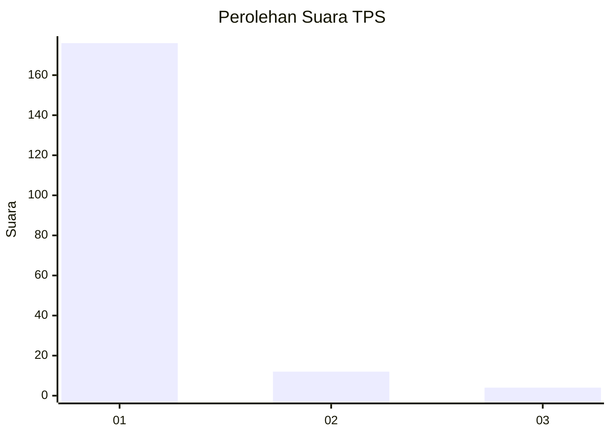
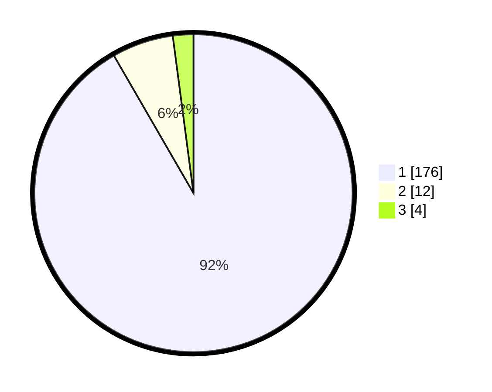

# Hasil

## Grafik

## Tabel

| No. | Nama Paslon    | Suara | Suara (raw) | Persentase |
|:--- |:-------------- | -----:| -----------:| ----------:|
| 1   | ANIES MUHAIMIN | 176   | [176][p-1]  | 91,67      |
| 2   | PRABOWO GIBRAN | 12    | [12][p-2]   | 6,25       |
| 3   | GANJAR MAHFUD  | 4     | [4][p-3]    | 2,08       |

[p-1]: https://github.com/gigit-pemilu/pemilu-2024-11-aceh/blob/main/pilpres/hitung-suara/sub/11-aceh/sub/03-aceh-timur/sub/07-peureulak/sub/2035-matang-peulawi/sub/003-tps/sub/paslon-1.txt
[p-2]: https://github.com/gigit-pemilu/pemilu-2024-11-aceh/blob/main/pilpres/hitung-suara/sub/11-aceh/sub/03-aceh-timur/sub/07-peureulak/sub/2035-matang-peulawi/sub/003-tps/sub/paslon-2.txt
[p-3]: https://github.com/gigit-pemilu/pemilu-2024-11-aceh/blob/main/pilpres/hitung-suara/sub/11-aceh/sub/03-aceh-timur/sub/07-peureulak/sub/2035-matang-peulawi/sub/003-tps/sub/paslon-3.txt

## Foto C Plano

https://sirekap-obj-formc.kpu.go.id/0cca/pemilu/ppwp/11/03/07/20/35/1103072035003-20240215-081037--847fdcf4-8381-4625-b195-8243403567e8.jpg

https://sirekap-obj-formc.kpu.go.id/0cca/pemilu/ppwp/11/03/07/20/35/1103072035003-20240215-081246--75fdde89-5693-42e5-b398-81cf8cee90e4.jpg

https://sirekap-obj-formc.kpu.go.id/0cca/pemilu/ppwp/11/03/07/20/35/1103072035003-20240215-081354--a9cb2dc7-9c1a-4ec9-892b-a522c46f1fb6.jpg

## Metadata

| Key        | Value               |
| ---------- | ------------------- |
| Time Stamp | 2024-02-19 13:00:00 |

