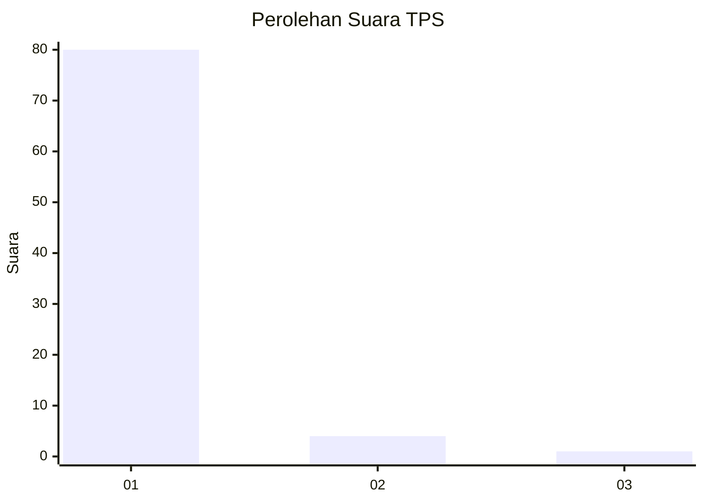
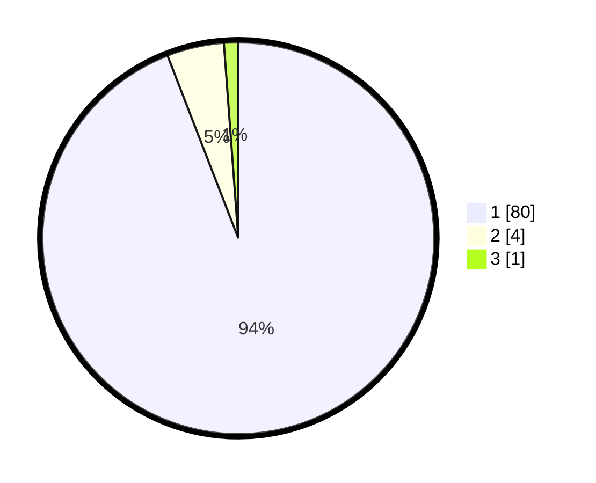

# Hasil

## Grafik

## Tabel

| No. | Nama Paslon    | Suara | Suara (raw) | Persentase |
|:--- |:-------------- | -----:| -----------:| ----------:|
| 1   | ANIES MUHAIMIN | 80    | [80][p-1]   | 94,12      |
| 2   | PRABOWO GIBRAN | 4     | [4][p-2]    | 4,71       |
| 3   | GANJAR MAHFUD  | 1     | [1][p-3]    | 1,18       |

[p-1]: https://github.com/gigit-pemilu/pemilu-2024-11-aceh/blob/main/pilpres/hitung-suara/sub/11-aceh/sub/03-aceh-timur/sub/07-peureulak/sub/2037-alue-rambong/sub/003-tps/sub/paslon-1.txt
[p-2]: https://github.com/gigit-pemilu/pemilu-2024-11-aceh/blob/main/pilpres/hitung-suara/sub/11-aceh/sub/03-aceh-timur/sub/07-peureulak/sub/2037-alue-rambong/sub/003-tps/sub/paslon-2.txt
[p-3]: https://github.com/gigit-pemilu/pemilu-2024-11-aceh/blob/main/pilpres/hitung-suara/sub/11-aceh/sub/03-aceh-timur/sub/07-peureulak/sub/2037-alue-rambong/sub/003-tps/sub/paslon-3.txt

## Foto C Plano

https://sirekap-obj-formc.kpu.go.id/0819/pemilu/ppwp/11/03/07/20/37/1103072037003-20240216-185326--c5fdba4a-edb1-4fb3-a9f9-ae582a15619d.jpg

https://sirekap-obj-formc.kpu.go.id/0819/pemilu/ppwp/11/03/07/20/37/1103072037003-20240216-185350--bffde7f0-cc6d-4e97-a278-917aca9a4749.jpg

## Metadata

| Key        | Value               |
| ---------- | ------------------- |
| Time Stamp | 2024-02-22 17:00:00 |

