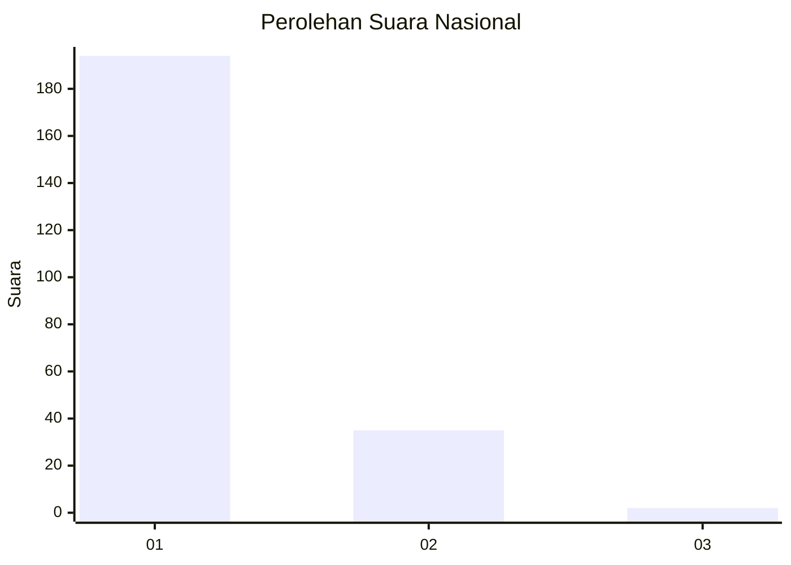
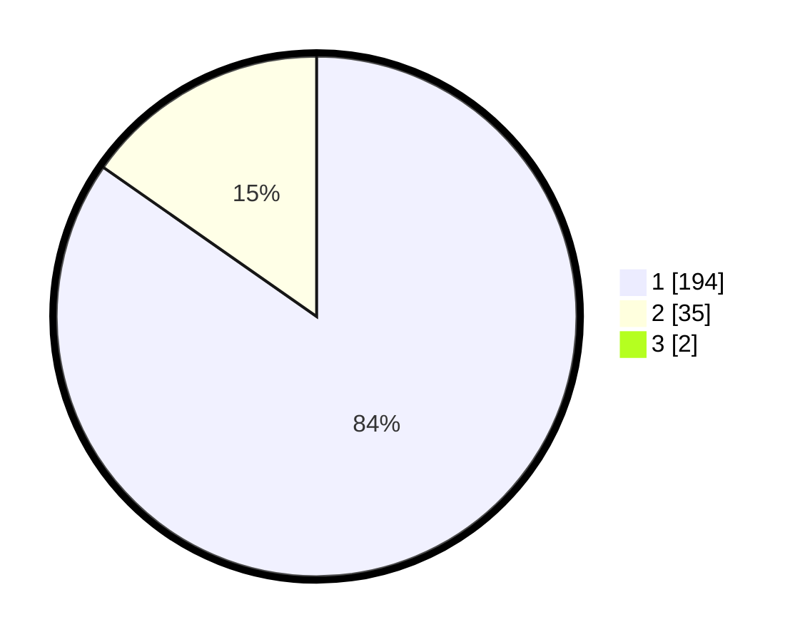

# Hasil

## Grafik

## Tabel

| No. | Nama Paslon    | Suara | Suara (raw) | Persentase |
|:--- |:-------------- | -----:| -----------:| ----------:|
| 1   | ANIES MUHAIMIN | 194   | [194][p-1]  | 83,98      |
| 2   | PRABOWO GIBRAN | 35    | [35][p-2]   | 15,15      |
| 3   | GANJAR MAHFUD  | 2     | [2][p-3]    | 0,87       |

[p-1]: https://github.com/gigit-pemilu/pemilu-2024/blob/main/pilpres/hitung-suara/sub/11-aceh/sub/03-aceh-timur/sub/08-rantau-selamat/sub/2001-bayeun/sub/004-tps/sub/paslon-1.txt
[p-2]: https://github.com/gigit-pemilu/pemilu-2024/blob/main/pilpres/hitung-suara/sub/11-aceh/sub/03-aceh-timur/sub/08-rantau-selamat/sub/2001-bayeun/sub/004-tps/sub/paslon-2.txt
[p-3]: https://github.com/gigit-pemilu/pemilu-2024/blob/main/pilpres/hitung-suara/sub/11-aceh/sub/03-aceh-timur/sub/08-rantau-selamat/sub/2001-bayeun/sub/004-tps/sub/paslon-3.txt

## Foto C Plano

https://sirekap-obj-formc.kpu.go.id/108a/pemilu/ppwp/11/03/08/20/01/1103082001004-20240218-121705--0559514e-ae6d-4c83-a1e8-9fa462e4fa54.jpg

https://sirekap-obj-formc.kpu.go.id/108a/pemilu/ppwp/11/03/08/20/01/1103082001004-20240218-121707--70a5a809-a8e3-438c-bee0-aa24ec2e6faf.jpg

https://sirekap-obj-formc.kpu.go.id/108a/pemilu/ppwp/11/03/08/20/01/1103082001004-20240218-121706--2f33bd28-5d45-472e-a6c3-477435a1ea52.jpg

## Metadata

| Key        | Value               |
| ---------- | ------------------- |
| Time Stamp | 2024-02-19 06:16:00 |

## DATA PEMILIH TETAP

Jumlah pemilih dalam DPT: **286**.
 * L: **150**.
 * P: **136**.

## DATA PENGGUNA HAK PILIH

Jumlah pengguna hak pilih dalam DPT: **230**.
 * L: **123**.
 * P: **107**.

Jumlah pengguna hak pilih dalam DPTb: **0**.
 * L: **0**.
 * P: **0**.

Jumlah pengguna hak pilih dalam DPK: **6**.
 * L: **4**.
 * P: **2**.

Jumlah pengguna hak pilih: **236**.
 * L: **127**.
 * P: **109**.

## JUMLAH SUARA SAH DAN TIDAK SAH

JUMLAH SELURUH SUARA SAH: **231**.

JUMLAH SUARA TIDAK SAH: **5**.

JUMLAH SELURUH SUARA SAH DAN SUARA TIDAK SAH: **236**.

