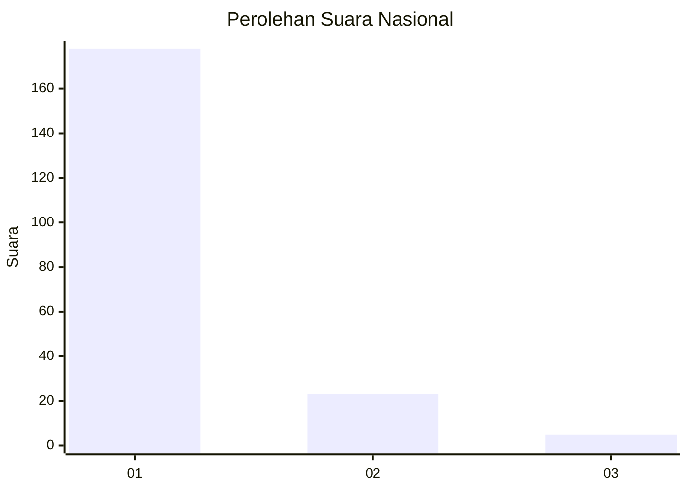
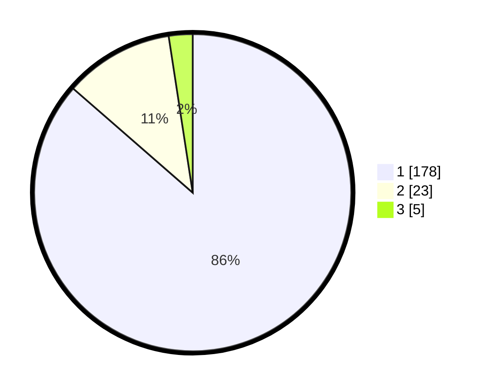

# Hasil

## Grafik

## Tabel

| No. | Nama Paslon    | Suara | Suara (raw) | Persentase |
|:--- |:-------------- | -----:| -----------:| ----------:|
| 1   | ANIES MUHAIMIN | 178   | [178][p-1]  | 86,41      |
| 2   | PRABOWO GIBRAN | 23    | [23][p-2]   | 11,17      |
| 3   | GANJAR MAHFUD  | 5     | [5][p-3]    | 2,43       |

[p-1]: https://github.com/gigit-pemilu/pemilu-2024/blob/main/pilpres/hitung-suara/sub/11-aceh/sub/03-aceh-timur/sub/08-rantau-selamat/sub/2001-bayeun/sub/005-tps/sub/paslon-1.txt
[p-2]: https://github.com/gigit-pemilu/pemilu-2024/blob/main/pilpres/hitung-suara/sub/11-aceh/sub/03-aceh-timur/sub/08-rantau-selamat/sub/2001-bayeun/sub/005-tps/sub/paslon-2.txt
[p-3]: https://github.com/gigit-pemilu/pemilu-2024/blob/main/pilpres/hitung-suara/sub/11-aceh/sub/03-aceh-timur/sub/08-rantau-selamat/sub/2001-bayeun/sub/005-tps/sub/paslon-3.txt

## Foto C Plano

https://sirekap-obj-formc.kpu.go.id/3501/pemilu/ppwp/11/03/08/20/01/1103082001005-20240214-213207--ccd606ec-b415-4244-9c0c-64d9e24becd9.jpg

https://sirekap-obj-formc.kpu.go.id/3501/pemilu/ppwp/11/03/08/20/01/1103082001005-20240214-193837--8afb7f2b-beaa-448e-b8e5-51e7203b3174.jpg

https://sirekap-obj-formc.kpu.go.id/3501/pemilu/ppwp/11/03/08/20/01/1103082001005-20240214-193847--888eda9f-74e3-4850-bf00-6fb0e5f887ca.jpg

## Metadata

| Key        | Value               |
| ---------- | ------------------- |
| Time Stamp | 2024-02-15 15:00:29 |

## DATA PEMILIH TETAP

Jumlah pemilih dalam DPT: **271**.
 * L: **134**.
 * P: **137**.

## DATA PENGGUNA HAK PILIH

Jumlah pengguna hak pilih dalam DPT: **208**.
 * L: **98**.
 * P: **110**.

Jumlah pengguna hak pilih dalam DPTb: **0**.
 * L: **0**.
 * P: **0**.

Jumlah pengguna hak pilih dalam DPK: **0**.
 * L: **0**.
 * P: **0**.

Jumlah pengguna hak pilih: **208**.
 * L: **98**.
 * P: **110**.

## JUMLAH SUARA SAH DAN TIDAK SAH

JUMLAH SELURUH SUARA SAH: **206**.

JUMLAH SUARA TIDAK SAH: **2**.

JUMLAH SELURUH SUARA SAH DAN SUARA TIDAK SAH: **208**.

